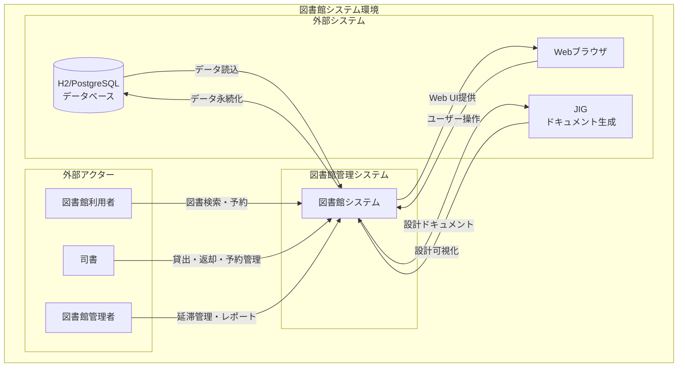

# システムコンテキスト分析

## システム価値・コンテキスト抽出

### 1. システムの価値命題

#### 1.1 主要なビジネス価値
- **司書業務の効率化**: 貸出・返却業務の自動化により、司書が本来業務に集中できる
- **利用者サービス向上**: 予約システムにより、利用者の利便性が向上
- **適切な蔵書管理**: 貸出制限ルールにより、公平で適切な図書館資源の配分
- **業務の標準化**: 複雑な業務ルールをシステム化することで、サービス品質の均質化

#### 1.2 解決する課題
- **手作業による貸出管理**: 人的ミスの削減、処理時間の短縮
- **貸出制限の適用**: 複雑な会員種別・延滞状況に応じた制限を自動適用
- **予約管理**: 多数の予約を効率的に管理し、取り置き期限を自動管理
- **延滞管理**: 延滞状況の把握と適切な制限措置の実施

### 2. システムコンテキスト図

### 3. システム境界定義

#### 3.1 システム内部（管理対象）
- **貸出・返却管理**: 図書の貸出・返却業務
- **予約・取置管理**: 図書の予約・取置業務
- **会員管理**: 図書館利用者の基本情報管理
- **蔵書管理**: 図書・資料の基本情報管理
- **業務ルール適用**: 貸出制限・延滞制限の自動適用
- **状態管理**: 予約・蔵書の状態遷移管理

#### 3.2 システム外部（連携対象）
- **人的リソース**: 司書・図書館管理者・利用者
- **データベース**: 永続化データストア
- **Webインターフェース**: ユーザー操作受付
- **設計ドキュメント**: JIGによる自動生成

#### 3.3 システム境界外（対象外）
- **図書の購入・発注**: 外部業者との取引
- **図書の物理的配架**: 書架での物理的整理
- **レファレンスサービス**: 相談業務
- **イベント管理**: 図書館イベントの企画・運営

### 4. ビジネスコンテキスト

#### 4.1 業務領域
- **図書館運営**: 公立図書館の日常業務支援
- **利用者サービス**: 図書館利用者への効率的なサービス提供
- **資源管理**: 限られた図書館資源の適切な配分

#### 4.2 業界特性
- **公共サービス**: 公平性・透明性が重要
- **教育支援**: 学習・研究活動の支援
- **コミュニティサービス**: 地域住民へのサービス提供

#### 4.3 規制・制約
- **個人情報保護**: 貸出記録の適切な管理・削除
- **公平性確保**: 利用者間の公平なサービス提供
- **開館時間制約**: 図書館の運営時間内での業務

### 5. 技術的コンテキスト

#### 5.1 技術スタック
- **言語**: Java 17
- **フレームワーク**: Spring Boot 3.1.1
- **データベース**: H2 (開発), PostgreSQL (本番想定)
- **O/Rマッピング**: MyBatis
- **Web UI**: Thymeleaf + Spring MVC
- **ドキュメント生成**: JIG

#### 5.2 アーキテクチャ特性
- **ドメイン駆動設計**: ビジネスロジックの独立性
- **多層アーキテクチャ**: 関心事の分離
- **設計可視化**: JIGによる自動ドキュメント生成

#### 5.3 品質特性
- **保守性**: 清潔なアーキテクチャ
- **テスタビリティ**: 充実したテストスイート
- **可視性**: 設計ドキュメントの自動生成

### 6. 運用コンテキスト

#### 6.1 運用環境
- **開発環境**: H2 インメモリDB
- **本番環境**: PostgreSQL + Spring Boot
- **監視**: Spring Boot Actuator
- **品質管理**: SonarCloud + Jacoco

#### 6.2 運用特性
- **単一システム**: スタンドアロン運用
- **Web アクセス**: localhost:8080
- **バックアップ**: データベースレベル
- **監視**: アプリケーションレベル

### 7. 将来拡張性

#### 7.1 拡張可能な領域
- **他システム連携**: 外部図書館システムとの連携
- **モバイル対応**: スマートフォン・タブレット対応
- **API公開**: 外部システムからの利用
- **レポート機能**: 統計・分析機能の追加

#### 7.2 制約事項
- **単一テナント**: 現在は単一図書館向け
- **同期処理**: 現在は同期処理のみ
- **シンプル UI**: 基本的なWeb UI

### 8. ステークホルダー分析

#### 8.1 主要ステークホルダー
1. **図書館利用者**: システムの最終受益者
2. **司書**: システムの主要操作者
3. **図書館管理者**: システムの管理・運用責任者
4. **システム開発者**: システムの開発・保守担当者

#### 8.2 ステークホルダーの関心事
- **利用者**: 使いやすさ・サービス品質
- **司書**: 業務効率化・操作性
- **管理者**: 運用性・信頼性
- **開発者**: 保守性・拡張性

### 9. 成功指標

#### 9.1 業務効率指標
- **貸出処理時間**: 手作業比較での処理時間短縮
- **延滞管理精度**: 延滞制限の適切な適用
- **予約管理効率**: 予約処理の自動化効果

#### 9.2 品質指標
- **システム稼働率**: 業務時間中の安定稼働
- **データ整合性**: 業務データの正確性維持
- **ユーザー満足度**: 利用者・司書の満足度

### 10. リスク要因

#### 10.1 技術リスク
- **データベース障害**: 業務データの損失・復旧
- **システム障害**: 業務停止の影響
- **性能劣化**: アクセス増加時の対応

#### 10.2 業務リスク
- **操作ミス**: 司書の誤操作による影響
- **業務ルール変更**: 図書館政策変更への対応
- **個人情報漏洩**: データセキュリティの確保