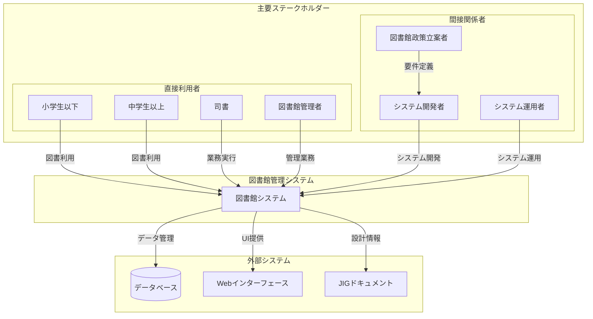

# 主要ステークホルダー分析

## ステークホルダー特定

### 1. アクター分析

#### 1.1 主要アクター（システム利用者）

##### 1.1.1 図書館利用者
- **種別**: 外部アクター
- **役割**: 図書館サービスの受益者
- **細分化**:
  - **小学生以下**: 15点・15日間の貸出制限
  - **中学生以上**: 20点・15日間の貸出制限
  - **一般市民**: 市内在住または市内学校在籍者
- **主要な関心事**:
  - 図書の検索・予約
  - 貸出・返却の利便性
  - 予約状況の確認
  - サービス品質の向上

##### 1.1.2 司書
- **種別**: 内部アクター
- **役割**: 図書館業務の実行者
- **責任範囲**:
  - 貸出・返却業務の実行
  - 予約管理・取置管理
  - 利用者対応
  - 日常業務の運営
- **主要な関心事**:
  - 業務効率化
  - 操作の簡便性
  - 正確な業務処理
  - 利用者サービス品質

##### 1.1.3 図書館管理者
- **種別**: 内部アクター
- **役割**: 図書館運営の責任者
- **責任範囲**:
  - 延滞管理・督促業務
  - 業務運営の監督
  - 政策・規則の適用
  - システム運用管理
- **主要な関心事**:
  - 業務統計・レポート
  - 延滞・督促の適切な管理
  - 公平なサービス提供
  - 図書館政策の実現

### 2. ステークホルダー関係図

### 3. 外部システム連携分析

#### 3.1 現在の外部システム連携
- **データベース**: H2/PostgreSQL
  - 関係性: データ永続化・検索
  - 依存度: 高（必須）
  - 方向性: 双方向
  
- **Webブラウザ**: 各種ブラウザ対応
  - 関係性: ユーザーインターフェース
  - 依存度: 高（必須）
  - 方向性: 双方向

- **JIGドキュメント生成**: 設計可視化
  - 関係性: 開発支援・保守性向上
  - 依存度: 中（開発時）
  - 方向性: 単方向（出力）

#### 3.2 将来の外部システム連携可能性
- **他図書館システム**: 相互貸借・横断検索
- **電子書籍システム**: デジタル資料管理
- **市民サービスシステム**: 市民ID連携
- **会計システム**: 督促・延滞金管理

### 4. ビジネスコンテキスト詳細

#### 4.1 組織コンテキスト
- **組織種別**: 公立図書館
- **組織規模**: 単一館運営
- **組織文化**: 公共サービス・教育支援
- **組織目標**: 地域住民の学習・文化活動支援

#### 4.2 業務コンテキスト
- **業務領域**: 図書館運営業務
- **業務特性**: 
  - 定型業務（貸出・返却）
  - 規則適用（制限・督促）
  - 顧客サービス（利用者対応）
- **業務制約**:
  - 開館時間制約
  - 個人情報保護
  - 公平性確保

#### 4.3 技術コンテキスト
- **技術レベル**: 中程度（司書のIT運用能力）
- **技術制約**: 
  - 単一システム運用
  - 限定的な技術リソース
  - 安定稼働の重視
- **技術方針**:
  - 保守性重視
  - 操作性重視
  - 標準技術採用

### 5. アクター詳細分析

#### 5.1 図書館利用者（詳細）

##### 利用者タイプ別特性
| タイプ | 年齢層 | 貸出上限 | 視聴覚上限 | 主な利用パターン |
|--------|--------|----------|------------|------------------|
| 小学生以下 | ~12歳 | 15点 | 5点 | 絵本・児童書中心 |
| 中学生以上 | 13歳~ | 20点 | 5点 | 学習・趣味・研究 |

##### 利用者行動パターン
- **検索・予約**: 図書検索→予約→取置通知受領
- **貸出**: 図書持参→貸出手続き→持帰り
- **返却**: 図書持参→返却手続き
- **延長**: 延長申請→承認→期限延長

##### 利用者ニーズ
- **利便性**: 簡単な操作・迅速な処理
- **可視性**: 予約状況・貸出状況の確認
- **公平性**: 制限の適切な適用
- **サービス品質**: 正確・丁寧な対応

#### 5.2 司書（詳細）

##### 業務責任範囲
- **貸出業務**: 貸出可否判定・貸出登録・貸出物引渡
- **返却業務**: 返却受付・返却登録・延滞確認
- **予約管理**: 予約受付・取置準備・取置通知
- **利用者対応**: 問い合わせ対応・操作支援

##### 業務フロー
1. **朝の業務**: 予約取置準備・返却処理
2. **日中業務**: 貸出・返却・予約対応
3. **夕方業務**: 延滞確認・督促準備

##### 司書ニーズ
- **効率性**: 迅速な業務処理
- **正確性**: エラーフリーな操作
- **支援性**: 業務判断支援
- **操作性**: 直感的なインターフェース

#### 5.3 図書館管理者（詳細）

##### 管理責任範囲
- **政策実行**: 図書館政策・規則の適用
- **業務監督**: 司書業務の適切な遂行
- **延滞管理**: 延滞状況把握・督促実行
- **運営管理**: 図書館全体の運営統括

##### 管理業務フロー
1. **日次管理**: 業務状況確認・問題対応
2. **週次管理**: 延滞状況確認・督促準備
3. **月次管理**: 利用統計確認・業務改善

##### 管理者ニーズ
- **可視性**: 業務状況・統計情報
- **制御性**: 政策・規則の確実な適用
- **効率性**: 管理業務の効率化
- **品質管理**: サービス品質の維持

### 6. ステークホルダー間関係分析

#### 6.1 利害関係マトリックス
| ステークホルダー | 影響度 | 関心度 | 対応方針 |
|------------------|--------|--------|----------|
| 図書館利用者 | 高 | 高 | 積極的関与 |
| 司書 | 高 | 高 | 積極的関与 |
| 図書館管理者 | 高 | 高 | 積極的関与 |
| システム開発者 | 中 | 高 | 情報提供 |
| 政策立案者 | 中 | 中 | 監視対応 |

#### 6.2 利害衝突・調整ポイント
- **利便性 vs 公平性**: 利用者の利便性と公平な制限適用
- **効率性 vs 正確性**: 業務効率化と正確な業務処理
- **自動化 vs 柔軟性**: システム自動化と例外対応

### 7. 成功要因分析

#### 7.1 各ステークホルダーの成功要因
- **利用者**: 快適な図書館利用体験
- **司書**: 業務負荷軽減・品質向上
- **管理者**: 適切な図書館運営・政策実現
- **開発者**: 保守性・拡張性の高いシステム

#### 7.2 システム成功の鍵
- **使いやすさ**: 直感的で効率的な操作
- **信頼性**: 正確で安定した動作
- **適応性**: 業務変化への対応力
- **透明性**: 処理過程の可視化

### 8. コミュニケーション戦略

#### 8.1 ステークホルダー別コミュニケーション
- **利用者**: 分かりやすい操作説明・状況通知
- **司書**: 業務手順・エラー対応ガイド
- **管理者**: 運用レポート・統計情報
- **開発者**: 技術仕様・設計情報

#### 8.2 情報共有方針
- **透明性**: システムの動作・制限を明確化
- **適時性**: 必要な情報の適切なタイミング提供
- **アクセス性**: 各ステークホルダーが必要な情報にアクセス可能