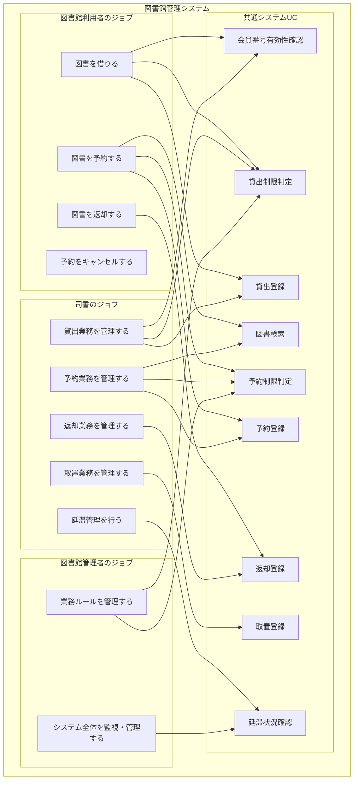

# ビジネスユースケース抽出

## アクターのジョブ特定とBUC定義

### 1. ジョブベースBUC分析の概要

#### 1.1 分析方針
- **Job-to-be-Done**: アクターが達成したいジョブ（仕事）を中心にBUCを構成
- **ジョブステップ**: 各ジョブを達成するためのステップを詳細分析
- **UC活用**: 各ステップで利用されるシステム機能（UC）を特定
- **業務価値**: ジョブが完了することで生まれるビジネス価値を明確化

#### 1.2 BUC構成パターン
```
アクター → ジョブ → ジョブステップ → システムUC
```

### 2. ビジネスユースケース図



### 3. アクター別ジョブ詳細分析

#### 3.1 図書館利用者のジョブ

##### ジョブ1: 図書を借りる
- **価値命題**: 必要な図書を自宅で読める状態にする
- **成功条件**: 図書を持ち帰り、貸出期限内で利用できる
- **前提条件**: 有効な図書館カードを持っている

**ジョブステップ分析**:
1. **来館** → 図書館に来館する（物理的移動）
2. **図書選択** → 必要な図書を書架から選択する
3. **貸出申込** → カウンターで貸出を申し込む
4. **貸出完了** → 図書を受け取り持ち帰る

**各ステップでのUC利用**:
- ステップ3: 会員番号有効性確認、所蔵品貸出可否判定、貸出制限判定
- ステップ4: 貸出登録、貸出状況提示

##### ジョブ2: 図書を予約する
- **価値命題**: 必要な図書を確実に借りられる状態にする
- **成功条件**: 図書が利用可能になった時に優先的に借りられる
- **前提条件**: 有効な図書館カードを持っている

**ジョブステップ分析**:
1. **図書検索** → 必要な図書を検索で特定する
2. **予約対象選択** → 予約したい図書を選択する
3. **予約申込** → 予約を申し込む
4. **予約完了** → 予約が登録され、通知を待つ

**各ステップでのUC利用**:
- ステップ1: 図書検索
- ステップ2: 図書詳細確認
- ステップ3-4: 会員番号有効性確認、予約制限判定、予約登録

##### ジョブ3: 予約をキャンセルする
- **価値命題**: 不要になった予約を解除し、予約枠を有効活用する
- **成功条件**: 予約が正常にキャンセルされ、予約枠が開放される
- **前提条件**: 有効な予約を持っている

**ジョブステップ分析**:
1. **予約状況確認** → 現在の予約状況を確認する
2. **キャンセル申込** → 不要な予約のキャンセルを申し込む
3. **キャンセル完了** → 予約がキャンセルされる

**各ステップでのUC利用**:
- ステップ1: 予約状況確認
- ステップ2-3: 予約キャンセル

##### ジョブ4: 図書を返却する
- **価値命題**: 借りた図書を正常に返却し、延滞を回避する
- **成功条件**: 図書が正常に返却され、貸出記録が適切に処理される
- **前提条件**: 貸出中の図書を持っている

**ジョブステップ分析**:
1. **返却申込** → カウンターで返却を申し込む
2. **返却完了** → 返却が登録され、貸出記録が更新される

**各ステップでのUC利用**:
- ステップ1-2: 返却登録

#### 3.2 司書のジョブ

##### ジョブ5: 貸出業務を管理する
- **価値命題**: 利用者の貸出要求を効率的かつ正確に処理する
- **成功条件**: 適切な制限下で貸出が完了し、利用者が満足する
- **前提条件**: 図書館システムが正常稼働している

**ジョブステップ分析**:
1. **貸出申込受付** → 利用者からの貸出申込を受付
2. **貸出可否判定** → システムによる自動判定を確認
3. **貸出処理** → 貸出の登録処理を実行
4. **貸出完了** → 利用者に図書を引渡し、説明

**各ステップでのUC利用**:
- ステップ1-2: 会員番号有効性確認、所蔵品貸出可否判定、貸出制限判定
- ステップ3-4: 貸出登録、貸出状況提示

##### ジョブ6: 予約業務を管理する
- **価値命題**: 利用者の予約要求を効率的に処理し、予約待ちを管理する
- **成功条件**: 予約が適切に登録され、利用者に確認情報が提供される
- **前提条件**: 予約システムが正常稼働している

**ジョブステップ分析**:
1. **予約申込受付** → 利用者からの予約申込を受付
2. **予約可否判定** → システムによる制限チェック
3. **予約処理** → 予約の登録処理を実行
4. **予約完了** → 利用者に予約完了を通知

**各ステップでのUC利用**:
- ステップ1: 図書検索、会員番号有効性確認
- ステップ2-4: 予約制限判定、予約登録

##### ジョブ7: 取置業務を管理する
- **価値命題**: 予約された図書を適切に準備し、利用者が受取可能な状態にする
- **成功条件**: 予約図書が正確に取置され、期限内に貸出される
- **前提条件**: 予約システムと在庫管理が連携している

**ジョブステップ分析**:
1. **未準備予約確認** → 準備が必要な予約を特定
2. **予約図書準備** → 該当図書を書架から取り出し
3. **取置登録** → システムに取置状況を登録
4. **取置管理** → 取置中の図書を管理
5. **取置貸出** → 利用者来館時に貸出処理
6. **取置期限管理** → 期限切れの取置を処理

**各ステップでのUC利用**:
- ステップ1: 未準備予約一覧表示
- ステップ2-3: 予約確認、所蔵品状態確認、予約図書一致確認、取置登録
- ステップ4-5: 取置一覧表示、取置貸出処理
- ステップ6: 取置期限切れ処理

##### ジョブ8: 返却業務を管理する
- **価値命題**: 利用者の返却を効率的に処理し、図書を再利用可能な状態にする
- **成功条件**: 返却が正確に処理され、図書が適切に配架される
- **前提条件**: 返却システムが正常稼働している

**ジョブステップ分析**:
1. **返却申込受付** → 利用者からの返却申込を受付
2. **返却処理** → システムに返却を登録
3. **返却完了** → 図書を受け取り、配架準備

**各ステップでのUC利用**:
- ステップ1-3: 返却登録

##### ジョブ9: 延滞管理を行う
- **価値命題**: 延滞状況を適切に把握し、必要な制限措置を講じる
- **成功条件**: 延滞者への適切な対応が実施され、図書の回収が促進される
- **前提条件**: 延滞監視システムが稼働している

**ジョブステップ分析**:
1. **延滞状況確認** → 現在の延滞状況を把握
2. **延滞通知** → 延滞者への通知を送信
3. **貸出制限適用** → 延滞レベルに応じた制限を適用

**各ステップでのUC利用**:
- ステップ1: 延滞状況確認
- ステップ2: 延滞通知送信
- ステップ3: 貸出制限適用

#### 3.3 図書館管理者のジョブ

##### ジョブ10: システム全体を監視・管理する
- **価値命題**: 図書館システム全体の健全な運用を維持する
- **成功条件**: システムが安定稼働し、業務が円滑に進行する
- **前提条件**: 管理者権限でシステムにアクセスできる

**ジョブステップ分析**:
1. **システム状況監視** → 各種業務の状況を監視
2. **業務状況確認** → 貸出・予約・延滞等の状況確認
3. **問題対応** → 発見された問題への対応
4. **運用改善** → システム運用の継続的改善

**各ステップでのUC利用**:
- ステップ1-2: 貸出状況一覧表示、予約状況一覧表示、取置状況一覧表示、延滞状況一覧表示
- ステップ3-4: システム設定管理

##### ジョブ11: 業務ルールを管理する
- **価値命題**: 図書館の政策・規則をシステムに適切に反映する
- **成功条件**: 業務ルールが正確にシステムに設定され、適切に適用される
- **前提条件**: 業務ルール設定権限を持っている

**ジョブステップ分析**:
1. **ルール設定** → 新しい業務ルールの設定
2. **制限値管理** → 各種制限値の管理
3. **ルール適用** → 設定したルールの適用確認
4. **ルール監視** → ルール適用状況の監視

**各ステップでのUC利用**:
- ステップ1-2: 貸出制限設定、予約制限設定、会員種別管理、延滞ルール設定
- ステップ3-4: 貸出制限判定、予約制限判定（適用状況確認）

### 4. BUC価値定義

#### 4.1 各ジョブのビジネス価値

##### 利用者ジョブの価値
- **図書を借りる**: 学習・娯楽・研究のための知識獲得
- **図書を予約する**: 確実な図書アクセスによる学習機会確保
- **予約をキャンセルする**: 柔軟な図書利用計画の調整
- **図書を返却する**: 責任ある図書利用と他者への配慮

##### 司書ジョブの価値
- **貸出業務管理**: 効率的な図書流通と利用者満足度向上
- **予約業務管理**: 公平な図書アクセス機会の提供
- **取置業務管理**: 予約者への確実なサービス提供
- **返却業務管理**: 図書の適切な回収と再流通
- **延滞管理**: 公平性確保と図書回収率向上

##### 管理者ジョブの価値
- **システム監視管理**: 安定的なサービス提供
- **業務ルール管理**: 図書館政策の確実な実現

#### 4.2 成功条件とKPI

##### 利用者満足度指標
- **貸出処理時間**: 平均2分以内
- **予約成功率**: 95%以上
- **システム利用満足度**: 4.0/5.0以上

##### 業務効率指標
- **司書業務効率**: 手作業比50%削減
- **延滞率**: 5%以下維持
- **予約取置率**: 98%以上

##### システム稼働指標
- **システム稼働率**: 99.9%以上
- **データ整合性**: エラー率0.1%以下
- **業務ルール適用精度**: 100%

### 5. BUC関係性分析

#### 5.1 ジョブ間依存関係
```
図書を予約する → 取置業務を管理する → 図書を借りる
図書を借りる → 図書を返却する
延滞管理を行う → 貸出業務を管理する（制限適用）
```

#### 5.2 UC再利用パターン
- **会員番号有効性確認**: 全ての利用者向けジョブで利用
- **図書検索**: 予約関連ジョブで利用
- **制限判定**: 貸出・予約の両方で利用
- **状況表示**: 管理者・司書の監視ジョブで利用

#### 5.3 ビジネスルール適用
- **年齢別制限**: 小学生以下(15点)、中学生以上(20点)
- **資料別制限**: 視聴覚資料(5点制限)
- **延滞制限**: 15日以上延滞で新規貸出停止
- **予約制限**: 一人15点まで予約可能

### 6. 将来拡張可能なジョブ

#### 6.1 利用者の潜在ジョブ
- **オンラインで図書を検索・予約する**: デジタル化対応
- **電子書籍を利用する**: デジタルコンテンツ拡張
- **読書履歴を管理する**: パーソナル機能拡張

#### 6.2 司書の潜在ジョブ
- **蔵書を管理する**: 資料発注・登録業務
- **利用統計を分析する**: データ分析業務
- **レファレンスを管理する**: 相談業務支援

#### 6.3 管理者の潜在ジョブ
- **予算を管理する**: 財務管理統合
- **職員を管理する**: 人事管理統合
- **イベントを管理する**: 文化活動支援