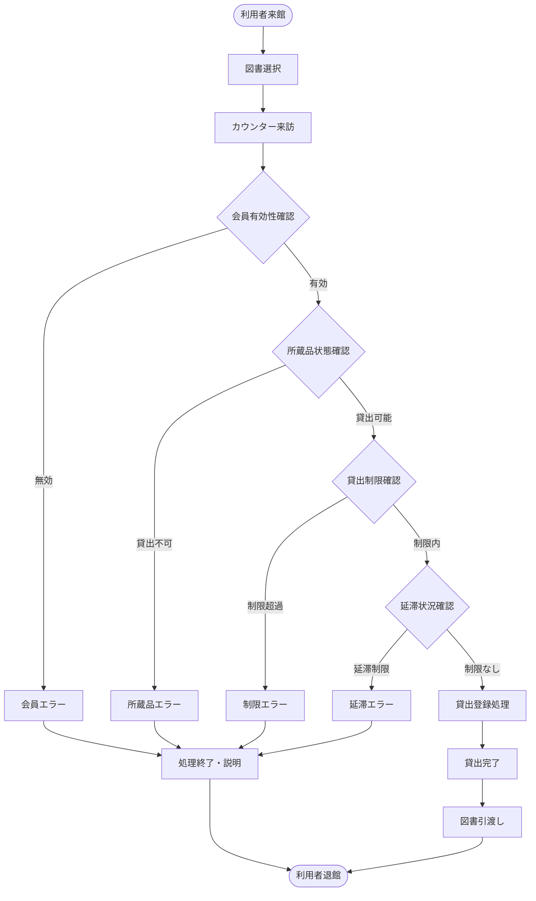
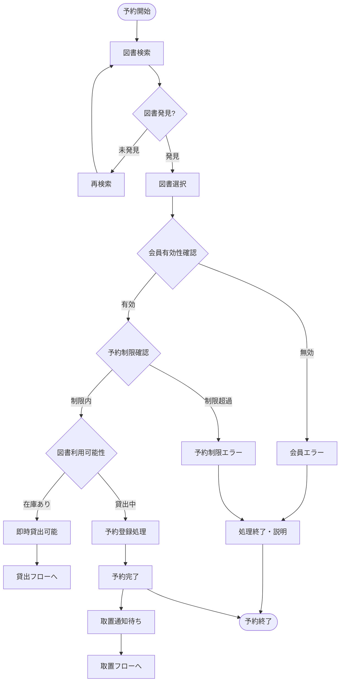
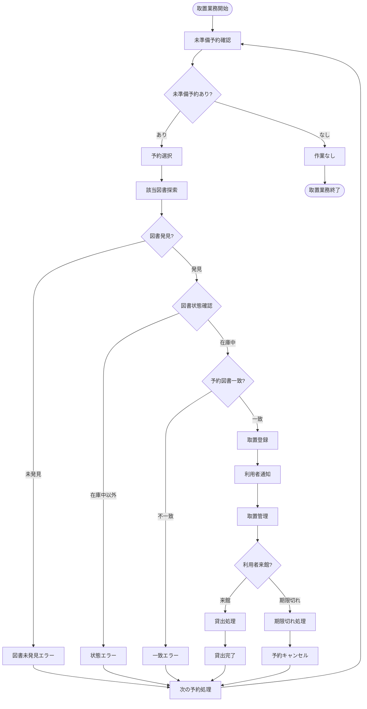
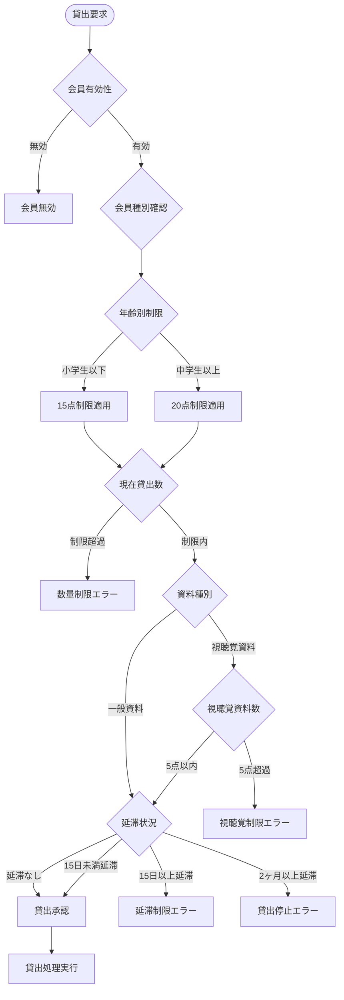
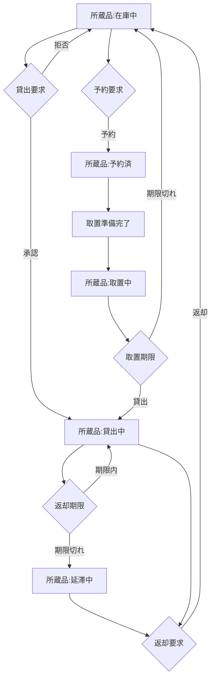
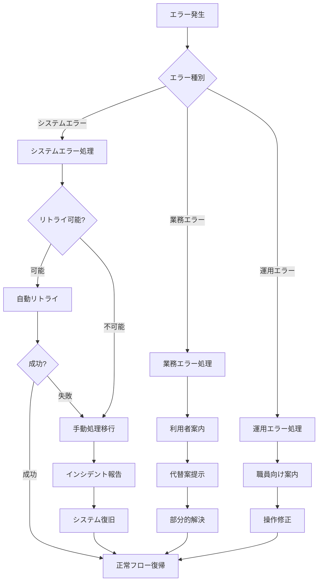

# 業務フロー分析

## ジョブステップシーケンスと判断ポイント特定

### 1. 業務フロー分析の概要

#### 1.1 分析方針
- **ジョブステップシーケンス**: 各ジョブの実行順序と依存関係を分析
- **判断ポイント特定**: 業務の分岐点・決定点を明確化
- **UCとジョブステップの関連付け**: どのステップでどのUCが利用されるかを詳細化
- **例外フロー**: 正常フローと例外フローの両方を考慮

#### 1.2 フロー表記法
- **順次**: ステップの連続実行
- **分岐**: 条件による処理の分岐
- **並行**: 複数処理の同時実行
- **例外**: エラー・例外発生時の処理

### 2. 主要業務フロー図

#### 2.1 図書貸出の統合フロー



#### 2.2 図書予約の統合フロー



#### 2.3 予約取置の統合フロー



### 3. ジョブステップ詳細分析

#### 3.1 図書館利用者のジョブフロー

##### ジョブ: 図書を借りる
| ステップ順序 | ステップ名 | 判断ポイント | 利用UC | 次ステップ | 例外処理 |
|-------------|------------|-------------|--------|------------|----------|
| 1 | 来館 | - | - | 図書選択 | - |
| 2 | 図書選択 | 図書発見? | - | カウンター来訪 | 再探索 |
| 3 | カウンター来訪 | - | - | 会員確認 | - |
| 4 | 会員確認 | 会員有効? | 会員番号有効性確認 | 所蔵品確認 | エラー終了 |
| 5 | 所蔵品確認 | 貸出可能? | 所蔵品貸出可否判定 | 制限確認 | エラー終了 |
| 6 | 制限確認 | 制限内? | 貸出制限判定 | 貸出処理 | エラー終了 |
| 7 | 貸出処理 | - | 貸出登録 | 図書引渡し | - |
| 8 | 図書引渡し | - | - | 完了 | - |

##### ジョブ: 図書を予約する
| ステップ順序 | ステップ名 | 判断ポイント | 利用UC | 次ステップ | 例外処理 |
|-------------|------------|-------------|--------|------------|----------|
| 1 | 図書検索 | 図書発見? | 図書検索 | 図書選択 | 再検索 |
| 2 | 図書選択 | - | 図書詳細確認 | 会員確認 | - |
| 3 | 会員確認 | 会員有効? | 会員番号有効性確認 | 予約制限確認 | エラー終了 |
| 4 | 予約制限確認 | 制限内? | 予約制限判定 | 利用可能性確認 | エラー終了 |
| 5 | 利用可能性確認 | 在庫あり? | - | 即時貸出/予約処理 | - |
| 6a | 即時貸出 | - | 貸出登録 | 完了 | - |
| 6b | 予約処理 | - | 予約登録 | 完了 | - |

#### 3.2 司書のジョブフロー

##### ジョブ: 取置業務を管理する
| ステップ順序 | ステップ名 | 判断ポイント | 利用UC | 次ステップ | 例外処理 |
|-------------|------------|-------------|--------|------------|----------|
| 1 | 未準備予約確認 | 予約あり? | 未準備予約一覧表示 | 予約選択/終了 | - |
| 2 | 予約選択 | - | 予約確認 | 図書探索 | - |
| 3 | 図書探索 | 図書発見? | - | 状態確認 | 次予約処理 |
| 4 | 状態確認 | 在庫中? | 所蔵品状態確認 | 一致確認 | 次予約処理 |
| 5 | 一致確認 | 予約図書一致? | 予約図書一致確認 | 取置登録 | 次予約処理 |
| 6 | 取置登録 | - | 取置登録 | 利用者通知 | - |
| 7 | 利用者通知 | - | - | 取置管理 | - |
| 8 | 取置管理 | 利用者来館? | 取置一覧表示 | 貸出処理/期限処理 | - |
| 9a | 貸出処理 | - | 取置貸出処理 | 次予約処理 | - |
| 9b | 期限処理 | - | 取置期限切れ処理 | 次予約処理 | - |

### 4. 判断ポイント詳細分析

#### 4.1 主要判断ポイント

##### 会員有効性判断
- **判断基準**: 会員番号の存在・有効期限
- **分岐**: 有効 → 処理続行、無効 → エラー終了
- **影響範囲**: 全ての利用者向けサービス
- **例外処理**: 会員登録案内、一時利用案内

##### 貸出制限判断
- **判断基準**: 
  - 年齢別制限（小学生以下15点、中学生以上20点）
  - 資料別制限（視聴覚資料5点）
  - 延滞制限（15日以上延滞で新規貸出停止）
- **分岐**: 制限内 → 貸出可能、制限超過 → 貸出不可
- **影響範囲**: 貸出・予約サービス
- **例外処理**: 制限説明、返却促進案内

##### 予約制限判断
- **判断基準**:
  - 全体予約数制限（15点まで）
  - 視聴覚資料予約制限（5点まで）
- **分岐**: 制限内 → 予約可能、制限超過 → 予約不可
- **影響範囲**: 予約サービス
- **例外処理**: 制限説明、既存予約確認案内

##### 図書利用可能性判断
- **判断基準**: 所蔵品の現在状態
- **分岐**: 在庫中 → 即時貸出、貸出中 → 予約待ち
- **影響範囲**: 貸出・予約サービス
- **例外処理**: 代替資料案内、予約案内

##### 取置期限判断
- **判断基準**: 取置登録日から7開館日経過
- **分岐**: 期限内 → 取置継続、期限切れ → 予約キャンセル
- **影響範囲**: 取置管理業務
- **例外処理**: 期限延長（特例）、再予約案内

### 5. ビジネスルール適用フロー

#### 5.1 複合判定フロー



#### 5.2 状態変更フロー



### 6. UC連携フロー分析

#### 6.1 UC実行順序

##### 貸出処理のUC連携
```
会員番号有効性確認 → 所蔵品貸出可否判定 → 貸出制限判定 → 貸出登録 → 貸出状況提示
```

##### 予約処理のUC連携
```
図書検索 → 図書詳細確認 → 会員番号有効性確認 → 予約制限判定 → 予約登録
```

##### 取置処理のUC連携
```
未準備予約一覧表示 → 予約確認 → 所蔵品状態確認 → 予約図書一致確認 → 取置登録 → 取置一覧表示
```

#### 6.2 UCの再利用パターン

| UC名 | 利用ジョブ | 利用頻度 | 共通度 |
|------|------------|----------|--------|
| 会員番号有効性確認 | 貸出、予約、返却 | 高 | 高 |
| 図書検索 | 予約、蔵書管理 | 中 | 中 |
| 貸出制限判定 | 貸出、取置貸出 | 高 | 中 |
| 予約制限判定 | 予約 | 中 | 低 |
| 所蔵品状態確認 | 貸出、取置 | 中 | 中 |

### 7. 例外フロー・エラーハンドリング

#### 7.1 例外パターン分類

##### システムエラー
- **データベース接続エラー**: システム一時停止、手動処理へ移行
- **データ整合性エラー**: 管理者アラート、データ修復処理
- **ネットワークエラー**: 自動リトライ、タイムアウト処理

##### 業務エラー
- **会員無効エラー**: 会員登録案内、一時利用案内
- **制限超過エラー**: 制限内容説明、代替案提示
- **図書未発見エラー**: 再検索案内、類似図書案内

##### 運用エラー
- **操作ミスエラー**: 操作取消、再入力案内
- **権限エラー**: 適切な権限者への引継ぎ
- **時間外エラー**: 開館時間案内、緊急連絡先案内

#### 7.2 エラー回復フロー



### 8. 業務フロー最適化ポイント

#### 8.1 効率化機会
- **自動判定**: 複雑な制限判定の自動化
- **バッチ処理**: 期限切れ処理等の一括実行
- **プロアクティブ通知**: 期限前の事前通知
- **ワンストップ処理**: 関連処理の統合実行

#### 8.2 品質向上機会
- **入力検証**: 早期エラー検出
- **処理確認**: 重要処理の確認ステップ
- **ログ記録**: 処理履歴の完全記録
- **状態同期**: リアルタイム状態更新

#### 8.3 ユーザビリティ向上
- **進行状況表示**: 処理進行の可視化
- **ガイダンス**: 操作手順の明確化
- **ショートカット**: 熟練者向け高速操作
- **元に戻す**: 誤操作の取消機能