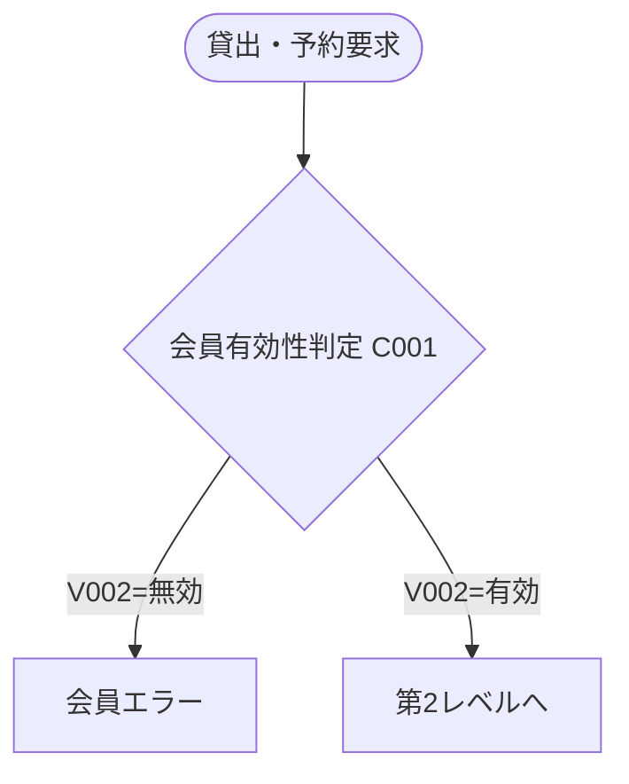
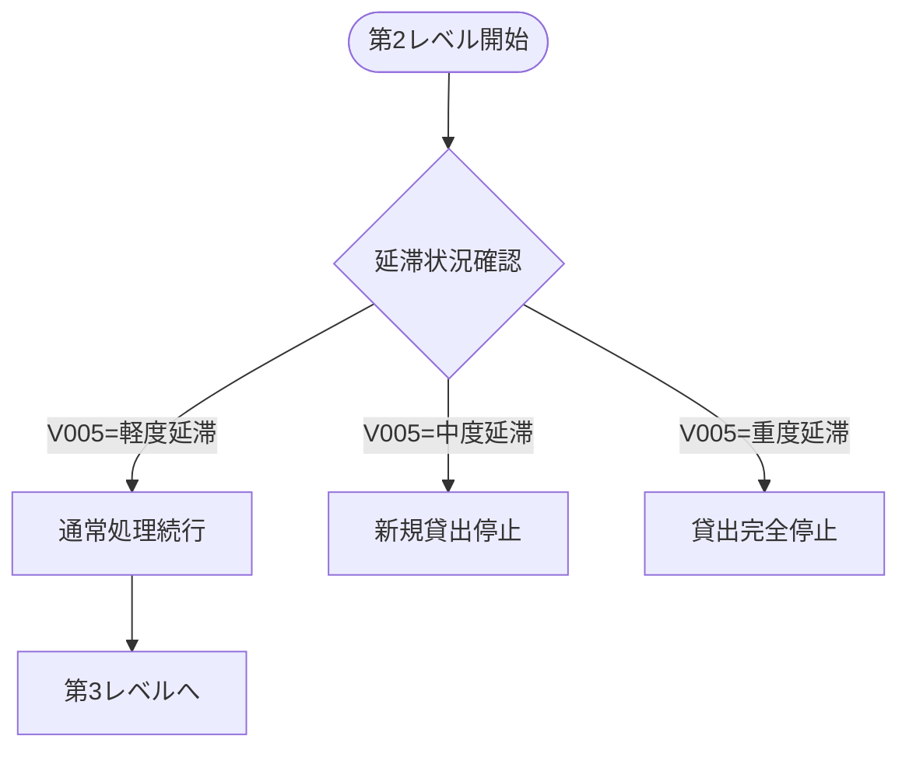
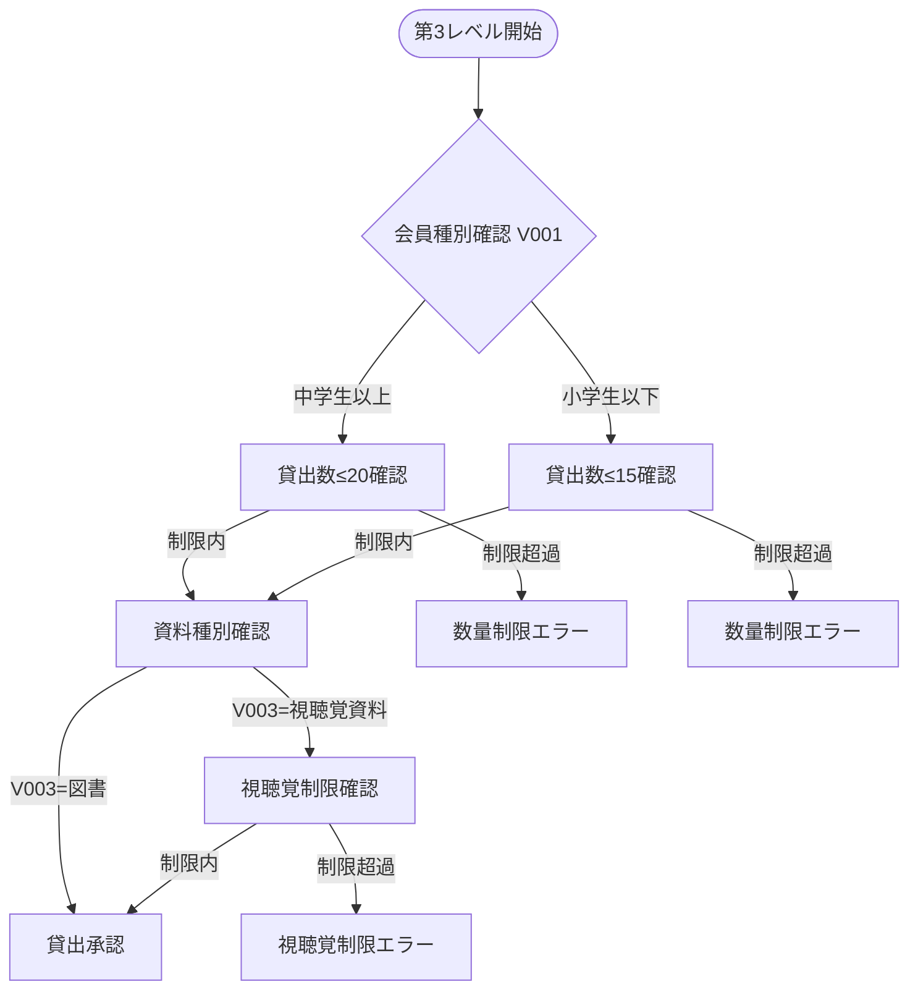
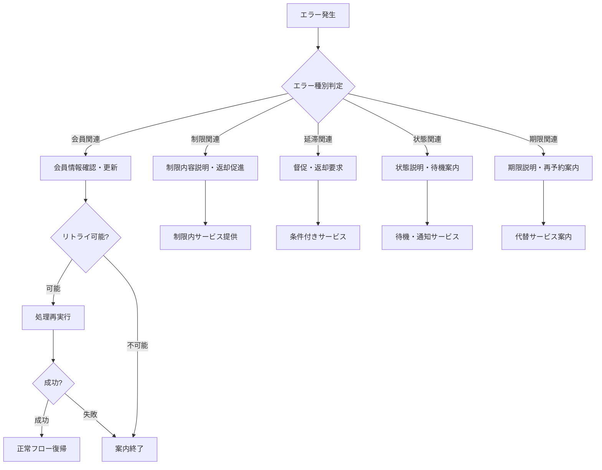

# バリエーション・条件特定

## 条件分岐・例外処理・ビジネスルール抽出

### 1. 条件分析表（必須表形式出力）

| 条件ID | 条件名 | 条件式/ルール | 適用場面 | 関連UC | 影響範囲 | ソース根拠 | ディレクトリ |
|--------|--------|---------------|----------|--------|----------|------------|--------------|
| C001 | 会員有効性判定 | member.status === '有効' | 貸出・予約時 | 会員番号有効性確認 | 全利用者向けサービス | domain/model/member/MemberStatus.java:8 | domain |
| C002 | 年齢別貸出制限判定 | memberType === '中学生以上' ? 20 : 15 | 貸出時 | 貸出制限判定 | 貸出システム | domain/model/loan/rule/RestrictionOfQuantityMap.java:20-21 | domain |
| C003 | 視聴覚資料制限判定 | audiovisualCount + 1 <= 5 | 貸出・予約時 | 貸出制限判定 | 視聴覚資料管理 | domain/model/loan/rule/RestrictionOfQuantity.java:26-30 | domain |
| C004 | 延滞期間判定 | delayDays >= 15 && delayMonths < 2 | 貸出時 | 延滞状況確認 | 貸出制限システム | domain/model/delay/DelayStatus.java:13 | domain |
| C005 | 重度延滞判定 | delayMonths >= 2 | 貸出時 | 延滞状況確認 | 貸出停止システム | domain/model/delay/DelayStatus.java:14 | domain |
| C006 | 軽度延滞判定 | delayDays < 15 && delayMonths < 1 | 貸出時 | 延滞状況確認 | 貸出通常処理 | domain/model/delay/DelayStatus.java:12 | domain |
| C007 | 所蔵品状態判定 | itemStatus === '在庫中' | 貸出時 | 所蔵品貸出可否判定 | 貸出システム | domain/model/material/item/ItemStatus.java:8 | domain |
| C008 | 予約制限判定 | reservationCount < 15 | 予約時 | 予約制限判定 | 予約システム | domain/model/reservation/rule/ReservationRestriction.java:19 | domain |
| C009 | 視聴覚予約制限判定 | audiovisualReservationCount < 5 | 予約時 | 予約制限判定 | 予約システム | domain/model/reservation/rule/ReservationRestriction.java:20 | domain |
| C010 | 返却期限判定 | currentDate > dueDate | 返却時 | 延滞状況確認 | 返却システム | domain/model/loan/due/DueDateStatus.java:8 | domain |
| C011 | 貸出期間設定 | loanDate + 15日 - 1日 | 貸出時 | 貸出登録 | 貸出システム | domain/model/loan/due/DueDate.java:16 | domain |
| C012 | 取置期限判定 | retentionDate + 7日 < currentDate | 取置管理時 | 取置期限切れ処理 | 取置システム | domain/model/retention/ExpireDate.java:16 | domain |
| C013 | 予約準備状態判定 | reservationStatus === '未準備' | 取置準備時 | 未準備予約一覧表示 | 取置システム | domain/model/reservation/ReservationStatus.java:7 | domain |
| C014 | 資料種別判定 | entryType === '図書' OR '視聴覚資料' | 貸出・予約時 | 貸出制限判定 | 全資料管理 | domain/model/material/entry/EntryType.java:8-9 | domain |
| C015 | 予約図書一致判定 | reservedItem.number === actualItem.number | 取置登録時 | 予約図書一致確認 | 取置システム | domain/model/retention/MaterialMatching.java | domain |

### 2. バリエーション分析表（必須表形式出力）

| バリエーションID | バリエーション名 | 取得値 | 説明 | 関連条件 | 変更頻度 | ソース根拠 | ディレクトリ |
|------------------|------------------|--------|------|----------|----------|------------|--------------|
| V001 | 会員種別 | 中学生以上, 小学生以下 | 年齢による会員分類 | C002 | 低 | domain/model/member/MemberType.java:7-8 | domain |
| V002 | 会員状態 | 未登録, 有効, 無効 | 会員の有効性状態 | C001 | 低 | domain/model/member/MemberStatus.java:7-10 | domain |
| V003 | 資料種別 | 図書, 視聴覚資料 | 貸出対象資料の分類 | C003, C009, C014 | 低 | domain/model/material/entry/EntryType.java:8-9 | domain |
| V004 | 所蔵品状態 | 未登録, 在庫中, 予約中, 取置中, 貸出中, その他 | 個別資料の現在状態 | C007 | 高 | domain/model/material/item/ItemStatus.java:7-12 | domain |
| V005 | 延滞状態 | 遅延日数１５日未満, 遅延日数２ヶ月未満, 遅延日数２ヶ月以上 | 延滞の重篤度レベル | C004, C005, C006 | 高 | domain/model/delay/DelayStatus.java:12-14 | domain |
| V006 | 貸出可否状態 | 貸出可能, 冊数制限により貸出不可, 視聴覚資料貸出不可, 新規貸出不可, 貸出一定期間停止 | 貸出判定結果 | C002, C003, C004, C005 | 高 | domain/model/loan/rule/Loanability.java:6-11 | domain |
| V007 | 予約状態 | 未準備, 消込済 | 予約の進行状況 | C013 | 高 | domain/model/reservation/ReservationStatus.java:7-8 | domain |
| V008 | 返却期限状態 | 期限内, 期限切れ | 貸出物の期限状況 | C010 | 高 | domain/model/loan/due/DueDateStatus.java:7-8 | domain |
| V009 | 予約可否状態 | 予約可能, 冊数制限により予約不可, 視聴覚資料予約不可, 予約一定期間停止 | 予約判定結果 | C008, C009 | 中 | domain/model/reservation/availability/ReservationAvailability.java:7-10 | domain |
| V010 | 所蔵品貸出可否 | 貸出可能, 貸出中により貸出不可能, 予約中により貸出不可能, その他の理由で貸出不可能 | 個別所蔵品の貸出判定 | C007 | 高 | domain/model/loan/rule/ItemLoanability.java:26-31 | domain |

### 3. 分岐パターン分析表（必須表形式出力）

| パターンID | 分岐名 | 条件組み合わせ | 結果 | 例外処理 | テストケース | ソース根拠 | ディレクトリ |
|------------|--------|----------------|------|----------|-------------|------------|--------------|
| P001 | 中学生以上通常貸出 | V001=中学生以上 AND C007=在庫中 AND currentLoanCount < 20 | 貸出可能 | 制限超過時エラー案内 | 有 | domain/model/loan/rule/Restriction.java:28-36 | domain |
| P002 | 小学生以下通常貸出 | V001=小学生以下 AND C007=在庫中 AND currentLoanCount < 15 | 貸出可能 | 制限超過時エラー案内 | 有 | domain/model/loan/rule/Restriction.java:28-36 | domain |
| P003 | 視聴覚資料制限 | V003=視聴覚資料 AND audiovisualCount >= 5 | 視聴覚資料貸出不可 | 視聴覚制限説明 | 有 | domain/model/loan/rule/RestrictionOfQuantity.java:26-30 | domain |
| P004 | 軽度延滞対応 | V005=遅延日数１５日未満 | 貸出可能 | 返却推奨案内 | 有 | domain/model/delay/DelayStatus.java:12 | domain |
| P005 | 中度延滞制限 | V005=遅延日数２ヶ月未満 | 新規貸出不可 | 返却要求・督促 | 有 | domain/model/delay/DelayStatus.java:13 | domain |
| P006 | 重度延滞停止 | V005=遅延日数２ヶ月以上 | 貸出一定期間停止 | 返却要求・面談案内 | 有 | domain/model/delay/DelayStatus.java:14 | domain |
| P007 | 予約から即時貸出 | V004=在庫中 AND 予約要求 | 即時貸出可能案内 | 通常貸出フローへ | 有 | application/scenario/reservation/ | application |
| P008 | 予約待ち登録 | V004=貸出中 AND C008=制限内 | 予約登録 | 取置通知案内 | 有 | application/scenario/reservation/ | application |
| P009 | 取置準備完了 | V007=未準備 AND V004=在庫中 AND C015=一致 | 取置登録 | 利用者通知送信 | 有 | application/scenario/retention/ | application |
| P010 | 取置期限切れ | C012=期限切れ | 予約キャンセル | 再予約案内 | 有 | application/scenario/retention/RetentionExpireScenario.java | application |

### 4. ビジネスルール階層分析

#### 4.1 第1レベル: 基本資格確認

#### 4.2 第2レベル: 延滞状況確認

#### 4.3 第3レベル: 数量・資料制限確認

### 5. 複合条件マトリックス

#### 5.1 貸出可否判定マトリックス

| 会員種別(V001) | 延滞状態(V005) | 現在貸出数 | 資料種別(V003) | 判定結果(V006) | パターンID |
|----------------|----------------|------------|----------------|----------------|------------|
| 中学生以上 | 軽度延滞 | <20 | 図書 | 貸出可能 | P001 |
| 中学生以上 | 軽度延滞 | ≥20 | 図書 | 冊数制限により貸出不可 | P001 |
| 中学生以上 | 軽度延滞 | <20, AV≥5 | 視聴覚資料 | 視聴覚資料貸出不可 | P003 |
| 小学生以下 | 軽度延滞 | <15 | 図書 | 貸出可能 | P002 |
| 小学生以下 | 軽度延滞 | ≥15 | 図書 | 冊数制限により貸出不可 | P002 |
| 任意 | 中度延滞 | 任意 | 任意 | 新規貸出不可 | P005 |
| 任意 | 重度延滞 | 任意 | 任意 | 貸出一定期間停止 | P006 |

#### 5.2 予約可否判定マトリックス

| 会員種別(V001) | 予約数 | 視聴覚予約数 | 資料種別(V003) | 判定結果(V009) | パターンID |
|----------------|--------|-------------|----------------|----------------|------------|
| 任意 | <15 | <5 | 図書 | 予約可能 | P008 |
| 任意 | <15 | <5 | 視聴覚資料 | 予約可能 | P008 |
| 任意 | ≥15 | 任意 | 任意 | 冊数制限により予約不可 | P008 |
| 任意 | 任意 | ≥5 | 視聴覚資料 | 視聴覚資料予約不可 | P008 |

### 6. 例外処理・エラーパターン

#### 6.1 例外処理分類

| 例外カテゴリ | 条件 | 処理内容 | 復旧方法 | 関連パターン |
|-------------|------|----------|----------|-------------|
| 会員関連例外 | C001=false | 会員有効性エラー | 会員更新・再登録 | MemberError |
| 制限関連例外 | 数量制限超過 | 制限説明・代替案提示 | 既存貸出の返却 | P001, P002 |
| 延滞関連例外 | 延滞期間による制限 | 返却要求・督促 | 延滞図書の返却 | P005, P006 |
| 状態関連例外 | 所蔵品状態不適切 | 状態説明・待機案内 | 時間経過・状態変更 | P007, P008 |
| 期限関連例外 | 取置期限切れ | 期限切れ通知・再予約案内 | 新規予約申込 | P010 |

#### 6.2 エラー回復シナリオ

### 7. ビジネスルール設定値

#### 7.1 システム定数

| 定数名 | 値 | 用途 | 変更頻度 | ソース根拠 |
|--------|---|------|----------|------------|
| 最大貸出日数 | 15日 | 貸出期間設定 | 低 | domain/model/loan/due/DueDate.java:16 |
| 取置最大日数 | 7日 | 取置期間設定 | 低 | domain/model/retention/ExpireDate.java:16 |
| 中学生以上貸出上限 | 20点 | 年齢別制限 | 低 | domain/model/loan/rule/RestrictionOfQuantityMap.java:20 |
| 小学生以下貸出上限 | 15点 | 年齢別制限 | 低 | domain/model/loan/rule/RestrictionOfQuantityMap.java:21 |
| 視聴覚資料上限 | 5点 | 資料別制限 | 低 | domain/model/loan/rule/RestrictionOfQuantity.java |
| 予約上限 | 15点 | 予約制限 | 低 | domain/model/reservation/rule/ReservationRestriction.java:19 |
| 視聴覚予約上限 | 5点 | 予約制限 | 低 | domain/model/reservation/rule/ReservationRestriction.java:20 |
| 軽度延滞閾値 | 15日 | 延滞分類 | 中 | domain/model/delay/DelayStatus.java:12 |
| 重度延滞閾値 | 2ヶ月 | 延滞分類 | 中 | domain/model/delay/DelayStatus.java:14 |

### 8. バリエーション・条件の整合性検証

#### 8.1 相互依存関係

| 主条件 | 従属条件 | 関係性 | 整合性チェック |
|--------|----------|--------|----------------|
| C001(会員有効) | C002(年齢別制限) | 前提条件 | 会員有効→年齢制限適用 |
| C002(年齢別制限) | C003(視聴覚制限) | 並行条件 | 両制限同時適用 |
| C004,C005,C006(延滞判定) | C002(年齢別制限) | 優先条件 | 延滞制限が優先 |
| C007(所蔵品状態) | C015(図書一致) | 前提条件 | 在庫中→一致確認 |
| C013(予約準備状態) | C012(取置期限) | 順次条件 | 準備完了→期限管理 |

#### 8.2 ビジネスルール優先順位

1. **最高優先**: 会員有効性確認 (C001)
2. **高優先**: 延滞状況確認 (C004, C005, C006)
3. **中優先**: 数量制限確認 (C002, C003, C008, C009)
4. **低優先**: 状態・期限確認 (C007, C010, C012)

この優先順位により、複数条件が競合した場合の判定順序が決定される。