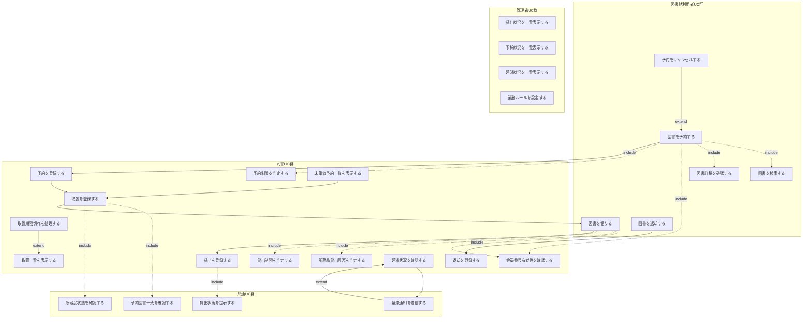
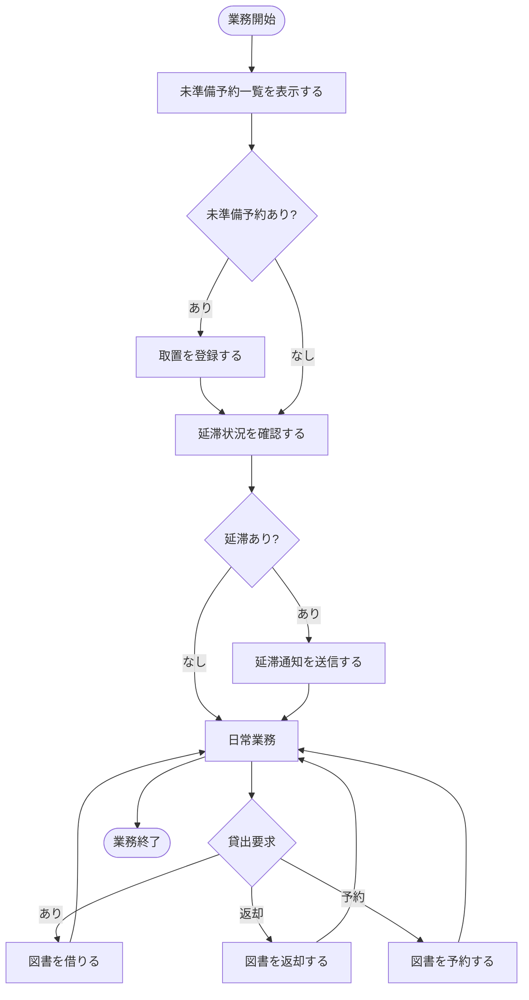
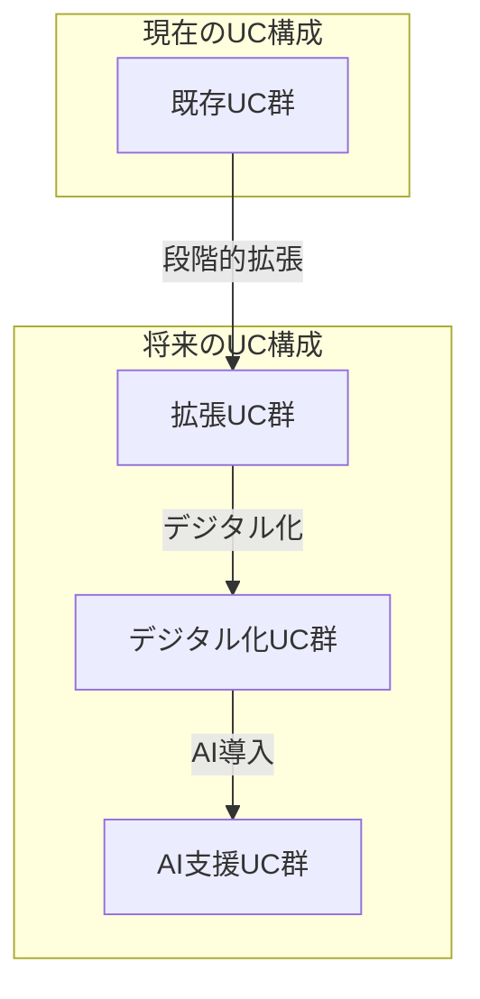

# UC複合図による関係整理

## ユースケース間関係・依存関係整理

### 1. UC複合図の概要

#### 1.1 分析方針
- **Include関係**: 共通機能の抽出とモジュール化
- **Extend関係**: 基本UCの拡張・特殊化
- **依存関係**: UC実行順序と前提条件
- **包含関係**: 複合UCの構成要素分析

#### 1.2 UC分類
- **基本UC**: 独立して実行可能な基本機能
- **共通UC**: 複数のUCから利用される共通機能
- **拡張UC**: 基本UCの特殊ケース・拡張機能
- **複合UC**: 複数UCを組み合わせた業務フロー

### 2. UC複合図



### 3. UC関係性詳細分析

#### 3.1 Include関係 (共通機能の抽出)

| 基本UC | Include先UC | 関係性の説明 | 共通度 | 再利用頻度 |
|--------|-------------|-------------|--------|------------|
| 図書を予約する | 図書を検索する | 予約前に図書を特定する必要 | 高 | 高 |
| 図書を予約する | 図書詳細を確認する | 予約対象の詳細確認が必要 | 中 | 中 |
| 図書を予約する | 会員番号有効性を確認する | 予約権限の確認が必要 | 高 | 高 |
| 図書を予約する | 予約制限を判定する | 予約可否の判定が必要 | 高 | 高 |
| 図書を借りる | 会員番号有効性を確認する | 貸出権限の確認が必要 | 高 | 高 |
| 図書を借りる | 所蔵品貸出可否を判定する | 図書の貸出可能性確認が必要 | 高 | 高 |
| 図書を借りる | 貸出制限を判定する | 貸出可否の判定が必要 | 高 | 高 |
| 貸出を登録する | 貸出状況を提示する | 貸出完了後の状況確認が必要 | 中 | 中 |
| 取置を登録する | 予約図書一致を確認する | 正しい図書の取置確認が必要 | 高 | 中 |
| 取置を登録する | 所蔵品状態を確認する | 取置可能状態の確認が必要 | 高 | 中 |

#### 3.2 Extend関係 (機能拡張)

| 基本UC | Extend元UC | 拡張条件 | 拡張内容 | 発生頻度 |
|--------|------------|----------|----------|----------|
| 図書を予約する | 予約をキャンセルする | 予約済み状態 | 既存予約の取消機能 | 中 |
| 取置一覧を表示する | 取置期限切れを処理する | 期限切れ検出 | 期限切れ予約の自動処理 | 低 |
| 延滞状況を確認する | 延滞通知を送信する | 延滞発生 | 延滞者への自動通知機能 | 中 |

#### 3.3 依存関係 (実行順序)

| 先行UC | 後続UC | 依存関係の種類 | 必須性 | 間隔 |
|--------|--------|----------------|--------|------|
| 図書を予約する | 予約を登録する | データ生成依存 | 必須 | 即座 |
| 図書を借りる | 貸出を登録する | データ生成依存 | 必須 | 即座 |
| 図書を返却する | 返却を登録する | データ生成依存 | 必須 | 即座 |
| 予約を登録する | 取置を登録する | 業務フロー依存 | 条件付き | 遅延 |
| 取置を登録する | 図書を借りる | 業務フロー依存 | 条件付き | 遅延 |
| 未準備予約一覧を表示する | 取置を登録する | 作業フロー依存 | 条件付き | 任意 |
| 延滞状況を確認する | 延滞通知を送信する | 業務フロー依存 | 条件付き | 任意 |

### 4. UC実行パターン分析

#### 4.1 基本実行パターン

##### パターン1: 直接貸出
```
図書を借りる → [include] 会員番号有効性を確認する
             → [include] 所蔵品貸出可否を判定する
             → [include] 貸出制限を判定する
             → 貸出を登録する
             → [include] 貸出状況を提示する
```

##### パターン2: 予約経由貸出
```
図書を予約する → [include] 図書を検索する
              → [include] 図書詳細を確認する
              → [include] 会員番号有効性を確認する
              → [include] 予約制限を判定する
              → 予約を登録する
              → 未準備予約一覧を表示する
              → 取置を登録する → [include] 予約図書一致を確認する
                              → [include] 所蔵品状態を確認する
              → 図書を借りる (パターン1と同様)
```

##### パターン3: 返却処理
```
図書を返却する → 返却を登録する
```

##### パターン4: 延滞管理
```
延滞状況を確認する → [extend] 延滞通知を送信する
```

#### 4.2 複合実行パターン

##### 司書の日常業務フロー


### 5. UC再利用性分析

#### 5.1 高再利用UC

| UC名 | 利用回数 | 利用UC | 再利用性レベル |
|------|----------|--------|----------------|
| 会員番号有効性を確認する | 5回 | 予約・貸出・返却・キャンセル・取置 | 最高 |
| 所蔵品状態を確認する | 3回 | 貸出・取置・管理 | 高 |
| 図書を検索する | 2回 | 予約・管理 | 中 |
| 貸出制限を判定する | 2回 | 貸出・取置貸出 | 中 |

#### 5.2 UC共通化効果

| 共通化UC | 削減効果 | 保守性向上 | 一貫性確保 |
|----------|----------|------------|------------|
| 会員番号有効性を確認する | 重複コード80%削減 | 単一箇所での変更 | 認証ロジック統一 |
| 所蔵品状態を確認する | 重複コード60%削減 | 状態管理の一元化 | 状態判定の統一 |
| 制限判定UC群 | 重複コード70%削減 | ルール変更の容易性 | 制限ロジック統一 |

### 6. UC関係の制約・ルール

#### 6.1 Include関係の制約

| 制約種別 | 制約内容 | 影響範囲 |
|----------|----------|----------|
| 実行順序制約 | Include先UCが先に実行される | 全Include関係 |
| 成功条件制約 | Include先UCが成功しないと基本UCは続行不可 | 必須Include |
| データ依存制約 | Include先UCの結果を基本UCで利用 | データ連携Include |
| 権限制約 | Include先UCで権限確認が必要 | 認証系Include |

#### 6.2 Extend関係の制約

| 制約種別 | 制約内容 | 影響範囲 |
|----------|----------|----------|
| 条件制約 | 特定条件下でのみExtend UCが実行 | 全Extend関係 |
| 独立性制約 | Extend UCの失敗は基本UCに影響しない | オプション機能 |
| 後処理制約 | 基本UC完了後にExtend UCが実行 | 後処理系Extend |

### 7. UC複合図の品質評価

#### 7.1 設計品質指標

| 指標 | 現在値 | 目標値 | 評価 |
|------|--------|--------|------|
| UC結合度 | 中 | 低 | 要改善 |
| UC凝集度 | 高 | 高 | 良好 |
| 再利用性 | 高 | 高 | 良好 |
| 保守性 | 高 | 高 | 良好 |
| 拡張性 | 中 | 高 | 要改善 |

#### 7.2 改善提案

##### 結合度の削減
- **現状**: 一部UCが密結合
- **改善**: インターフェース層の導入
- **効果**: UC間依存の疎結合化

##### 拡張性の向上
- **現状**: 新機能追加時の影響範囲が大きい
- **改善**: プラグイン機構の導入
- **効果**: 影響を局所化した機能拡張

### 8. UC実装との対応関係

#### 8.1 実装クラスとUCの対応

| UC分類 | 実装層 | 実装パターン |
|--------|--------|-------------|
| 基本UC | Application/Scenario | Command Pattern |
| 共通UC | Application/Service | Service Pattern |
| 拡張UC | Application/Service | Strategy Pattern |
| 管理UC | Presentation/Controller | MVC Pattern |

#### 8.2 UC関係の実装方式

| 関係種別 | 実装方式 | 実装場所 |
|----------|----------|----------|
| Include | メソッド呼び出し | Service Layer |
| Extend | イベント発火 | Event Handler |
| 依存 | ワークフロー制御 | Scenario Layer |

### 9. 将来拡張でのUC関係

#### 9.1 新UC候補

| 新UC名 | 既存UCとの関係 | Include/Extend |
|--------|----------------|----------------|
| 電子書籍を借りる | 図書を借りる | Extend |
| オンライン予約する | 図書を予約する | Extend |
| 自動延長する | 図書を借りる | Extend |
| 推薦図書を表示する | 図書を検索する | Extend |

#### 9.2 UC関係の進化



この分析により、UC間の複雑な関係性が明確化され、システムの構造的理解と将来拡張への道筋が示された。