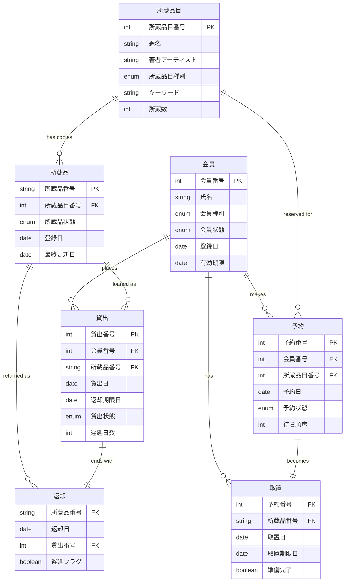
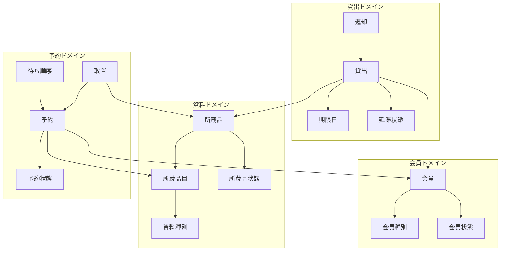

# 情報モデル構築

## エンティティ特定・関係性分析・概念モデル構築

### 1. 情報モデルの概要

#### 1.1 分析方針
- **ドメイン駆動設計**: DDDアーキテクチャに基づいたエンティティ分析
- **概念レベル**: ビジネス概念としての情報構造を重視
- **関係性重視**: エンティティ間の業務的関連性を明確化
- **集約設計**: 整合性境界と更新単位の特定

#### 1.2 情報分類
- **主要エンティティ**: 業務の核となる永続化情報
- **値オブジェクト**: エンティティの属性を表現する値
- **集約ルート**: 整合性境界を定義するエンティティ
- **関連オブジェクト**: エンティティ間の関係を表現

### 2. エンティティ関係図

### 3. 主要エンティティ詳細分析

#### 3.1 会員（Member）

| 属性名 | 型 | 必須 | 説明 | 業務ルール |
|--------|----|----|------|------------|
| 会員番号 | Integer | ○ | 会員の一意識別子 | システム自動採番 |
| 氏名 | String | ○ | 会員の氏名 | 50文字以内 |
| 会員種別 | Enum | ○ | 中学生以上/小学生以下 | 貸出制限の基準 |
| 会員状態 | Enum | ○ | 未登録/有効/無効 | 利用可否の判定基準 |

**関連エンティティ**:
- 貸出（1:N）- 一人の会員は複数の貸出を持つ
- 予約（1:N）- 一人の会員は複数の予約を持つ
- 取置（1:N）- 一人の会員は複数の取置を持つ

**業務制約**:
- 中学生以上：貸出上限20点、視聴覚資料5点
- 小学生以下：貸出上限15点、視聴覚資料5点
- 遅延15日以上で新規貸出停止

#### 3.2 所蔵品目（Entry）

| 属性名 | 型 | 必須 | 説明 | 業務ルール |
|--------|----|----|------|------------|
| 所蔵品目番号 | Integer | ○ | 品目の一意識別子 | システム自動採番 |
| 題名 | String | ○ | 資料の題名 | 100文字以内 |
| 著者アーティスト | String | ○ | 作者情報 | 100文字以内 |
| 所蔵品目種別 | Enum | ○ | 図書/視聴覚資料 | 制限適用の基準 |

**関連エンティティ**:
- 所蔵品（1:N）- 一つの品目は複数の所蔵品を持つ
- 予約（1:N）- 一つの品目は複数の予約を受ける

**業務制約**:
- 同一品目の複数所蔵品が存在可能
- 視聴覚資料は特別な貸出制限適用

#### 3.3 所蔵品（Item）

| 属性名 | 型 | 必須 | 説明 | 業務ルール |
|--------|----|----|------|------------|
| 所蔵品番号 | String | ○ | 個別資料の識別子 | バーコード等 |
| 所蔵品目番号 | Integer | ○ | 所属する品目への参照 | 外部キー制約 |
| 所蔵品状態 | Enum | ○ | 未登録/在庫中/予約中/取置中/貸出中/その他 | 利用可否の判定 |

**関連エンティティ**:
- 所蔵品目（N:1）- 所蔵品は一つの品目に属する
- 貸出（1:N）- 一つの所蔵品は複数回貸出される
- 返却（1:N）- 一つの所蔵品は複数回返却される

**状態遷移制約**:
- 在庫中 → 貸出中/予約中/取置中
- 貸出中 → 在庫中（返却時）
- 予約中 → 取置中 → 貸出中

#### 3.4 貸出（Loan）

| 属性名 | 型 | 必須 | 説明 | 業務ルール |
|--------|----|----|------|------------|
| 貸出番号 | Integer | ○ | 貸出の一意識別子 | システム自動採番 |
| 会員番号 | Integer | ○ | 借り手の会員への参照 | 外部キー制約 |
| 所蔵品番号 | String | ○ | 貸出対象の所蔵品への参照 | 外部キー制約 |
| 貸出日 | LocalDate | ○ | 貸出を実行した日 | 当日日付自動設定 |
| 返却期限日 | LocalDate | ○ | 返却すべき期限日 | 貸出日+15日-1日 |

**関連エンティティ**:
- 会員（N:1）- 貸出は一人の会員に属する
- 所蔵品（N:1）- 貸出は一つの所蔵品を対象とする
- 返却（1:1）- 貸出は一つの返却で終了する

**業務制約**:
- 貸出期間：最大15日間
- 会員種別により同時貸出数制限
- 延滞状態により新規貸出制限

#### 3.5 予約（Reservation）

| 属性名 | 型 | 必須 | 説明 | 業務ルール |
|--------|----|----|------|------------|
| 予約番号 | Integer | ○ | 予約の一意識別子 | システム自動採番 |
| 会員番号 | Integer | ○ | 予約者の会員への参照 | 外部キー制約 |
| 所蔵品目番号 | Integer | ○ | 予約対象の品目への参照 | 外部キー制約 |
| 予約日 | LocalDate | ○ | 予約を登録した日 | 当日日付自動設定 |
| 予約状態 | Enum | ○ | 未準備/消込済 | 処理状況の管理 |

**関連エンティティ**:
- 会員（N:1）- 予約は一人の会員に属する
- 所蔵品目（N:1）- 予約は一つの品目を対象とする
- 取置（1:1）- 予約は取置に変換される

**業務制約**:
- 予約上限：15点（視聴覚資料5点）
- 同一品目への重複予約可能
- 待ち順序により取置優先度決定

#### 3.6 取置（Retention）

| 属性名 | 型 | 必須 | 説明 | 業務ルール |
|--------|----|----|------|------------|
| 予約番号 | Integer | ○ | 元となる予約への参照 | 外部キー制約 |
| 所蔵品番号 | String | ○ | 取置対象の所蔵品への参照 | 外部キー制約 |
| 取置日 | LocalDate | ○ | 取置を準備した日 | 準備完了日自動設定 |
| 取置期限日 | LocalDate | ○ | 取置の期限日 | 取置日+7日 |

**関連エンティティ**:
- 予約（1:1）- 取置は一つの予約から生成される
- 所蔵品（N:1）- 取置は一つの所蔵品を対象とする

**業務制約**:
- 取置期間：最大7日間
- 期限切れで自動解放
- 利用者来館時に貸出移行

### 4. 値オブジェクト分析

#### 4.1 識別子系値オブジェクト

| 値オブジェクト名 | 基本型 | 説明 | 検証ルール |
|------------------|--------|------|------------|
| MemberNumber | Integer | 会員番号 | 正の整数 |
| EntryNumber | Integer | 所蔵品目番号 | 正の整数 |
| ItemNumber | String | 所蔵品番号 | 英数字、最大20文字 |
| LoanNumber | Integer | 貸出番号 | 正の整数 |
| ReservationNumber | Integer | 予約番号 | 正の整数 |

#### 4.2 名称系値オブジェクト

| 値オブジェクト名 | 基本型 | 説明 | 検証ルール |
|------------------|--------|------|------------|
| Name | String | 人名 | 1-50文字、必須 |
| Title | String | 図書題名 | 1-100文字、必須 |
| WorkOf | String | 著者・アーティスト | 1-100文字、必須 |
| Keyword | String | 検索キーワード | 任意文字列 |

#### 4.3 日付系値オブジェクト

| 値オブジェクト名 | 基本型 | 説明 | 計算ルール |
|------------------|--------|------|------------|
| LoanDate | LocalDate | 貸出日 | 当日日付 |
| DueDate | LocalDate | 返却期限日 | 貸出日+15日-1日 |
| ReturnDate | LocalDate | 返却日 | 当日日付 |
| RetainedDate | LocalDate | 取置日 | 当日日付 |
| ExpireDate | LocalDate | 取置期限日 | 取置日+7日 |

#### 4.4 期間系値オブジェクト

| 値オブジェクト名 | 基本型 | 説明 | 計算ルール |
|------------------|--------|------|------------|
| Days | Integer | 日数 | 日付差分計算 |
| DaysPeriod | Object | 日数期間 | 開始日と日数 |
| Months | Integer | 月数 | 月差分計算 |

#### 4.5 列挙型値オブジェクト

| 値オブジェクト名 | 取得可能値 | 説明 | 業務的意味 |
|------------------|------------|------|------------|
| MemberType | 中学生以上, 小学生以下 | 会員種別 | 貸出制限の基準 |
| MemberStatus | 未登録, 有効, 無効 | 会員状態 | 利用可否の判定 |
| EntryType | 図書, 視聴覚資料 | 資料種別 | 特別制限の適用 |
| ItemStatus | 未登録, 在庫中, 予約中, 取置中, 貸出中, その他 | 所蔵品状態 | 利用可否の判定 |
| ReservationStatus | 未準備, 消込済 | 予約状態 | 処理進行の管理 |
| DelayStatus | 遅延日数１５日未満, 遅延日数２ヶ月未満, 遅延日数２ヶ月以上 | 延滞レベル | 制限適用の基準 |

### 5. 集約設計分析

#### 5.1 会員集約

**集約ルート**: Member
**構成要素**: 
- Member（ルート）
- MemberNumber, Name, MemberType, MemberStatus（値オブジェクト）

**整合性ルール**:
- 会員の状態変更は会員集約内で完結
- 貸出・予約の追加は会員集約を経由
- 会員削除時は関連する貸出・予約の整合性確認

**業務不変条件**:
- 有効な会員のみが貸出・予約可能
- 会員種別に応じた制限の適用

#### 5.2 資料集約

**集約ルート**: Entry
**構成要素**:
- Entry（ルート）
- Items（所蔵品コレクション）
- EntryNumber, Title, WorkOf, EntryType（値オブジェクト）

**整合性ルール**:
- 所蔵品の追加・削除は品目集約内で管理
- 所蔵品状態の変更は集約境界を超えて通知
- 品目削除時は全所蔵品の状態確認

**業務不変条件**:
- 少なくとも一つの所蔵品が存在する品目のみ有効
- 所蔵品の状態は品目の利用可能性に影響

#### 5.3 貸出集約

**集約ルート**: Loan
**構成要素**:
- Loan（ルート）
- DueDate, DelayStatus（値オブジェクト）
- Returns（返却コレクション）

**整合性ルール**:
- 貸出の開始・終了は貸出集約内で完結
- 期限・延滞状態の計算は集約内で実行
- 返却時の状態更新は原子的に実行

**業務不変条件**:
- 一つの所蔵品は同時に一人にのみ貸出
- 貸出期間中は所蔵品状態が貸出中

#### 5.4 予約集約

**集約ルート**: Reservation
**構成要素**:
- Reservation（ルート）
- WaitingOrder（待ち順序）
- Retention（取置）

**整合性ルール**:
- 予約から取置への変換は予約集約内で管理
- 待ち順序の管理は集約境界内で完結
- 取置期限の管理は集約内で実行

**業務不変条件**:
- 同一品目への予約は待ち順序で管理
- 取置は予約から必ず生成される

### 6. 関連分析

#### 6.1 関連の種類と多重度

| 関連名 | 元エンティティ | 先エンティティ | 多重度 | 関連種別 |
|--------|----------------|----------------|--------|----------|
| 会員貸出関連 | Member | Loan | 1:N | 集約間参照 |
| 会員予約関連 | Member | Reservation | 1:N | 集約間参照 |
| 品目所蔵品関連 | Entry | Item | 1:N | 集約内包含 |
| 品目予約関連 | Entry | Reservation | 1:N | 集約間参照 |
| 所蔵品貸出関連 | Item | Loan | 1:N | 集約間参照 |
| 所蔵品返却関連 | Item | Returned | 1:N | 集約間参照 |
| 予約取置関連 | Reservation | Retention | 1:1 | 集約内包含 |
| 貸出返却関連 | Loan | Returned | 1:1 | 集約内包含 |

#### 6.2 参照整合性制約

| 制約名 | 制約内容 | 実装方式 |
|--------|----------|----------|
| 会員存在制約 | 貸出・予約は有効な会員のみ | 外部キー制約 + ドメインルール |
| 所蔵品存在制約 | 貸出・取置は存在する所蔵品のみ | 外部キー制約 + 状態確認 |
| 品目存在制約 | 予約は存在する品目のみ | 外部キー制約 |
| 状態整合性制約 | 所蔵品状態と貸出状態の整合 | ドメインサービス |
| 期限整合性制約 | 貸出期限と返却日の関係 | 値オブジェクト |

### 7. データ関係性図

### 8. 情報モデルの品質評価

#### 8.1 正規化レベル

| エンティティ | 正規化レベル | 評価 | 改善点 |
|-------------|-------------|------|--------|
| Member | 第3正規形 | 良好 | - |
| Entry | 第3正規形 | 良好 | - |
| Item | 第3正規形 | 良好 | - |
| Loan | 第3正規形 | 良好 | - |
| Reservation | 第3正規形 | 良好 | - |
| Retention | 第3正規形 | 良好 | - |

#### 8.2 モデル品質指標

| 指標 | 現在値 | 目標値 | 評価 |
|------|--------|--------|------|
| エンティティ数 | 7 | 5-10 | 適切 |
| 関連数 | 8 | 8-15 | 適切 |
| 集約数 | 4 | 3-7 | 適切 |
| 値オブジェクト数 | 20 | 15-30 | 適切 |
| 循環参照 | 0 | 0 | 良好 |

#### 8.3 拡張性評価

| 拡張観点 | 対応度 | 説明 |
|----------|--------|------|
| 新資料種別追加 | 高 | EntryType列挙型の拡張で対応 |
| 新会員種別追加 | 高 | MemberType列挙型とルールの拡張 |
| 電子書籍対応 | 中 | Item概念の拡張が必要 |
| 延長機能追加 | 高 | Loan集約内での機能追加 |
| 複数館対応 | 低 | 全体アーキテクチャの見直しが必要 |

### 9. 将来拡張での情報モデル進化

#### 9.1 段階的拡張計画

**第1段階**: 機能拡張
- 貸出延長機能（Loan集約内拡張）
- 督促機能（新たな集約追加）
- 統計機能（読み取り専用モデル）

**第2段階**: デジタル化対応
- 電子書籍エンティティ追加
- デジタルライセンス管理
- 利用ログ追跡

**第3段階**: マルチテナント対応
- 図書館エンティティ追加
- テナント境界の設計
- データ分離戦略

#### 9.2 技術進化への対応

この情報モデル分析により、図書館管理システムの情報構造が明確化され、保守性と拡張性を確保した設計基盤が構築された。