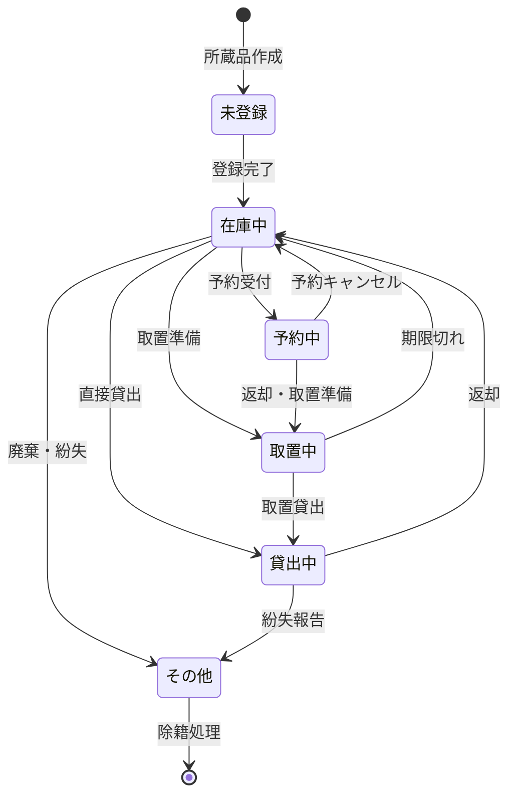
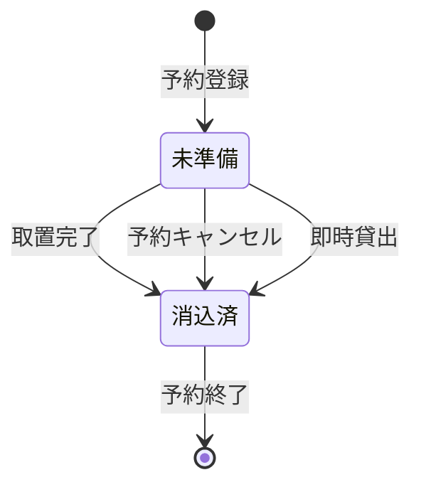
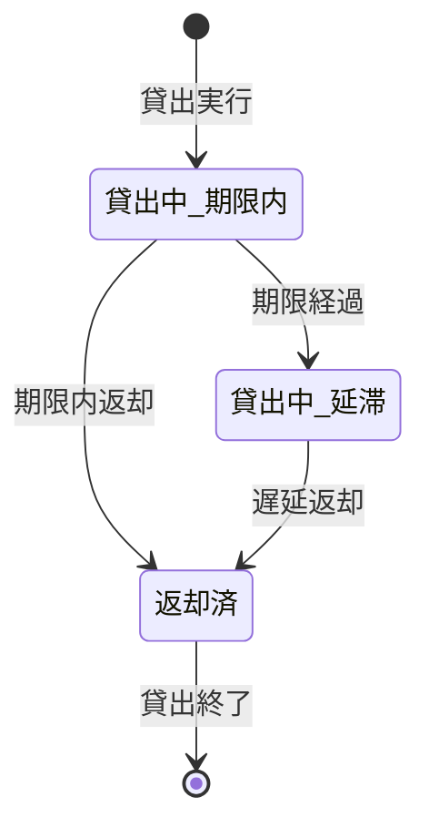
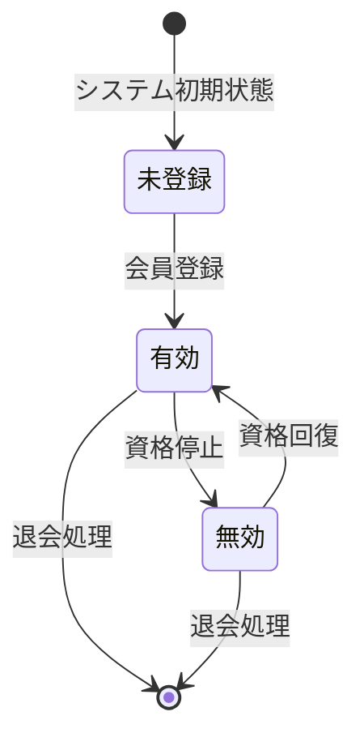
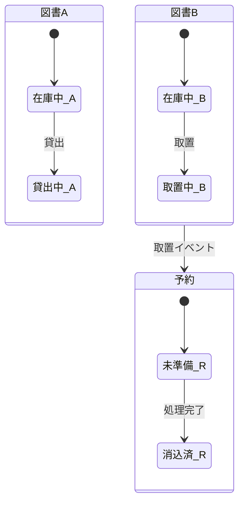
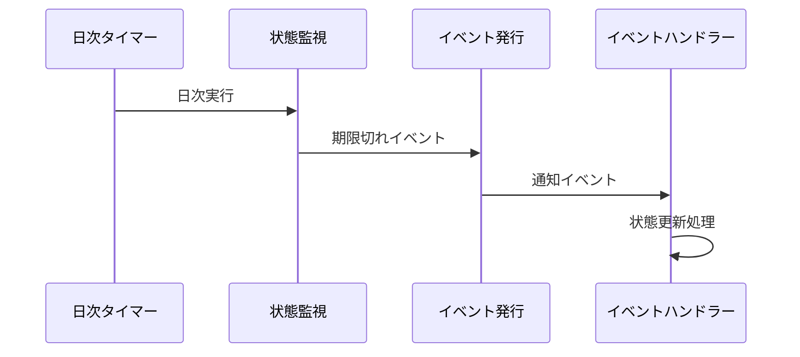

# 状態モデル定義

## 状態遷移特定・ビジネスイベント分析

### 1. 状態モデルの概要

#### 1.1 分析方針
- **ライフサイクル中心**: エンティティの生存期間を通じた状態変化を分析
- **ビジネスイベント駆動**: 業務イベントによる状態遷移を特定
- **制約明確化**: 状態遷移の前提条件・事後条件を定義
- **並行性考慮**: 複数状態の同時管理と整合性確保

#### 1.2 状態モデル対象
- **所蔵品状態**: 在庫管理の核となる状態遷移
- **予約状態**: 予約プロセスの進行管理
- **貸出状態**: 貸出ライフサイクルの管理
- **会員状態**: 会員資格の管理

### 2. 主要状態遷移図

#### 2.1 所蔵品状態遷移



#### 2.2 予約状態遷移



#### 2.3 貸出状態遷移



#### 2.4 会員状態遷移



### 3. 状態詳細分析

#### 3.1 所蔵品状態モデル

| 状態名 | 説明 | 許可される操作 | 遷移先候補 | 滞在条件 |
|--------|------|----------------|------------|----------|
| 未登録 | システムに登録されていない | 登録 | 在庫中 | 物理的存在のみ |
| 在庫中 | 利用可能な状態 | 貸出、予約、取置 | 貸出中、予約中、取置中、その他 | 図書館内に存在 |
| 貸出中 | 利用者に貸出済み | 返却 | 在庫中、その他 | 貸出記録が存在 |
| 予約中 | 予約待ちの状態 | 取置準備、予約キャンセル | 取置中、在庫中 | 予約記録が存在 |
| 取置中 | 予約者のために取置済み | 取置貸出、期限切れ処理 | 貸出中、在庫中 | 取置記録が存在 |
| その他 | 廃棄・紛失等 | 除籍 | 終了 | 特殊状況 |

#### 3.2 予約状態モデル

| 状態名 | 説明 | 許可される操作 | 遷移先候補 | 滞在条件 |
|--------|------|----------------|------------|----------|
| 未準備 | 予約登録済み、準備待ち | 取置準備、キャンセル、即時貸出 | 消込済 | 対象所蔵品が貸出中 |
| 消込済 | 予約処理完了 | 履歴確認 | 終了 | 処理完了 |

#### 3.3 貸出状態モデル

| 状態名 | 説明 | 許可される操作 | 遷移先候補 | 滞在条件 |
|--------|------|----------------|------------|----------|
| 貸出中_期限内 | 期限内の正常貸出 | 返却、期限確認 | 返却済、貸出中_延滞 | 返却期限日まで |
| 貸出中_延滞 | 期限超過の延滞状態 | 返却、督促 | 返却済 | 返却期限日経過 |
| 返却済 | 返却完了 | 履歴確認 | 終了 | 返却処理完了 |

#### 3.4 会員状態モデル

| 状態名 | 説明 | 許可される操作 | 遷移先候補 | 滞在条件 |
|--------|------|----------------|------------|----------|
| 未登録 | システム未登録 | 新規登録 | 有効 | 登録前状態 |
| 有効 | 正常な会員 | 貸出、予約、情報更新 | 無効、退会 | 会員資格有効 |
| 無効 | 資格停止中 | 情報確認、資格回復 | 有効、退会 | 制裁・問題発生 |

### 4. ビジネスイベント分析

#### 4.1 状態変更イベント

| イベント名 | 発生タイミング | 影響エンティティ | 状態変更 | トリガー |
|------------|----------------|------------------|----------|----------|
| 貸出実行 | 貸出手続き完了時 | 所蔵品、貸出 | 在庫中→貸出中、[新規]→貸出中_期限内 | 司書操作 |
| 返却実行 | 返却手続き完了時 | 所蔵品、貸出 | 貸出中→在庫中、貸出中_*→返却済 | 司書操作 |
| 予約登録 | 予約申込完了時 | 予約 | [新規]→未準備 | 利用者/司書操作 |
| 取置準備 | 所蔵品準備完了時 | 所蔵品、予約 | 在庫中→取置中、未準備→消込済 | 司書操作 |
| 期限経過 | 日付変更時 | 貸出 | 貸出中_期限内→貸出中_延滞 | システム自動 |
| 取置期限切れ | 期限日経過時 | 所蔵品、予約 | 取置中→在庫中、未準備→消込済 | システム自動 |
| 会員登録 | 新規会員登録時 | 会員 | 未登録→有効 | 司書操作 |
| 資格停止 | 制裁措置時 | 会員 | 有効→無効 | 管理者操作 |

#### 4.2 イベント詳細分析

##### 貸出実行イベント
```
前提条件:
- 会員状態 = 有効
- 所蔵品状態 = 在庫中
- 貸出制限 = 制限内

処理内容:
1. 貸出番号を採番
2. 貸出レコードを作成
3. 所蔵品状態を「貸出中」に変更
4. 返却期限日を計算・設定

事後条件:
- 貸出状態 = 貸出中_期限内
- 所蔵品状態 = 貸出中
- 会員の貸出数が1増加
```

##### 取置準備イベント
```
前提条件:
- 予約状態 = 未準備
- 所蔵品状態 = 在庫中
- 対象所蔵品と予約品目が一致

処理内容:
1. 取置レコードを作成
2. 所蔵品状態を「取置中」に変更
3. 予約状態を「消込済」に変更
4. 利用者に通知を送信

事後条件:
- 所蔵品状態 = 取置中
- 予約状態 = 消込済
- 取置期限日が設定される
```

##### 期限経過イベント
```
前提条件:
- 貸出状態 = 貸出中_期限内
- 現在日付 > 返却期限日

処理内容:
1. 貸出状態を「貸出中_延滞」に変更
2. 延滞日数を計算
3. 延滞レベルを判定
4. 必要に応じて督促処理

事後条件:
- 貸出状態 = 貸出中_延滞
- 延滞状況が記録される
- 督促対象に追加される
```

### 5. 複合状態管理

#### 5.1 所蔵品の複合状態

| 所蔵品状態 | 貸出状態 | 予約状態 | 複合状態説明 |
|------------|----------|----------|-------------|
| 在庫中 | - | - | 完全利用可能 |
| 在庫中 | - | 未準備 | 予約待ち（他の所蔵品が貸出中） |
| 貸出中 | 貸出中_期限内 | - | 正常貸出中 |
| 貸出中 | 貸出中_延滞 | - | 延滞貸出中 |
| 取置中 | - | 消込済 | 予約者のため取置中 |
| 予約中 | - | 未準備 | この所蔵品への予約中（不整合状態） |

#### 5.2 状態整合性ルール

| ルール名 | 制約内容 | 違反時の処理 |
|----------|----------|-------------|
| 貸出排他制約 | 一つの所蔵品は同時に一人にのみ貸出 | 二重貸出検出・エラー |
| 状態一貫性制約 | 所蔵品状態と貸出状態の一致 | 状態同期処理 |
| 期限整合性制約 | 期限日と状態の一致 | 期限再計算 |
| 予約順序制約 | 予約順序による取置優先度 | 順序再整理 |

### 6. 状態遷移制約

#### 6.1 禁止遷移

| 元状態 | 先状態 | 禁止理由 | 代替手順 |
|--------|--------|----------|----------|
| 貸出中 | 予約中 | 論理的矛盾 | 返却→予約 |
| 取置中 | 予約中 | 業務フロー違反 | 期限切れ→予約 |
| その他 | 在庫中 | 物理的不可能 | 再登録処理 |
| 返却済 | 貸出中_期限内 | 過去の状態への戻り | 新規貸出 |

#### 6.2 条件付き遷移

| 遷移 | 実行条件 | 条件不成立時の処理 |
|------|----------|-------------------|
| 在庫中→貸出中 | 会員有効 AND 制限内 | エラーメッセージ表示 |
| 在庫中→予約中 | 他の所蔵品が貸出中 | 即座に貸出案内 |
| 未準備→消込済 | 対象所蔵品が在庫中 | 待機継続 |
| 有効→無効 | 管理者権限 | 権限エラー |

### 7. 並行状態管理

#### 7.1 同時発生可能な状態変更



#### 7.2 排他制御が必要な操作

| 操作名 | 排他対象 | 排他レベル | 理由 |
|--------|----------|------------|------|
| 貸出実行 | 所蔵品 | 行レベル | 二重貸出防止 |
| 取置準備 | 所蔵品 | 行レベル | 二重取置防止 |
| 予約登録 | 会員 | なし | 同時予約許可 |
| 返却処理 | 所蔵品、貸出 | 行レベル | 状態整合性確保 |

### 8. 状態監視・通知

#### 8.1 状態監視ポイント

| 監視対象 | 監視条件 | 通知タイミング | 通知内容 |
|----------|----------|----------------|----------|
| 貸出期限 | 期限日-1日 | 日次バッチ | 期限前通知 |
| 延滞状況 | 期限日+1日 | 日次バッチ | 延滞通知 |
| 取置期限 | 期限日-1日 | 日次バッチ | 期限前通知 |
| 取置期限切れ | 期限日経過 | 日次バッチ | 期限切れ処理 |

#### 8.2 イベント通知システム



### 9. 状態履歴管理

#### 9.1 履歴記録対象

| エンティティ | 記録対象状態 | 保存期間 | 用途 |
|-------------|-------------|----------|------|
| 所蔵品 | 全状態変更 | 無期限 | 利用履歴分析 |
| 貸出 | 開始・終了・延滞 | 3年 | 利用統計 |
| 予約 | 登録・取置・消込 | 1年 | 予約分析 |
| 会員 | 登録・停止・復帰 | 無期限 | 会員管理 |

#### 9.2 履歴データ構造

```
状態履歴 {
    エンティティID: String
    エンティティ種別: Enum
    変更前状態: String
    変更後状態: String
    変更日時: DateTime
    変更理由: String
    変更者: String
    関連情報: JSON
}
```

### 10. 状態モデルの品質評価

#### 10.1 状態モデル品質指標

| 指標 | 現在値 | 目標値 | 評価 |
|------|--------|--------|------|
| 状態数 | 16 | 10-20 | 適切 |
| 遷移数 | 22 | 15-30 | 適切 |
| 禁止遷移数 | 4 | 3-8 | 適切 |
| 並行状態 | 2 | 1-5 | 適切 |
| 複合状態 | 6 | 3-10 | 適切 |

#### 10.2 改善提案

| 改善項目 | 現状課題 | 改善案 | 効果 |
|----------|----------|--------|------|
| 状態遷移の可視化 | 複雑な遷移ルール | 状態遷移表の活用 | 理解容易性向上 |
| 異常状態の検出 | 手動監視 | 自動監視機能 | 運用効率化 |
| 履歴データの活用 | 分析不足 | ダッシュボード整備 | 業務改善 |

この状態モデル分析により、図書館システムの動的な振る舞いが明確化され、状態管理の品質と信頼性が向上する基盤が構築された。