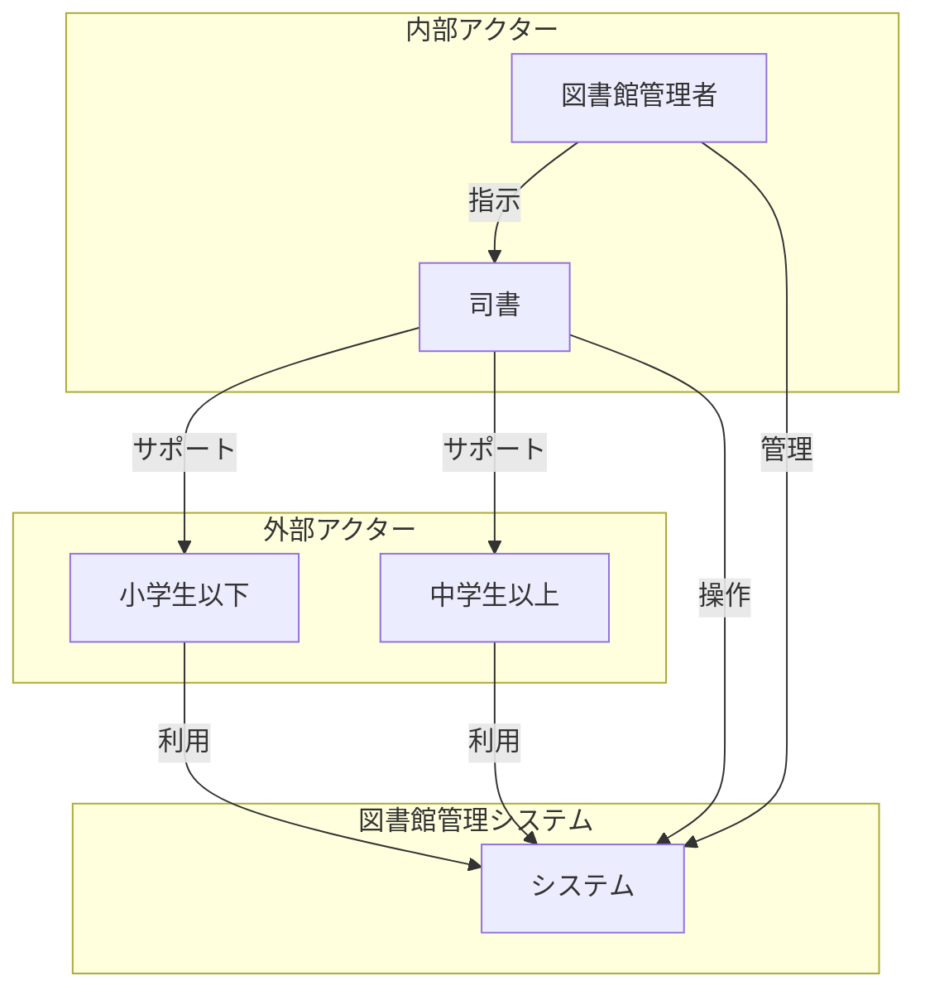

# アクターシート

## 図書館管理システムのアクター定義

### アクターシート

| アクター群 | アクター | 説明 |
|-------|------|----|
| 図書館利用者 | 小学生以下 | 12歳以下の図書館利用者。貸出上限15点、視聴覚資料5点まで。15日間の貸出期間。 |
| 図書館利用者 | 中学生以上 | 13歳以上の図書館利用者。貸出上限20点、視聴覚資料5点まで。15日間の貸出期間。 |
| 図書館職員 | 司書 | 日常的な図書館業務を担当。貸出・返却・予約・取置業務の実行者。 |
| 図書館職員 | 図書館管理者 | 図書館運営の責任者。延滞管理・督促業務・業務ルール設定を担当。 |

### アクター詳細情報

#### 図書館利用者群

##### 小学生以下
- **年齢範囲**: 0歳～12歳
- **利用制限**: 
  - 一般図書：15点まで
  - 視聴覚資料：5点まで
  - 貸出期間：15日間
  - 予約上限：15点まで（視聴覚資料5点まで）
- **主要ジョブ**: 
  - 図書を借りる
  - 図書を予約する
  - 図書を返却する
  - 予約をキャンセルする
- **利用可能サービス**: 貸出、返却、予約、キャンセル
- **制限事項**: 年齢による貸出冊数制限、延滞による利用制限

##### 中学生以上
- **年齢範囲**: 13歳以上
- **利用制限**: 
  - 一般図書：20点まで
  - 視聴覚資料：5点まで
  - 貸出期間：15日間
  - 予約上限：15点まで（視聴覚資料5点まで）
- **主要ジョブ**: 
  - 図書を借りる
  - 図書を予約する
  - 図書を返却する
  - 予約をキャンセルする
- **利用可能サービス**: 貸出、返却、予約、キャンセル
- **制限事項**: 延滞による利用制限（年齢制限は緩和）

#### 図書館職員群

##### 司書
- **役割**: 日常業務の実行者
- **権限**: 
  - 貸出・返却処理
  - 予約・取置処理
  - 会員情報確認
  - 延滞状況確認
- **主要ジョブ**: 
  - 貸出業務を管理する
  - 予約業務を管理する
  - 取置業務を管理する
  - 返却業務を管理する
  - 延滞管理を行う
- **利用可能システム**: 図書館管理システム全機能
- **責任範囲**: カウンター業務、利用者対応

##### 図書館管理者
- **役割**: 運営管理責任者
- **権限**: 
  - 全システム機能へのアクセス
  - 業務ルール設定・変更
  - 会員資格の停止・回復
  - システム設定変更
- **主要ジョブ**: 
  - システム全体を監視・管理する
  - 業務ルールを管理する
- **利用可能システム**: 図書館管理システム全機能＋管理機能
- **責任範囲**: 図書館運営全般、政策実行

### アクター関係図

### アクター特性分析

#### 利用頻度と重要度

| アクター | 利用頻度 | 重要度 | システムへの影響度 | 備考 |
|---------|----------|--------|------------------|------|
| 小学生以下 | 高 | 高 | 中 | 主要利用者層 |
| 中学生以上 | 高 | 高 | 中 | 主要利用者層 |
| 司書 | 最高 | 最高 | 最高 | システム主要操作者 |
| 図書館管理者 | 中 | 最高 | 高 | システム運営責任者 |

#### アクター間の相互作用

| 関係 | 相互作用の内容 | 頻度 | 重要度 |
|------|----------------|------|--------|
| 司書 ⇔ 利用者 | 貸出・返却・予約の窓口対応 | 日常的 | 高 |
| 管理者 ⇔ 司書 | 業務指示・問題解決・ルール伝達 | 定期的 | 高 |
| 管理者 ⇔ 利用者 | 問題対応・制裁措置・特例処理 | 例外的 | 中 |
| 利用者同士 | 予約待ち・図書推薦（間接的） | 間接的 | 低 |

### アクターのペルソナ分析

#### 小学生以下の典型例
- **名前**: 田中太郎（8歳）
- **利用パターン**: 放課後・休日に保護者と来館
- **主な関心**: 絵本、児童書、図鑑
- **技術レベル**: 基本操作のみ（保護者サポート必要）
- **利用頻度**: 週1-2回
- **特別な配慮**: 簡単な操作、視覚的な案内が必要

#### 中学生以上の典型例
- **名前**: 佐藤花子（16歳）
- **利用パターン**: 学校帰り・テスト期間に集中利用
- **主な関心**: 学習参考書、小説、専門書
- **技術レベル**: 高い（自立した利用が可能）
- **利用頻度**: 週2-3回
- **特別な配慮**: 効率的な操作、豊富な情報提供

#### 司書の典型例
- **名前**: 山田一郎（35歳）
- **経験年数**: 10年
- **スキルレベル**: エキスパート
- **業務パターン**: 日中のカウンター業務、夕方の事務処理
- **関心事**: 効率的な業務処理、利用者満足度向上
- **システム要求**: 迅速な処理、直感的な操作、エラー回復機能

#### 図書館管理者の典型例
- **名前**: 鈴木次郎（50歳）
- **経験年数**: 20年
- **スキルレベル**: 上級者
- **業務パターン**: 朝の業務確認、月末の統計確認、問題対応
- **関心事**: 図書館運営の最適化、政策実現、品質管理
- **システム要求**: 包括的な情報、分析機能、設定変更の柔軟性

### アクターの成功指標

#### 利用者（小学生以下・中学生以上）
- **満足度**: 希望する図書の借用成功率 95%以上
- **利便性**: 予約から貸出までの平均期間 3日以内
- **学習効果**: 図書館利用による学習成果の向上
- **継続利用**: 年間利用回数の維持・増加

#### 司書
- **効率性**: 一件あたりの処理時間短縮 20%
- **正確性**: 処理エラー率 1%以下
- **利用者対応**: 利用者からの満足度評価 4.5/5.0以上
- **業務負荷**: 残業時間の削減

#### 図書館管理者
- **運営効率**: 全体的な業務効率の向上 15%
- **コンプライアンス**: 業務ルールの100%適用
- **品質管理**: サービス品質の一定水準維持
- **戦略実現**: 図書館政策の確実な実行

### アクターのリスク要因

#### 利用者関連リスク
- **操作ミス**: 不適切な予約・キャンセル操作
- **制限違反**: 意図的・非意図的な制限違反
- **苦情・要望**: サービスレベルへの不満
- **利用減少**: デジタル化による図書館離れ

#### 職員関連リスク
- **操作ミス**: 重要な業務処理でのエラー
- **権限乱用**: 不適切な権限行使
- **スキル不足**: システム変更への対応遅れ
- **人員不足**: 業務負荷の増大

### アクター進化の可能性

#### 短期的変化（1-2年）
- **利用者**: デジタルネイティブ世代の増加
- **司書**: システム習熟度の向上
- **管理者**: データ活用スキルの向上

#### 中期的変化（3-5年）
- **利用者**: オンライン予約の一般化
- **司書**: AIサポート機能の活用
- **管理者**: 予測分析による運営最適化

#### 長期的変化（5年以上）
- **利用者**: 完全デジタル化への適応
- **司書**: 高度な相談業務への特化
- **管理者**: 戦略立案・政策策定への集中

このアクター分析により、図書館管理システムの利用者特性と要求が明確化され、各アクターに最適化されたシステム設計の基盤が構築された。