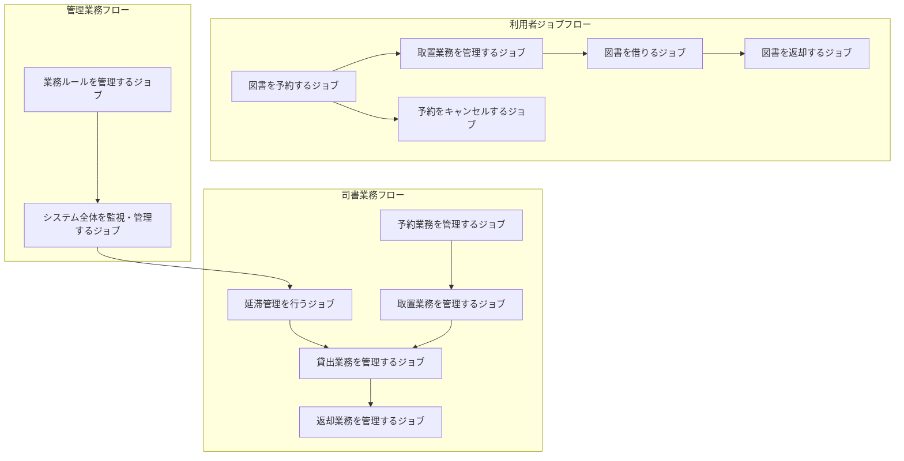

# BUCシート

## 図書館管理システムのビジネスユースケース定義

### BUCシート

| 業務 | BUC | 先 | アクティビティ | 次 | UC | 関連モデル1 | 関連オブジェクト | 関連モデル2 | 関連オブジェクト２ | 説明 |
|------|-----|---|------------|---|----|---------|-----------|---------|---------|----|
| 図書利用 | 図書を借りるジョブ |  | 図書館に来館する | ↓ |  |  |  | アクター | 図書館利用者 | 利用者が必要な図書を借りて学習・娯楽に活用するジョブ |
| 図書利用 | 図書を借りるジョブ |  | 書架から図書を選択する | ↓ |  |  |  |  |  | 必要な図書を物理的に選択する |
| 図書利用 | 図書を借りるジョブ |  | カウンターで貸出を申し込む | ↓ | 会員番号有効性を確認する | 画面 | 貸出申込画面 | アクター | 司書 | 司書による貸出手続きの開始 |
| 図書利用 | 図書を借りるジョブ |  |  |  | 所蔵品貸出可否を判定する | 情報 | 所蔵品情報 |  |  | 選択した図書の貸出可能性を確認 |
| 図書利用 | 図書を借りるジョブ |  |  |  | 貸出制限を判定する | 情報 | 会員情報 |  |  | 会員の貸出制限状況を確認 |
| 図書利用 | 図書を借りるジョブ |  |  |  |  | 条件 | 年齢別貸出制限 |  |  | 会員種別による制限の適用 |
| 図書利用 | 図書を借りるジョブ |  |  |  |  | 条件 | 視聴覚資料制限 |  |  | 視聴覚資料の特別制限適用 |
| 図書利用 | 図書を借りるジョブ |  |  |  |  | 条件 | 延滞制限 |  |  | 延滞状況による制限適用 |
| 図書利用 | 図書を借りるジョブ |  | 貸出処理を完了する |  | 貸出を登録する | 情報 | 貸出情報 |  |  | 貸出記録の正式登録 |
| 図書利用 | 図書を借りるジョブ |  |  |  | 貸出状況を提示する | 画面 | 貸出完了画面 |  |  | 貸出完了の確認情報提示 |
| 図書利用 | 図書を借りるジョブ |  | 図書を持ち帰る |  |  |  |  |  |  | 利用者による図書の受け取り |
| 図書予約 | 図書を予約するジョブ |  | 必要な図書を検索する | ↓ | 図書を検索する | 画面 | 図書検索画面 | アクター | 図書館利用者 | 貸出中図書の予約による確実な利用確保ジョブ |
| 図書予約 | 図書を予約するジョブ |  |  |  |  | 情報 | 所蔵品目情報 |  |  | 検索対象となる図書情報 |
| 図書予約 | 図書を予約するジョブ |  | 予約したい図書を選択する | ↓ | 図書詳細を確認する | 画面 | 図書詳細画面 |  |  | 予約対象図書の詳細確認 |
| 図書予約 | 図書を予約するジョブ |  | 予約を申し込む | ↓ | 会員番号有効性を確認する | 画面 | 予約申込画面 | アクター | 司書 | 予約手続きの開始 |
| 図書予約 | 図書を予約するジョブ |  |  |  | 予約制限を判定する | 情報 | 会員情報 |  |  | 会員の予約制限状況確認 |
| 図書予約 | 図書を予約するジョブ |  |  |  |  | 条件 | 予約冊数制限 |  |  | 予約可能冊数の制限適用 |
| 図書予約 | 図書を予約するジョブ |  | 予約処理を完了する |  | 予約を登録する | 情報 | 予約情報 |  |  | 予約記録の正式登録 |
| 図書予約 | 図書を予約するジョブ |  |  |  |  | 情報 | 待ち順序情報 |  |  | 予約待ち順序の管理 |
| 図書返却 | 図書を返却するジョブ |  | 図書館に来館する | ↓ |  |  |  | アクター | 図書館利用者 | 借りた図書を適切に返却するジョブ |
| 図書返却 | 図書を返却するジョブ |  | カウンターで返却を申し込む | ↓ | 返却を登録する | 画面 | 返却処理画面 | アクター | 司書 | 返却手続きの実行 |
| 図書返却 | 図書を返却するジョブ |  |  |  |  | 情報 | 貸出情報 |  |  | 返却対象の貸出記録 |
| 図書返却 | 図書を返却するジョブ |  |  |  |  | 情報 | 返却情報 |  |  | 返却記録の作成 |
| 図書返却 | 図書を返却するジョブ |  | 返却処理を完了する |  |  |  |  |  |  | 返却手続きの完了 |
| 予約管理 | 予約をキャンセルするジョブ |  | 予約状況を確認する | ↓ | 予約状況を確認する | 画面 | 予約確認画面 | アクター | 図書館利用者 | 不要になった予約を取り消すジョブ |
| 予約管理 | 予約をキャンセルするジョブ |  |  |  |  | 情報 | 予約情報 |  |  | キャンセル対象の予約記録 |
| 予約管理 | 予約をキャンセルするジョブ |  | キャンセルを申し込む |  | 予約をキャンセルする | 画面 | 予約キャンセル画面 | アクター | 司書 | キャンセル処理の実行 |
| 貸出業務 | 貸出業務を管理するジョブ |  | 貸出申込を受け付ける | ↓ | 会員番号有効性を確認する | 画面 | 貸出管理画面 | アクター | 司書 | 司書による効率的な貸出業務の実行ジョブ |
| 貸出業務 | 貸出業務を管理するジョブ |  | 貸出可否を判定する | ↓ | 所蔵品貸出可否を判定する | 情報 | 所蔵品情報 |  |  | 資料の貸出可能性確認 |
| 貸出業務 | 貸出業務を管理するジョブ |  |  |  | 貸出制限を判定する | 情報 | 貸出制限情報 |  |  | 会員の制限状況確認 |
| 貸出業務 | 貸出業務を管理するジョブ |  | 貸出を実行する |  | 貸出を登録する | 情報 | 貸出情報 |  |  | 貸出記録の作成 |
| 貸出業務 | 貸出業務を管理するジョブ |  |  |  | 貸出状況を提示する | 画面 | 貸出状況画面 |  |  | 貸出完了の確認 |
| 予約業務 | 予約業務を管理するジョブ |  | 予約申込を受け付ける | ↓ | 図書を検索する | 画面 | 予約管理画面 | アクター | 司書 | 司書による効率的な予約業務の実行ジョブ |
| 予約業務 | 予約業務を管理するジョブ |  | 予約可否を判定する | ↓ | 会員番号有効性を確認する | 情報 | 会員情報 |  |  | 予約者の有効性確認 |
| 予約業務 | 予約業務を管理するジョブ |  |  |  | 予約制限を判定する | 情報 | 予約制限情報 |  |  | 予約制限の確認 |
| 予約業務 | 予約業務を管理するジョブ |  | 予約を実行する |  | 予約を登録する | 情報 | 予約情報 |  |  | 予約記録の作成 |
| 取置業務 | 取置業務を管理するジョブ |  | 未準備予約を確認する | ↓ | 未準備予約一覧を表示する | 画面 | 取置管理画面 | アクター | 司書 | 司書による効率的な取置業務の実行ジョブ |
| 取置業務 | 取置業務を管理するジョブ |  |  |  |  | 情報 | 予約情報 |  |  | 取置対象の予約確認 |
| 取置業務 | 取置業務を管理するジョブ |  | 予約図書を準備する | ↓ | 予約図書一致を確認する | 情報 | 所蔵品情報 |  |  | 正しい図書の取り出し |
| 取置業務 | 取置業務を管理するジョブ |  |  |  | 所蔵品状態を確認する |  |  |  |  | 取置可能状態の確認 |
| 取置業務 | 取置業務を管理するジョブ |  | 取置を登録する |  | 取置を登録する | 情報 | 取置情報 |  |  | 取置記録の作成 |
| 取置業務 | 取置業務を管理するジョブ |  |  |  |  | イベント | 利用者通知 | 外部システム | 通知システム | 予約者への取置完了通知 |
| 取置業務 | 取置業務を管理するジョブ |  | 取置を管理する | ↓ | 取置一覧を表示する | 画面 | 取置一覧画面 |  |  | 取置状況の管理 |
| 取置業務 | 取置業務を管理するジョブ |  | 取置期限を管理する |  | 取置期限切れを処理する |  |  |  |  | 期限切れの自動処理 |
| 返却業務 | 返却業務を管理するジョブ |  | 返却申込を受け付ける | ↓ | 返却を登録する | 画面 | 返却管理画面 | アクター | 司書 | 司書による効率的な返却業務の実行ジョブ |
| 返却業務 | 返却業務を管理するジョブ |  |  |  |  | 情報 | 貸出情報 |  |  | 返却対象の貸出確認 |
| 返却業務 | 返却業務を管理するジョブ |  |  |  |  | 情報 | 返却情報 |  |  | 返却記録の作成 |
| 返却業務 | 返却業務を管理するジョブ |  | 次の予約を確認する |  | 予約状況を確認する | 情報 | 予約情報 |  |  | 返却後の予約処理 |
| 延滞管理 | 延滞管理を行うジョブ |  | 延滞状況を確認する | ↓ | 延滞状況を確認する | 画面 | 延滞管理画面 | アクター | 司書 | 司書による延滞の適切な管理ジョブ |
| 延滞管理 | 延滞管理を行うジョブ |  |  |  |  | 情報 | 貸出情報 |  |  | 延滞対象の貸出確認 |
| 延滞管理 | 延滞管理を行うジョブ |  |  |  |  | 条件 | 延滞期間判定 |  |  | 延滞レベルの判定 |
| 延滞管理 | 延滞管理を行うジョブ |  | 延滞通知を送信する |  | 延滞通知を送信する | イベント | 督促通知 | 外部システム | 通知システム | 延滞者への督促通知 |
| 延滞管理 | 延滞管理を行うジョブ |  | 貸出制限を適用する |  | 貸出制限を適用する | 情報 | 貸出制限情報 |  |  | 延滞による制限措置 |
| システム管理 | システム全体を監視・管理するジョブ |  | システム状況を監視する | ↓ | 貸出状況一覧を表示する | 画面 | システム管理画面 | アクター | 図書館管理者 | 管理者による図書館システム全体の運営管理ジョブ |
| システム管理 | システム全体を監視・管理するジョブ |  |  |  | 予約状況一覧を表示する | 画面 | システム管理画面 |  |  | 予約状況の全体把握 |
| システム管理 | システム全体を監視・管理するジョブ |  |  |  | 延滞状況一覧を表示する | 画面 | システム管理画面 |  |  | 延滞状況の全体把握 |
| システム管理 | システム全体を監視・管理するジョブ |  | 業務状況を確認する | ↓ |  | 情報 | 業務統計情報 |  |  | 業務実績の確認 |
| システム管理 | システム全体を監視・管理するジョブ |  | 問題に対応する |  |  |  |  |  |  | 発見された問題への対応 |
| ルール管理 | 業務ルールを管理するジョブ |  | ルールを設定する | ↓ | 貸出制限を設定する | 画面 | ルール設定画面 | アクター | 図書館管理者 | 管理者による業務ルール・制限値の設定管理ジョブ |
| ルール管理 | 業務ルールを管理するジョブ |  |  |  | 予約制限を設定する |  |  |  |  | 予約制限値の設定 |
| ルール管理 | 業務ルールを管理するジョブ |  |  |  | 会員種別を管理する | 情報 | 会員種別情報 |  |  | 会員分類の管理 |
| ルール管理 | 業務ルールを管理するジョブ |  | 制限値を管理する | ↓ |  | 情報 | 制限設定情報 |  |  | 各種制限値の管理 |
| ルール管理 | 業務ルールを管理するジョブ |  | ルールを適用する |  |  | 条件 | 業務ルール適用 |  |  | 設定したルールの適用 |

### BUC関係分析

#### ジョブの分類と関係

**利用者ジョブ群**:
- 図書を借りるジョブ
- 図書を予約するジョブ  
- 図書を返却するジョブ
- 予約をキャンセルするジョブ

**司書ジョブ群**:
- 貸出業務を管理するジョブ
- 予約業務を管理するジョブ
- 取置業務を管理するジョブ
- 返却業務を管理するジョブ
- 延滞管理を行うジョブ

**管理者ジョブ群**:
- システム全体を監視・管理するジョブ
- 業務ルールを管理するジョブ

#### ジョブ間の依存関係

#### UC利用パターン分析

| UC名 | 利用ジョブ数 | 主要利用ジョブ | 共通性 | 重要度 |
|------|-------------|----------------|--------|--------|
| 会員番号有効性を確認する | 4 | 貸出・予約関連 | 最高 | 必須 |
| 図書を検索する | 2 | 予約関連 | 高 | 重要 |
| 貸出制限を判定する | 3 | 貸出・制限関連 | 高 | 必須 |
| 予約制限を判定する | 2 | 予約関連 | 中 | 重要 |
| 延滞状況を確認する | 2 | 延滞・管理関連 | 中 | 重要 |

### ジョブ価値分析

#### ビジネス価値の定量化

| ジョブ名 | 実行頻度/日 | 処理時間/件 | 利用者満足度 | ビジネス価値 | 優先度 |
|----------|-------------|-------------|-------------|-------------|--------|
| 図書を借りるジョブ | 50件 | 2分 | 4.5/5.0 | 最高 | 1 |
| 図書を返却するジョブ | 45件 | 1分 | 4.3/5.0 | 高 | 2 |
| 図書を予約するジョブ | 15件 | 3分 | 4.2/5.0 | 高 | 3 |
| 取置業務を管理するジョブ | 10件 | 5分 | 4.0/5.0 | 中 | 4 |
| 延滞管理を行うジョブ | 5件 | 10分 | 3.5/5.0 | 中 | 5 |

#### 成功指標

| ジョブ名 | KPI | 目標値 | 現在値 | 改善方向 |
|----------|-----|--------|--------|----------|
| 図書を借りるジョブ | 処理時間 | <2分 | 2.1分 | 短縮 |
| 図書を予約するジョブ | 予約成功率 | >95% | 92% | 向上 |
| 取置業務を管理するジョブ | 取置準備時間 | <1日 | 1.2日 | 短縮 |
| 延滞管理を行うジョブ | 延滞率 | <5% | 7% | 削減 |

### アクティビティとUCの対応

#### 詳細なアクティビティ分解

**図書を借りるジョブの詳細**:
1. 図書館に来館する（物理移動）
2. 書架から図書を選択する（図書探索）
3. カウンターで貸出を申し込む（手続き開始）
   - UC: 会員番号有効性を確認する
   - UC: 所蔵品貸出可否を判定する  
   - UC: 貸出制限を判定する
4. 貸出処理を完了する（記録作成）
   - UC: 貸出を登録する
   - UC: 貸出状況を提示する
5. 図書を持ち帰る（物理移動）

**取置業務を管理するジョブの詳細**:
1. 未準備予約を確認する（業務開始）
   - UC: 未準備予約一覧を表示する
2. 予約図書を準備する（図書収集）
   - UC: 予約図書一致を確認する
   - UC: 所蔵品状態を確認する
3. 取置を登録する（状態変更）
   - UC: 取置を登録する
   - イベント: 利用者通知
4. 取置を管理する（継続管理）
   - UC: 取置一覧を表示する
5. 取置期限を管理する（期限管理）
   - UC: 取置期限切れを処理する

### 関連オブジェクト分析

#### 画面（UI）関連オブジェクト

| 画面名 | 利用ジョブ | 主要機能 | アクター | 複雑度 |
|--------|------------|----------|---------|--------|
| 貸出申込画面 | 図書を借りる | 貸出手続き | 司書 | 中 |
| 図書検索画面 | 図書を予約する | 図書探索 | 利用者・司書 | 中 |
| 取置管理画面 | 取置業務を管理する | 取置状況管理 | 司書 | 高 |
| システム管理画面 | システム全体を監視・管理する | 全体監視 | 管理者 | 高 |

#### 情報関連オブジェクト

| 情報名 | 利用ジョブ | データ種別 | 更新頻度 | 重要度 |
|--------|------------|------------|----------|--------|
| 会員情報 | 貸出・予約関連 | マスター | 低 | 最高 |
| 所蔵品情報 | 貸出・取置関連 | マスター | 中 | 最高 |
| 貸出情報 | 貸出・返却・延滞関連 | トランザクション | 高 | 最高 |
| 予約情報 | 予約・取置関連 | トランザクション | 中 | 高 |

#### 条件関連オブジェクト

| 条件名 | 適用ジョブ | 複雑度 | 変更頻度 | 影響範囲 |
|--------|------------|--------|----------|----------|
| 年齢別貸出制限 | 図書を借りる | 低 | 極低 | 貸出全般 |
| 視聴覚資料制限 | 図書を借りる・予約する | 低 | 極低 | 特定資料 |
| 延滞制限 | 貸出・延滞管理 | 中 | 低 | 延滞者のみ |
| 予約冊数制限 | 図書を予約する | 低 | 極低 | 予約全般 |

### ジョブ最適化分析

#### 効率化機会

| ジョブ名 | 現在の課題 | 改善案 | 期待効果 | 実装難易度 |
|----------|------------|--------|----------|------------|
| 図書を借りるジョブ | 手動確認作業 | 自動判定強化 | 処理時間30%短縮 | 低 |
| 取置業務を管理するジョブ | 手動図書探索 | バーコード/RFID | 処理時間50%短縮 | 中 |
| 延滞管理を行うジョブ | 手動通知 | 自動通知機能 | 作業時間70%削減 | 中 |

#### 品質向上機会

| ジョブ名 | 品質課題 | 改善案 | 期待効果 | 実装難易度 |
|----------|----------|--------|----------|------------|
| 図書を予約するジョブ | 重複予約エラー | 事前チェック強化 | エラー率50%削減 | 低 |
| 取置業務を管理するジョブ | 図書取り違え | 照合機能強化 | ミス率80%削減 | 中 |
| システム全体を監視・管理するジョブ | 手動監視 | ダッシュボード強化 | 問題発見時間短縮 | 高 |

このBUC分析により、図書館システムの業務プロセスが体系化され、効率化と品質向上の具体的な方向性が明確になった。