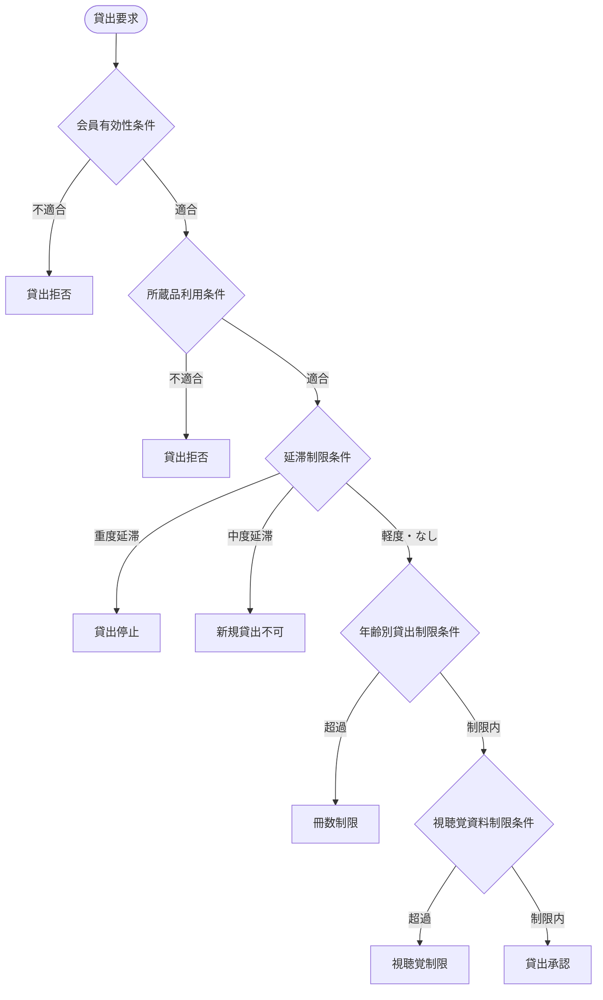
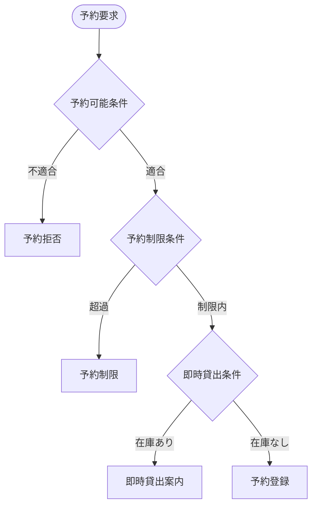

# 条件シート

## 図書館管理システムの条件定義

### 条件シート

| コンテキスト | 条件 | 条件の説明 | バリエーション | 状態モデル |
|--------|------------|----------------------|-----------|-------|
| 貸出管理 | 年齢別貸出制限条件 | 会員種別により貸出可能冊数が決定される。中学生以上は20点、小学生以下は15点まで | 会員種別 |  |
| 貸出管理 | 視聴覚資料制限条件 | 視聴覚資料（DVD、CD等）は会員種別に関わらず5点まで | 資料種別 |  |
| 貸出管理 | 延滞制限条件 | 延滞期間により新規貸出が制限される。15日以上で新規貸出停止、2ヶ月以上で全面停止 | 延滞状態 |  |
| 貸出管理 | 貸出期間条件 | 貸出期間は15日間。貸出日から15日後の前日が返却期限日 |  |  |
| 貸出管理 | 所蔵品利用条件 | 所蔵品が「在庫中」状態の場合のみ新規貸出が可能 | 所蔵品状態 | 所蔵品の状態 |
| 予約管理 | 予約制限条件 | 一人当たり最大15点まで予約可能。視聴覚資料は5点まで | 会員種別、資料種別 |  |
| 予約管理 | 予約可能条件 | 有効な会員のみ予約申込が可能。無効会員は予約不可 | 会員状態 |  |
| 予約管理 | 即時貸出条件 | 予約対象品目の所蔵品に「在庫中」があれば即時貸出を案内 | 所蔵品状態 |  |
| 取置管理 | 取置期限条件 | 取置期間は7日間。取置日から7日後が期限 |  |  |
| 取置管理 | 取置準備条件 | 予約状態が「未準備」かつ対象所蔵品が「在庫中」の場合に取置可能 | 予約状態、所蔵品状態 | 予約の状態、所蔵品の状態 |
| 取置管理 | 図書一致条件 | 予約された品目と実際の所蔵品が一致する場合のみ取置登録可能 |  |  |
| 会員管理 | 会員有効性条件 | 会員状態が「有効」の場合のみ全サービス利用可能 | 会員状態 |  |
| 会員管理 | 会員登録条件 | 市内在住または市内学校在籍者のみ会員登録可能 |  |  |
| 延滞管理 | 期限切れ判定条件 | 現在日付が返却期限日を超過した場合に延滞と判定 | 返却期限状態 | 貸出の状態 |
| 延滞管理 | 督促発動条件 | 延滞日数が設定値を超えた場合に督促通知を送信 | 延滞状態 |  |
| システム管理 | 営業時間条件 | 図書館の開館時間内のみシステム利用可能（緊急時除く） |  |  |

### 条件詳細分析

#### 貸出管理コンテキスト

##### 年齢別貸出制限条件
- **条件式**: `if (memberType == "中学生以上") maxLoanCount = 20; else maxLoanCount = 15;`
- **適用場面**: 貸出申込時の制限チェック
- **ビジネスルール**: 年齢による学習能力・責任能力を考慮した制限
- **例外処理**: 特別な事情がある場合は管理者判断で例外適用
- **変更頻度**: 極めて低（政策変更時のみ）
- **システム実装**: `RestrictionOfQuantityMap.java`

##### 視聴覚資料制限条件
- **条件式**: `if (entryType == "視聴覚資料") maxAVCount = 5;`
- **適用場面**: 視聴覚資料の貸出申込時
- **ビジネスルール**: 高価で破損しやすい資料の保護
- **例外処理**: 教育目的等での特別貸出（管理者承認）
- **変更頻度**: 低（資料管理方針変更時）
- **システム実装**: `RestrictionOfQuantity.java`

##### 延滞制限条件
- **条件式**: 
  ```
  if (delayDays >= 60) return "貸出停止";
  else if (delayDays >= 15) return "新規貸出不可";
  else return "貸出可能";
  ```
- **適用場面**: 貸出申込時の延滞状況チェック
- **ビジネルール**: 段階的制裁による返却促進
- **例外処理**: 特別な事情（病気等）での制限緩和
- **変更頻度**: 低（延滞対策方針変更時）
- **システム実装**: `DelayStatus.java`

##### 貸出期間条件
- **条件式**: `dueDate = loanDate.plusDays(15).minusDays(1);`
- **適用場面**: 貸出登録時の期限日計算
- **ビジネスルール**: 適切な利用期間の確保と回転率向上
- **例外処理**: 長期休暇期間中の延長（自動適用）
- **変更頻度**: 極めて低（基本政策変更時のみ）
- **システム実装**: `DueDate.java`

##### 所蔵品利用条件
- **条件式**: `if (itemStatus == "在庫中") return "貸出可能";`
- **適用場面**: 貸出可否判定時
- **ビジネスルール**: 物理的に利用可能な資料のみ貸出
- **例外処理**: 緊急時の特別貸出（管理者権限）
- **変更頻度**: なし（基本的制約）
- **システム実装**: `ItemLoanability.java`

#### 予約管理コンテキスト

##### 予約制限条件
- **条件式**: 
  ```
  totalReservations <= 15 && 
  avReservations <= 5
  ```
- **適用場面**: 予約申込時の制限チェック
- **ビジネスルール**: 公平な予約機会の確保
- **例外処理**: 研究目的等での特別予約（管理者承認）
- **変更頻度**: 低（利用状況に応じた調整）
- **システム実装**: `ReservationRestriction.java`

##### 予約可能条件
- **条件式**: `memberStatus == "有効"`
- **適用場面**: 予約申込受付時
- **ビジネスルール**: 正当な会員のみサービス利用可能
- **例外処理**: 資格回復手続き中の暫定利用
- **変更頻度**: なし（基本的制約）
- **システム実装**: 全予約関連UC

##### 即時貸出条件
- **条件式**: `availableItems.count() > 0`
- **適用場面**: 予約申込時の利用可能性チェック
- **ビジネスルール**: 効率的な資料利用の促進
- **例外処理**: 取置中資料の即時貸出（緊急時）
- **変更頻度**: なし（最適化ロジック）
- **システム実装**: 予約シナリオ

#### 取置管理コンテキスト

##### 取置期限条件
- **条件式**: `expireDate = retainedDate.plusDays(7);`
- **適用場面**: 取置登録時の期限日設定
- **ビジネスルール**: 適切な取置期間と資料回転率の両立
- **例外処理**: 特別事情（入院等）での延長
- **変更頻度**: 低（運用状況に応じた調整）
- **システム実装**: `ExpireDate.java`

##### 取置準備条件
- **条件式**: 
  ```
  reservationStatus == "未準備" && 
  itemStatus == "在庫中"
  ```
- **適用場面**: 取置業務実行時
- **ビジネスルール**: 適切な取置タイミングの確保
- **例外処理**: 状態不整合時の手動調整
- **変更頻度**: なし（業務ロジック）
- **システム実装**: 取置シナリオ

##### 図書一致条件
- **条件式**: `item.entryNumber == reservation.entryNumber`
- **適用場面**: 取置登録時の確認
- **ビジネスルール**: 正確な資料提供の確保
- **例外処理**: 類似資料での代替（利用者同意）
- **変更頻度**: なし（品質保証）
- **システム実装**: `MaterialMatching.java`

### 条件の複合評価

#### 貸出可否の総合判定



#### 予約処理の条件チェーン



### 条件パフォーマンス

#### 条件評価時間

| 条件名 | 評価時間目標 | 現在値 | 最適化余地 |
|--------|-------------|--------|------------|
| 会員有効性条件 | <100ms | 80ms | 低 |
| 年齢別貸出制限条件 | <50ms | 45ms | 低 |
| 延滞制限条件 | <200ms | 180ms | 中 |
| 所蔵品利用条件 | <50ms | 40ms | 低 |
| 予約制限条件 | <150ms | 140ms | 低 |

#### 条件適用頻度

| 条件名 | 適用頻度/日 | ピーク時負荷 | 重要度 |
|--------|-------------|-------------|--------|
| 所蔵品利用条件 | 100回 | 高 | 最高 |
| 会員有効性条件 | 80回 | 高 | 最高 |
| 年齢別貸出制限条件 | 50回 | 中 | 高 |
| 延滞制限条件 | 50回 | 中 | 高 |
| 予約制限条件 | 20回 | 低 | 中 |

### 条件メンテナンス

#### 条件変更管理

| 変更タイプ | 承認レベル | テスト要件 | 展開方法 |
|------------|------------|------------|----------|
| 制限値変更 | 管理者 | 回帰テスト | 段階展開 |
| 新条件追加 | システム管理者 | 全機能テスト | 計画展開 |
| 条件削除 | システム管理者 | 影響分析 | 慎重展開 |
| ロジック修正 | 開発者 | 全機能テスト | 十分検証後展開 |

#### 条件監視・警告

| 監視項目 | 警告条件 | 対応方法 | 頻度 |
|----------|----------|----------|------|
| 条件評価エラー | エラー率 > 1% | 即座に調査・修正 | リアルタイム |
| 条件適用異常 | 制限値超過適用 | ログ分析・原因調査 | 日次 |
| パフォーマンス | 評価時間 > 目標値 | 最適化検討 | 週次 |
| 条件不整合 | 複数条件の矛盾 | 設定見直し | 月次 |

### 条件進化計画

#### 短期的改善（3ヶ月以内）

| 改善項目 | 内容 | 期待効果 | 実装難易度 |
|----------|------|----------|------------|
| 条件評価キャッシュ | 頻繁に評価される条件の結果キャッシュ | パフォーマンス向上30% | 低 |
| エラーハンドリング強化 | 条件評価失敗時の適切な処理 | 安定性向上 | 中 |
| 条件設定UI | 管理者向けの条件設定画面 | 運用性向上 | 中 |

#### 中期的拡張（6ヶ月以内）

| 拡張項目 | 内容 | 期待効果 | 実装難易度 |
|----------|------|----------|------------|
| 動的条件設定 | 時間帯・曜日による条件変更 | 柔軟性向上 | 高 |
| 条件組み合わせ最適化 | 条件評価順序の最適化 | パフォーマンス向上20% | 中 |
| 予測的条件適用 | 利用パターンに基づく事前制御 | 利用者満足度向上 | 高 |

#### 長期的革新（1年以内）

| 革新項目 | 内容 | 期待効果 | 実装難易度 |
|----------|------|----------|------------|
| AI支援条件判定 | 機械学習による最適な制限値決定 | 効率性・公平性向上 | 最高 |
| 個人化条件 | 利用者ごとの個別制限設定 | パーソナライゼーション | 高 |
| リアルタイム条件調整 | システム負荷に応じた動的調整 | 安定性・拡張性向上 | 最高 |

この条件シート分析により、図書館管理システムの業務ルールが体系化され、正確で効率的な判定処理と将来の柔軟な拡張の基盤が構築された。