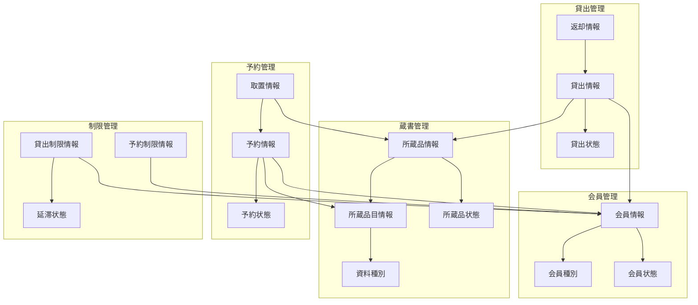

# 情報シート

## 図書館管理システムの情報定義

### 情報シート

| コンテキスト | 情報 | 関連情報 | 状態モデル | バリエーション | 説明 |
|--------|----------|------------|-------|---------|-------------|
| 会員管理 | 会員情報 | 貸出情報、予約情報 | - | 会員種別、会員状態 | 図書館を利用する登録会員の基本情報 |
| 蔵書管理 | 所蔵品目情報 | 所蔵品情報 | - | 資料種別 | 図書館が所蔵する資料の書誌情報（マスター） |
| 蔵書管理 | 所蔵品情報 | 所蔵品目情報、貸出情報 | 所蔵品の状態 | - | 実際の物理的な資料の個別管理情報 |
| 貸出管理 | 貸出情報 | 会員情報、所蔵品情報、返却情報 | 貸出の状態 | - | 資料の貸出記録と期限管理情報 |
| 予約管理 | 予約情報 | 会員情報、所蔵品目情報、取置情報 | 予約の状態 | - | 資料の予約申込と処理状況の管理情報 |
| 取置管理 | 取置情報 | 予約情報、所蔵品情報 | - | - | 予約による資料の取り置き管理情報 |
| 返却管理 | 返却情報 | 貸出情報、所蔵品情報 | - | - | 資料の返却記録と処理完了情報 |
| 制限管理 | 貸出制限情報 | 会員情報、貸出情報 | - | 延滞状態、制限レベル | 会員の貸出可否判定に関する制限情報 |
| 制限管理 | 予約制限情報 | 会員情報、予約情報 | - | 制限レベル | 会員の予約可否判定に関する制限情報 |

### 情報詳細定義

#### 会員管理コンテキスト

##### 会員情報
- **主要属性**:
  - 会員番号（識別子）
  - 氏名
  - 会員種別（中学生以上/小学生以下）
  - 会員状態（未登録/有効/無効）
  - 登録日
  - 有効期限
- **関連情報**:
  - 貸出情報（1:N）- 会員が行った貸出の履歴
  - 予約情報（1:N）- 会員が行った予約の履歴
- **バリエーション**:
  - 会員種別: 貸出制限の基準となる年齢区分
  - 会員状態: 利用可否を判定する状態区分
- **業務ルール**:
  - 有効な会員のみがサービス利用可能
  - 会員種別により貸出制限が異なる
  - 無効会員は資格回復まで利用不可

#### 蔵書管理コンテキスト

##### 所蔵品目情報
- **主要属性**:
  - 所蔵品目番号（識別子）
  - 題名
  - 著者・アーティスト
  - 資料種別（図書/視聴覚資料）
  - キーワード
  - 所蔵数
- **関連情報**:
  - 所蔵品情報（1:N）- 品目に属する個別所蔵品
- **バリエーション**:
  - 資料種別: 制限適用の基準となる分類
- **業務ルール**:
  - 同一品目の複数所蔵品が存在可能
  - 視聴覚資料は特別な貸出制限が適用

##### 所蔵品情報
- **主要属性**:
  - 所蔵品番号（識別子）
  - 所蔵品目番号（外部キー）
  - 所蔵品状態（未登録/在庫中/予約中/取置中/貸出中/その他）
  - 登録日
  - 最終更新日
- **関連情報**:
  - 所蔵品目情報（N:1）- 所属する品目情報
  - 貸出情報（1:N）- 貸出履歴
- **状態モデル**: 所蔵品の状態
- **業務ルール**:
  - 在庫中の所蔵品のみ新規貸出可能
  - 状態変更は業務フローに従って実行

#### 貸出管理コンテキスト

##### 貸出情報
- **主要属性**:
  - 貸出番号（識別子）
  - 会員番号（外部キー）
  - 所蔵品番号（外部キー）
  - 貸出日
  - 返却期限日
  - 貸出状態
  - 遅延日数
- **関連情報**:
  - 会員情報（N:1）- 借用者情報
  - 所蔵品情報（N:1）- 貸出対象資料
  - 返却情報（1:1）- 返却完了記録
- **状態モデル**: 貸出の状態
- **業務ルール**:
  - 貸出期間は最大15日間
  - 期限超過で延滞状態に移行
  - 延滞状況により新規貸出制限

#### 予約管理コンテキスト

##### 予約情報
- **主要属性**:
  - 予約番号（識別子）
  - 会員番号（外部キー）
  - 所蔵品目番号（外部キー）
  - 予約日
  - 予約状態（未準備/消込済）
  - 待ち順序
- **関連情報**:
  - 会員情報（N:1）- 予約者情報
  - 所蔵品目情報（N:1）- 予約対象品目
  - 取置情報（1:1）- 取置への変換
- **状態モデル**: 予約の状態
- **業務ルール**:
  - 同一品目への複数予約可能
  - 待ち順序により取置優先度決定
  - 在庫中の場合は即座に貸出案内

#### 取置管理コンテキスト

##### 取置情報
- **主要属性**:
  - 予約番号（外部キー、識別子）
  - 所蔵品番号（外部キー）
  - 取置日
  - 取置期限日
  - 準備完了フラグ
- **関連情報**:
  - 予約情報（1:1）- 元となる予約
  - 所蔵品情報（N:1）- 取置対象資料
- **業務ルール**:
  - 取置期間は最大7日間
  - 期限切れで自動的に解放
  - 利用者来館時に貸出移行

#### 返却管理コンテキスト

##### 返却情報
- **主要属性**:
  - 所蔵品番号（外部キー、識別子）
  - 返却日
  - 貸出番号（外部キー）
  - 遅延フラグ
- **関連情報**:
  - 貸出情報（1:1）- 終了する貸出
  - 所蔵品情報（N:1）- 返却される資料
- **業務ルール**:
  - 返却により貸出状態が終了
  - 遅延返却は延滞記録として保存
  - 返却後は次予約の取置処理

#### 制限管理コンテキスト

##### 貸出制限情報
- **主要属性**:
  - 会員番号（外部キー）
  - 現在貸出数
  - 視聴覚資料貸出数
  - 延滞日数
  - 制限レベル
- **関連情報**:
  - 会員情報（1:1）- 制限対象会員
  - 貸出情報（1:N）- 現在の貸出状況
- **バリエーション**:
  - 延滞状態: 制限適用レベルの基準
  - 制限レベル: 貸出可否の段階
- **業務ルール**:
  - 会員種別により制限値が異なる
  - 延滞状況により制限レベル変更
  - 制限超過時は新規貸出不可

##### 予約制限情報
- **主要属性**:
  - 会員番号（外部キー）
  - 現在予約数
  - 視聴覚資料予約数
  - 制限レベル
- **関連情報**:
  - 会員情報（1:1）- 制限対象会員
  - 予約情報（1:N）- 現在の予約状況
- **バリエーション**:
  - 制限レベル: 予約可否の段階
- **業務ルール**:
  - 全体予約数15点まで
  - 視聴覚資料予約数5点まで
  - 制限超過時は新規予約不可

### 情報関係図

### 情報品質管理

#### データ品質指標

| 情報種別 | 完全性 | 正確性 | 整合性 | 適時性 | 重要度 |
|----------|--------|--------|--------|--------|--------|
| 会員情報 | 100% | 99% | 99% | リアルタイム | 最高 |
| 所蔵品目情報 | 100% | 95% | 95% | 日次更新 | 高 |
| 所蔵品情報 | 100% | 99% | 99% | リアルタイム | 最高 |
| 貸出情報 | 100% | 99% | 99% | リアルタイム | 最高 |
| 予約情報 | 100% | 98% | 98% | リアルタイム | 高 |
| 取置情報 | 100% | 99% | 99% | リアルタイム | 高 |
| 返却情報 | 100% | 99% | 99% | リアルタイム | 高 |

#### データ整合性ルール

| ルール名 | 対象情報 | 制約内容 | 違反時処理 |
|----------|----------|----------|------------|
| 会員存在制約 | 貸出・予約情報 | 有効な会員のみ | エラー・処理停止 |
| 所蔵品存在制約 | 貸出・取置情報 | 存在する所蔵品のみ | エラー・処理停止 |
| 状態整合性制約 | 所蔵品・貸出状態 | 状態の論理的整合 | 状態同期処理 |
| 期限整合性制約 | 貸出・取置期限 | 期限日の論理性 | 期限再計算 |
| 数量整合性制約 | 制限・実績情報 | 制限値と実績の整合 | 制限値再計算 |

### 情報セキュリティ

#### 個人情報保護

| 情報分類 | 保護レベル | アクセス制御 | 保存期間 | 削除タイミング |
|----------|------------|-------------|----------|---------------|
| 会員基本情報 | 高 | 厳格 | 会員期間中 | 退会時即座 |
| 貸出履歴 | 中 | 制限 | 返却時まで | 返却時即座 |
| 予約履歴 | 中 | 制限 | 処理完了まで | 処理完了時 |
| 延滞情報 | 高 | 厳格 | 解決まで | 延滞解決時 |
| 統計情報 | 低 | 基本 | 無期限 | 匿名化済み |

#### データアクセス権限

| アクター | 参照権限 | 更新権限 | 削除権限 | 制限事項 |
|----------|----------|----------|----------|----------|
| 司書 | 業務関連全情報 | 業務処理のみ | なし | 個人情報保護法準拠 |
| 管理者 | 全情報 | 設定・マスター | あり | 法的要件準拠 |
| 利用者 | 自身の情報のみ | 基本情報のみ | なし | 本人確認後 |
| システム | 全情報 | 自動処理のみ | 自動削除のみ | ログ記録必須 |

### 情報ライフサイクル

#### 情報の生成・更新・削除

| 情報種別 | 生成タイミング | 更新タイミング | 削除タイミング | 保存期間 |
|----------|----------------|----------------|----------------|----------|
| 会員情報 | 新規登録時 | 情報変更時 | 退会時 | 会員期間中 |
| 所蔵品目情報 | 資料登録時 | 情報修正時 | 除籍時 | 除籍まで |
| 所蔵品情報 | 資料受入時 | 状態変更時 | 除籍時 | 除籍まで |
| 貸出情報 | 貸出実行時 | 期限・状態変更時 | 返却時 | 返却まで |
| 予約情報 | 予約登録時 | 状態変更時 | 処理完了時 | 処理完了まで |
| 取置情報 | 取置準備時 | 期限管理時 | 貸出・期限切れ時 | 処理完了まで |
| 返却情報 | 返却処理時 | なし | 統計処理後 | 統計作成まで |

この情報シート分析により、図書館管理システムの情報構造と品質管理の基盤が明確化され、データガバナンスの確立につながる。