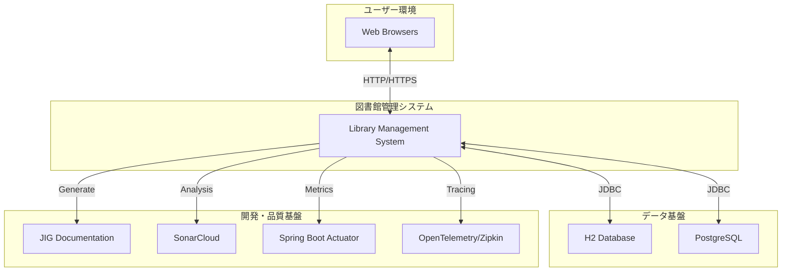

# 外部システムシート

## 図書館管理システムの外部システム定義

### 外部システムシート

| 外部システム群 | 外部システム | 説明 |
|---------|--------|----|
| データベース基盤 | H2データベース | 開発・テスト環境で使用されるインメモリデータベース。軽量で高速な動作が特徴。 |
| データベース基盤 | PostgreSQLデータベース | 本番環境想定のリレーショナルデータベース。高い信頼性とパフォーマンスを提供。 |
| 設計支援ツール | JIG設計可視化システム | ソースコードから自動的に設計ドキュメントを生成するツール。アーキテクチャの可視化を支援。 |
| 品質管理基盤 | SonarCloudシステム | 静的解析によるコード品質管理プラットフォーム。コード品質の継続的な監視を提供。 |
| 監視基盤 | Spring Boot Actuator | アプリケーションの健全性監視とメトリクス収集を行う組み込み監視システム。 |
| トレーシング基盤 | OpenTelemetry/Zipkin | 分散トレーシングとパフォーマンス監視を行うシステム。アプリケーションの動作分析を支援。 |
| ウェブブラウザ | 各種ブラウザ | Chrome、Firefox、Safari等の標準的なウェブブラウザ。ユーザーインターフェースを提供。 |

### 外部システム詳細情報

#### データベース基盤群

##### H2データベース
- **提供者**: H2 Database Engine
- **用途**: 開発・テスト環境でのデータ永続化
- **接続方式**: JDBCドライバー経由
- **データ形式**: SQL標準準拠
- **可用性**: 開発時間中（メモリ上）
- **パフォーマンス**: 高速（インメモリ）
- **制限事項**: メモリサイズ依存、永続化オプション
- **依存度**: 開発・テスト環境では必須
- **代替可能性**: 他のインメモリDBで代替可能

##### PostgreSQLデータベース
- **提供者**: PostgreSQL Global Development Group
- **用途**: 本番環境でのデータ永続化
- **接続方式**: JDBCドライバー経由
- **データ形式**: PostgreSQL拡張SQL
- **可用性**: 24時間365日
- **パフォーマンス**: 高パフォーマンス（ディスク最適化）
- **制限事項**: リソース消費、設定複雑性
- **依存度**: 本番環境では必須
- **代替可能性**: MySQL、Oracle等で代替可能

#### 設計支援ツール群

##### JIG設計可視化システム
- **提供者**: JIGプロジェクト
- **用途**: ソースコードからの設計ドキュメント自動生成
- **接続方式**: Gradleプラグイン経由
- **データ形式**: HTML、画像ファイル
- **可用性**: 開発時・ビルド時
- **パフォーマンス**: 中程度（解析処理）
- **制限事項**: Javaコード依存、Graphviz要求
- **依存度**: 設計可視化には必須
- **代替可能性**: PlantUML、他のドキュメント生成ツール

#### 品質管理基盤群

##### SonarCloudシステム
- **提供者**: SonarSource
- **用途**: 静的コード解析と品質管理
- **接続方式**: SonarQube Gradle Plugin
- **データ形式**: 品質メトリクス、レポート
- **可用性**: クラウドサービス（高可用性）
- **パフォーマンス**: 中程度（解析時間）
- **制限事項**: インターネット接続必須、利用制限
- **依存度**: 品質管理には推奨
- **代替可能性**: SonarQube、SpotBugs等

#### 監視基盤群

##### Spring Boot Actuator
- **提供者**: Spring Framework
- **用途**: アプリケーション監視とメトリクス
- **接続方式**: Spring Boot組み込み
- **データ形式**: JSON、プロメテウス形式
- **可用性**: アプリケーション稼働時
- **パフォーマンス**: 軽量（組み込み）
- **制限事項**: Spring Boot依存
- **依存度**: 運用監視には必須
- **代替可能性**: Micrometer、独自監視

##### OpenTelemetry/Zipkin
- **提供者**: OpenTelemetry Community / Zipkin
- **用途**: 分散トレーシングとパフォーマンス分析
- **接続方式**: OpenTelemetryエージェント
- **データ形式**: トレースデータ、スパン情報
- **可用性**: 監視システム稼働時
- **パフォーマンス**: 軽量（サンプリング）
- **制限事項**: 設定複雑性、ストレージ要求
- **依存度**: 詳細監視には推奨
- **代替可能性**: Jaeger、AppDynamics等

#### ユーザーインターフェース群

##### 各種ブラウザ
- **提供者**: Google、Mozilla、Apple等
- **用途**: ユーザーインターフェースの表示・操作
- **接続方式**: HTTP/HTTPS通信
- **データ形式**: HTML、CSS、JavaScript
- **可用性**: エンドユーザー環境依存
- **パフォーマンス**: ブラウザ依存
- **制限事項**: ブラウザ互換性、セキュリティポリシー
- **依存度**: ユーザー操作には必須
- **代替可能性**: デスクトップアプリ、モバイルアプリ

### 外部システム関係図



### 外部システム依存関係分析

#### 必須依存関係

| 外部システム | 依存レベル | 影響範囲 | 障害時の影響 | 復旧方法 |
|-------------|------------|----------|-------------|----------|
| データベース（H2/PostgreSQL） | 必須 | システム全体 | 完全停止 | DB復旧・フェイルオーバー |
| Webブラウザ | 必須 | ユーザーインターフェース | UI利用不可 | ブラウザ再起動・更新 |

#### 推奨依存関係

| 外部システム | 依存レベル | 影響範囲 | 障害時の影響 | 復旧方法 |
|-------------|------------|----------|-------------|----------|
| Spring Boot Actuator | 推奨 | 監視機能 | 監視情報取得不可 | 機能無効化・代替監視 |
| JIG | 推奨 | 設計ドキュメント | ドキュメント生成不可 | 手動ドキュメント作成 |

#### オプション依存関係

| 外部システム | 依存レベル | 影響範囲 | 障害時の影響 | 復旧方法 |
|-------------|------------|----------|-------------|----------|
| SonarCloud | オプション | 品質管理 | 品質分析不可 | ローカル解析・代替ツール |
| OpenTelemetry/Zipkin | オプション | 詳細監視 | トレース情報なし | 基本ログで代替 |

### データ交換インターフェース

#### データベース接続

```yaml
データベース接続仕様:
  プロトコル: JDBC
  データ形式: SQL DDL/DML
  文字エンコーディング: UTF-8
  接続プール: HikariCP
  トランザクション: ACID準拠
  セキュリティ: ユーザー認証・暗号化
```

#### Web API通信

```yaml
Web通信仕様:
  プロトコル: HTTP/HTTPS
  データ形式: HTML, JSON, Form Data
  文字エンコーディング: UTF-8
  セッション管理: Cookie/Session
  セキュリティ: CSRF対策、XSS対策
```

#### 監視データ

```yaml
監視データ仕様:
  メトリクス形式: Prometheus/JSON
  ログ形式: Logback/SLF4J
  トレース形式: OpenTelemetry
  健全性チェック: Spring Boot Health
  アラート: 閾値ベース通知
```

### 外部システム進化計画

#### 短期的拡張（1年以内）

| システム種別 | 拡張内容 | 目的 | 優先度 |
|-------------|----------|------|--------|
| 監視基盤 | Prometheusメトリクス拡張 | 詳細な運用監視 | 中 |
| 品質基盤 | カバレッジレポート統合 | 品質可視化強化 | 低 |
| データベース | レプリケーション設定 | 可用性向上 | 高 |

#### 中期的拡張（2-3年）

| システム種別 | 拡張内容 | 目的 | 優先度 |
|-------------|----------|------|--------|
| 認証基盤 | LDAP/OAuth2連携 | 統合認証 | 中 |
| 通知基盤 | メール/SMS通知システム | 利用者通知自動化 | 高 |
| バックアップ基盤 | 自動バックアップシステム | データ保護強化 | 高 |

#### 長期的拡張（3年以上）

| システム種別 | 拡張内容 | 目的 | 優先度 |
|-------------|----------|------|--------|
| AI基盤 | 推薦エンジン連携 | パーソナライゼーション | 低 |
| クラウド基盤 | AWS/Azure連携 | スケーラビリティ向上 | 中 |
| IoT基盤 | RFIDシステム連携 | 自動化推進 | 低 |

### セキュリティ考慮事項

#### 外部システム接続セキュリティ

| 接続先 | セキュリティ対策 | 脅威レベル | 対策状況 |
|--------|------------------|------------|----------|
| データベース | 暗号化通信、認証 | 高 | 実装済み |
| ブラウザ | HTTPS、CSRF対策 | 中 | 実装済み |
| 監視システム | アクセス制御 | 低 | 実装済み |
| 外部API | API認証、レート制限 | 中 | 計画中 |

#### データ保護

| データ種別 | 保護レベル | 暗号化 | アクセス制御 |
|------------|------------|--------|-------------|
| 個人情報 | 高 | 必須 | 厳格 |
| 貸出履歴 | 中 | 推奨 | 制限 |
| システムログ | 低 | オプション | 基本 |
| メトリクス | 低 | 不要 | 基本 |

### 外部システム運用手順

#### 日常監視手順

1. **データベース接続監視** - 接続プールの状況確認
2. **レスポンス時間監視** - Web応答時間の確認
3. **エラーログ監視** - 外部システム連携エラーの確認
4. **リソース使用量監視** - CPU、メモリ、ディスクの確認

#### 障害対応手順

1. **即座の影響範囲特定** - 影響する機能の洗い出し
2. **代替手段の検討** - 手動処理やフォールバック
3. **利用者への通知** - サービス影響の案内
4. **根本原因の調査** - ログ分析と外部システム連携確認
5. **復旧作業の実施** - システム復旧と動作確認

この外部システム分析により、図書館管理システムの外部依存関係が明確化され、安定運用と将来拡張の基盤が構築された。