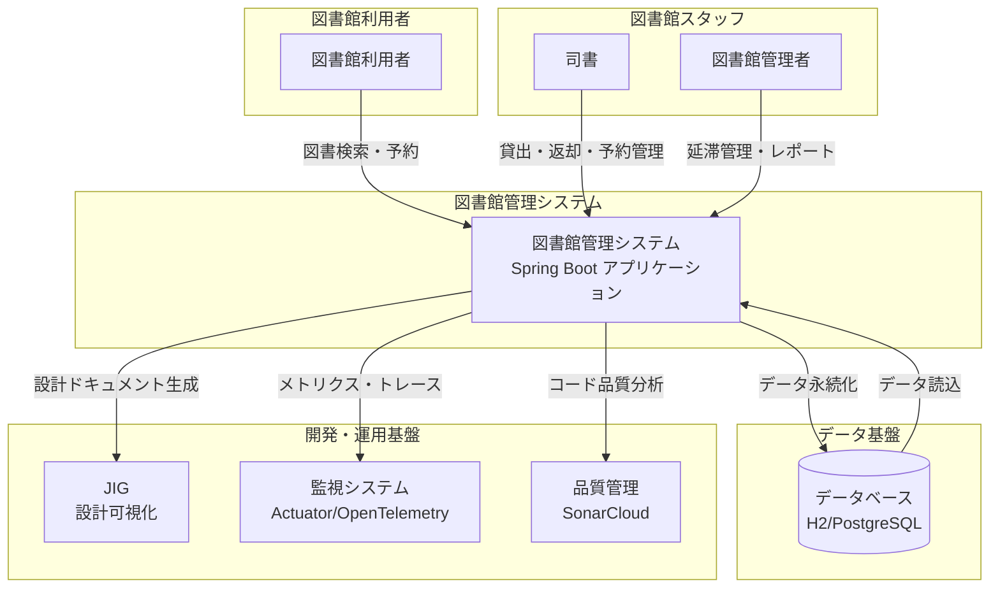
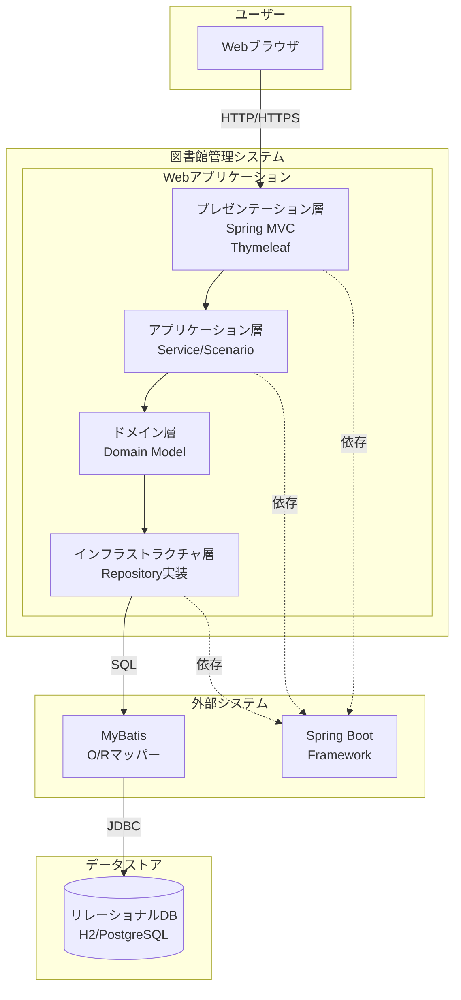
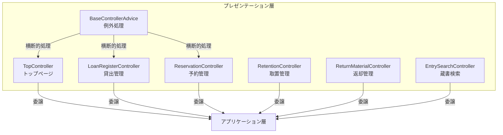
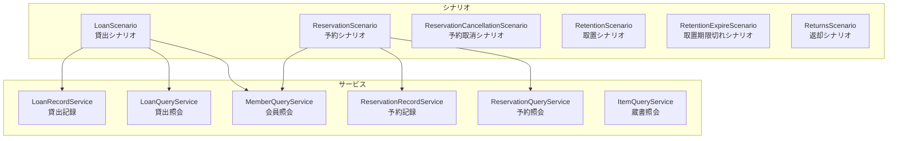
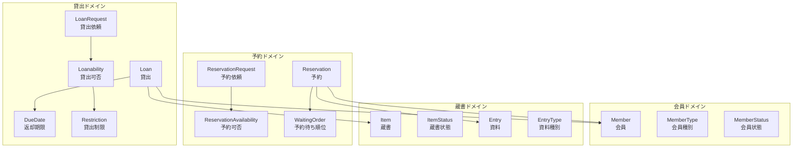
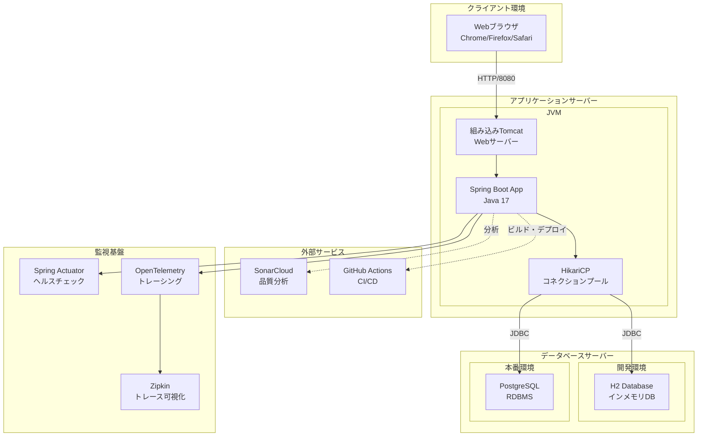
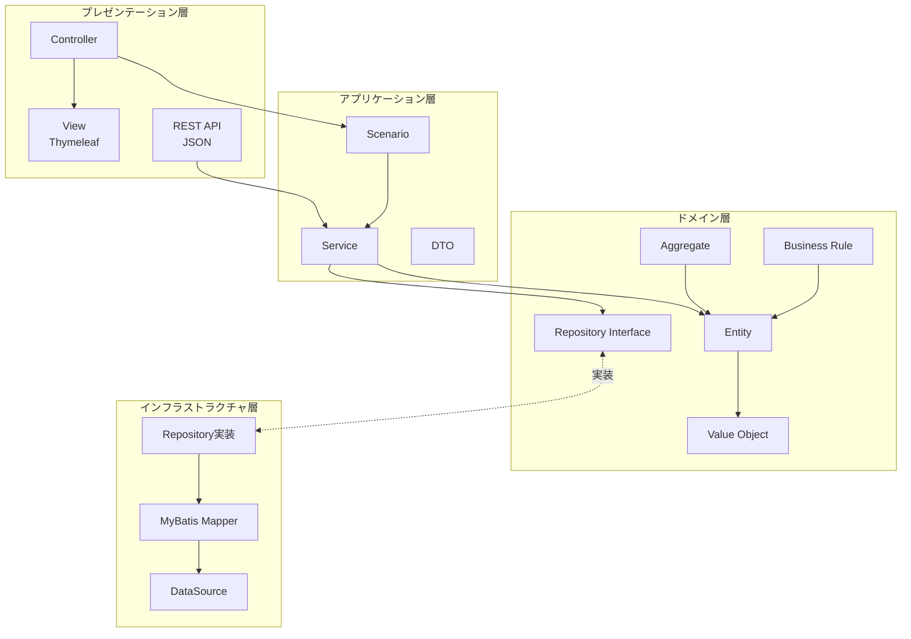
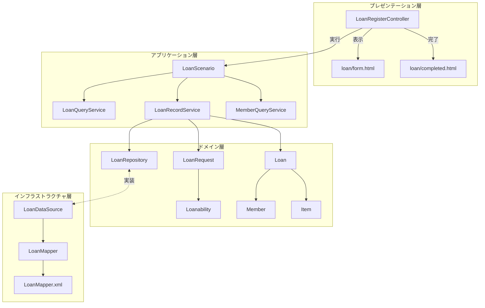

# アーキテクチャ設計書

## 1. C4 システムコンテキスト図

### 1.1 システムコンテキスト図

### 1.2 システムコンテキスト説明

| 名前 | 説明 |
|------|------|
| 図書館利用者 | 図書館の資料を借りたり予約したりする一般利用者 |
| 司書 | 図書館で貸出・返却・予約管理業務を行うスタッフ |
| 図書館管理者 | システムの管理・運用と統計レポートを確認する責任者 |
| 図書館管理システム | 図書館の貸出・返却・予約業務を支援するWebアプリケーション |
| データベース | システムのデータを永続化するリレーショナルデータベース（開発: H2、本番: PostgreSQL） |
| JIG | ソースコードから設計ドキュメントを自動生成するツール |
| 監視システム | アプリケーションの健全性とパフォーマンスを監視するシステム |
| 品質管理 | 静的コード解析により品質を管理するクラウドサービス |

## 2. C4 コンテナ図

### 2.1 コンテナ図

### 2.2 コンテナ説明

| 名前 | 説明 |
|------|------|
| Webブラウザ | ユーザーがシステムにアクセスするためのクライアント |
| プレゼンテーション層 | HTTPリクエストを受け付け、HTMLレスポンスを返すWeb層 |
| アプリケーション層 | ビジネスユースケースを実現するサービス・シナリオ層 |
| ドメイン層 | ビジネスルールとエンティティを含む中核的なビジネスロジック |
| インフラストラクチャ層 | データベースアクセスと外部システム連携を担当 |
| リレーショナルDB | アプリケーションデータを永続化するデータベース |
| MyBatis | SQLとオブジェクトをマッピングするO/Rマッパー |
| Spring Boot | アプリケーション全体の基盤となるフレームワーク |

## 3. C4 コンポーネント図

### 3.1 プレゼンテーション層コンポーネント図

### 3.2 アプリケーション層コンポーネント図

### 3.3 ドメイン層コンポーネント図

### 3.4 コンポーネント説明

| 名前 | 説明 |
|------|------|
| Controller | HTTPリクエストを受け付けてレスポンスを返すWebコントローラー |
| Scenario | 複数のサービスを組み合わせてユースケースを実現するクラス |
| Service | 単一の責務を持つビジネスロジックを提供するクラス |
| Domain Model | ビジネスルールとデータを保持するエンティティ・値オブジェクト |
| Repository | データベースアクセスを抽象化するインターフェース |
| Restriction | 貸出制限ルール（延滞制限、冊数制限など） |
| Availability | 予約・取置の可否判定ロジック |

## 4. 物理構成図

### 4.1 物理構成図

### 4.2 物理構成説明

| 名前 | 説明 |
|------|------|
| Webブラウザ | エンドユーザーが使用するWebクライアント |
| Spring Boot App | Javaで実装されたWebアプリケーション本体 |
| 組み込みTomcat | Spring Bootに内蔵されたWebサーバー |
| HikariCP | 高性能なデータベースコネクションプール |
| H2 Database | 開発・テスト用のインメモリデータベース |
| PostgreSQL | 本番環境用のリレーショナルデータベース |
| SonarCloud | コード品質を継続的に分析するクラウドサービス |
| GitHub Actions | CI/CDパイプラインを実行する自動化サービス |
| Spring Actuator | アプリケーションの健全性を監視する組み込み機能 |
| OpenTelemetry | 分散トレーシングデータを収集するエージェント |
| Zipkin | トレースデータを可視化する監視ツール |

## 5. レイヤー構成

### 5.1 アプリケーション全体のレイヤー構成

### 5.2 貸出機能のレイヤー構成

### 5.3 レイヤー説明

| 名前 | 説明 |
|------|------|
| プレゼンテーション層 | ユーザーインターフェースとHTTPリクエスト/レスポンスを処理 |
| アプリケーション層 | ユースケースの実現とトランザクション境界の管理 |
| ドメイン層 | ビジネスルールとエンティティを含む中核的なロジック |
| インフラストラクチャ層 | データベースアクセスや外部システムとの連携を実装 |
| Controller | HTTPリクエストを受け付けて適切なサービスに委譲 |
| Scenario | 複数のサービスを組み合わせて1つのユースケースを実現 |
| Service | 単一の責務を持つビジネスロジックを提供 |
| Entity | ビジネス上の概念を表現し、振る舞いを持つオブジェクト |
| Value Object | 不変で等価性によって識別される値 |
| Repository | データアクセスを抽象化するインターフェース |
| Mapper | SQLとJavaオブジェクトのマッピングを定義 |
| DataSource | データベース接続を管理するコンポーネント |

## チェックリスト更新

- [x] C4 システムコンテキスト図作成
- [x] C4 コンテナ図作成
- [x] C4 コンポーネント図作成
- [x] 物理構成図作成
- [x] レイヤー構成の文書化