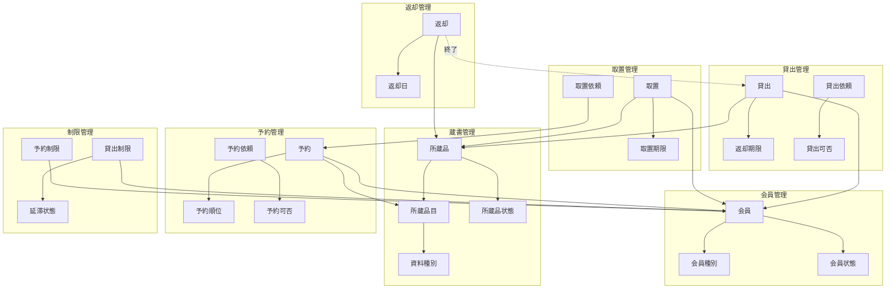
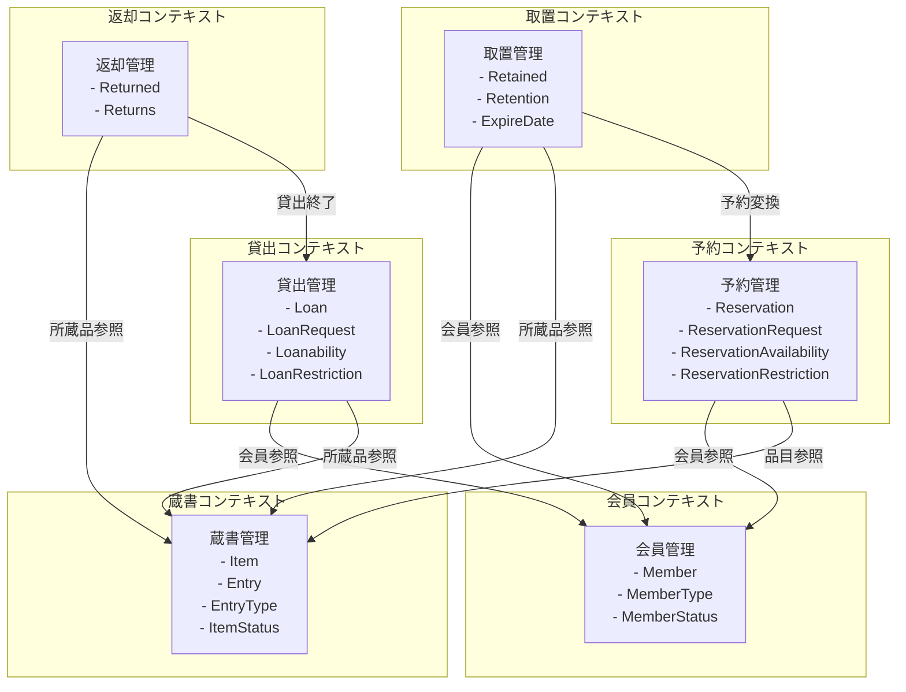
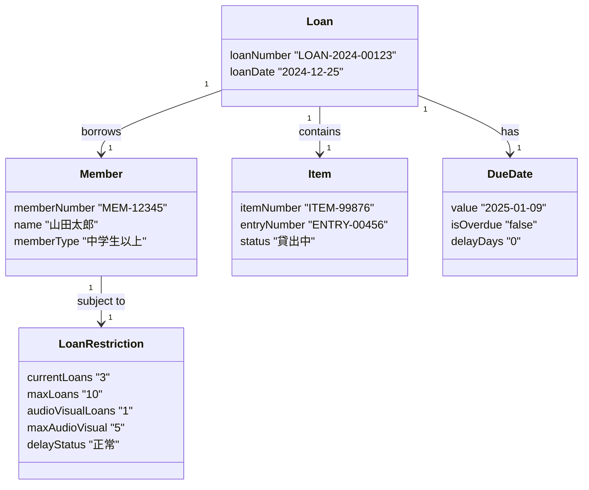
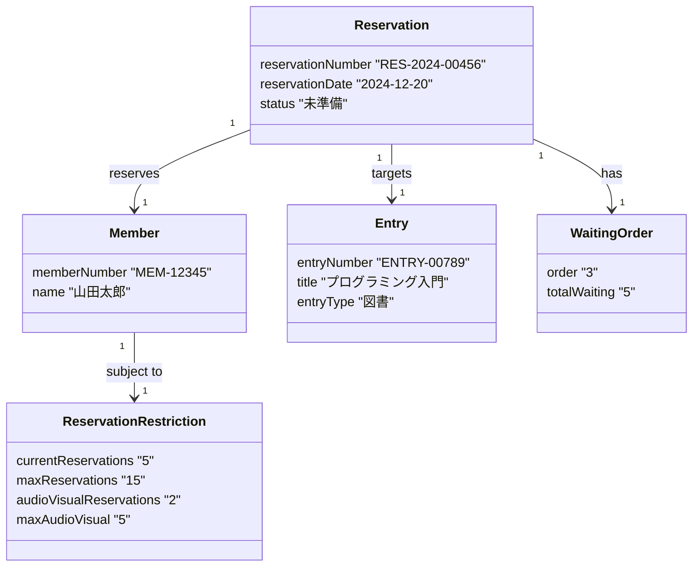
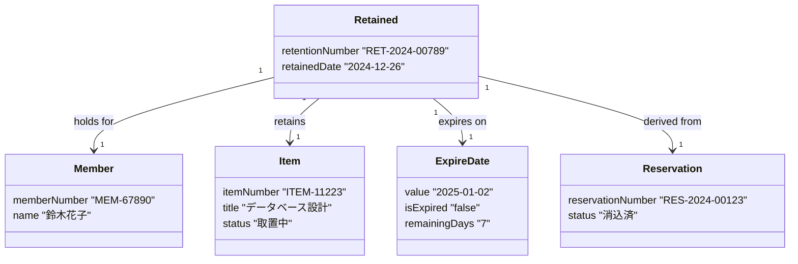
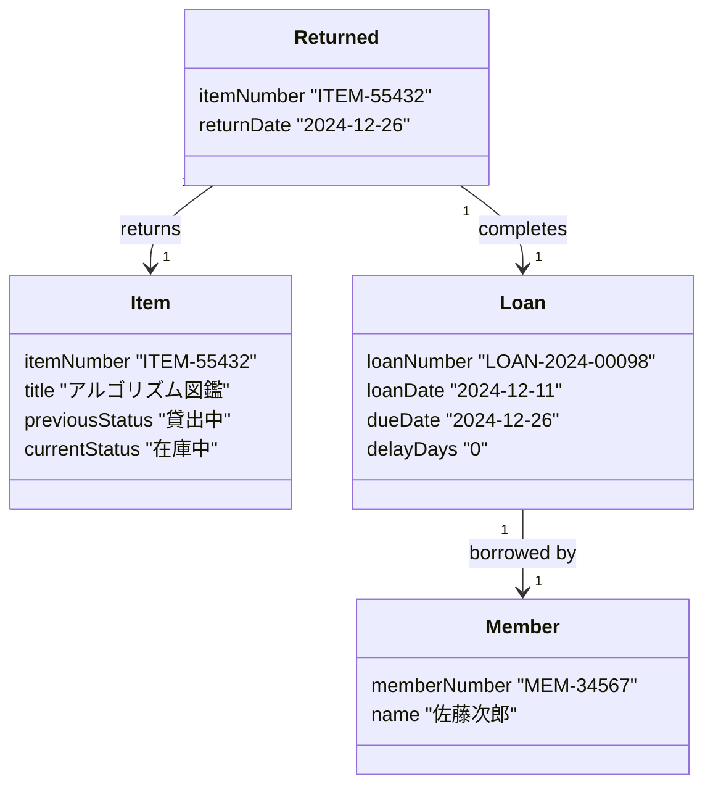
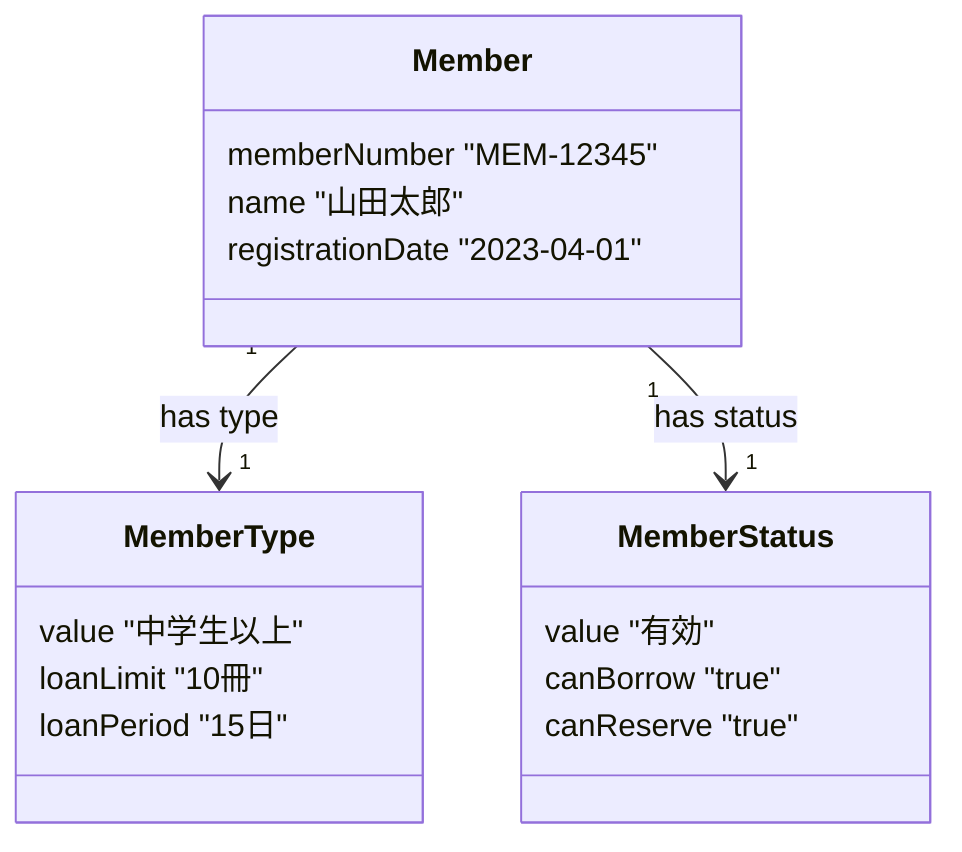
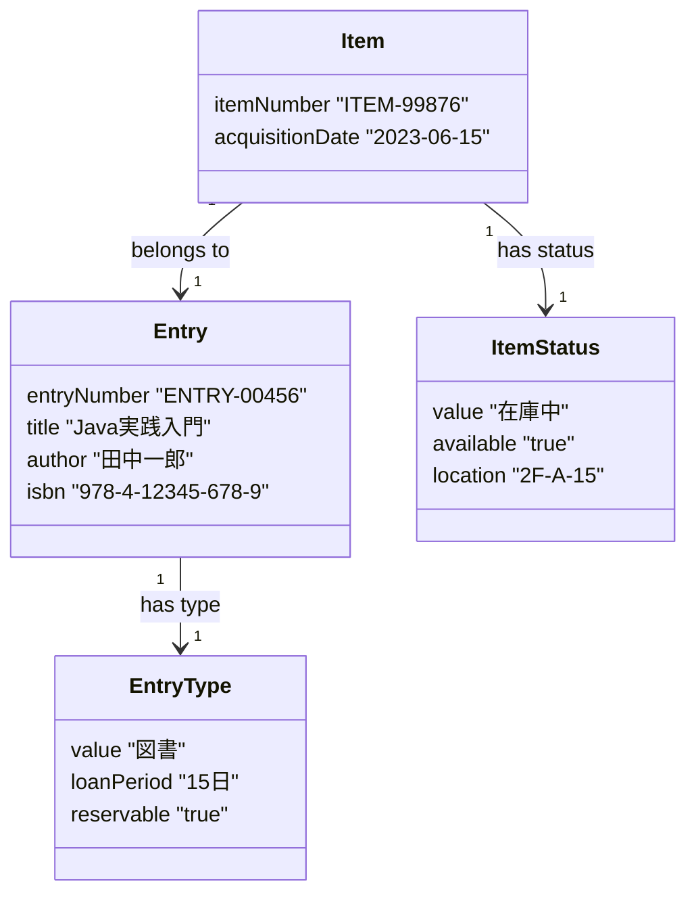

# ドメインモデル設計書

## 1. 概念モデル図

### 1.1 全体概念モデル

### 1.2 概念モデル説明

| 名前 | 説明 |
|------|------|
| 会員 | 図書館を利用する登録会員の情報 |
| 会員種別 | 中学生以上/小学生以下の区分 |
| 会員状態 | 未登録/有効/無効の状態 |
| 所蔵品目 | 図書館が所蔵する資料の書誌情報（マスター） |
| 所蔵品 | 実際の物理的な資料の個別管理情報 |
| 資料種別 | 図書/視聴覚資料の区分 |
| 所蔵品状態 | 在庫中/予約中/取置中/貸出中などの状態 |
| 貸出 | 資料の貸出記録と期限管理情報 |
| 貸出依頼 | 貸出を実行する際の依頼情報 |
| 返却期限 | 貸出資料の返却期限日 |
| 貸出可否 | 貸出制限ルールに基づく可否判定 |
| 予約 | 資料の予約申込と処理状況の管理情報 |
| 予約依頼 | 予約を登録する際の依頼情報 |
| 予約順位 | 同一資料に対する予約の待ち順序 |
| 予約可否 | 予約制限ルールに基づく可否判定 |
| 取置 | 予約による資料の取り置き管理情報 |
| 取置依頼 | 予約から取置への変換依頼 |
| 取置期限 | 取置資料の保管期限日 |
| 返却 | 資料の返却記録と処理完了情報 |
| 返却日 | 資料が返却された日付 |
| 貸出制限 | 会員の貸出可否判定に関する制限情報 |
| 予約制限 | 会員の予約可否判定に関する制限情報 |
| 延滞状態 | 会員の延滞状況による制限レベル |

## 2. エンティティ、集約、値オブジェクトの分類

### 2.1 エンティティ

| エンティティ名 | 識別子 | 責務 |
|---------------|--------|------|
| Member（会員） | MemberNumber | 会員情報の管理と保持 |
| Entry（所蔵品目） | EntryNumber | 資料の書誌情報の管理 |
| Item（所蔵品） | ItemNumber | 個別の物理的資料の管理 |
| Loan（貸出） | LoanNumber | 貸出記録と期限の管理 |
| Reservation（予約） | ReservationNumber | 予約情報と順位の管理 |
| Retained（取置） | RetentionNumber | 取置資料と期限の管理 |

### 2.2 集約

| 集約名 | 集約ルート | 含まれるエンティティ/値オブジェクト |
|--------|------------|----------------------------------|
| 貸出集約 | Loan | Loan, LoanNumber, LoanDate, DueDate |
| 予約集約 | Reservation | Reservation, ReservationNumber, WaitingOrder |
| 取置集約 | Retained | Retained, RetentionNumber, RetainedDate, ExpireDate |
| 会員集約 | Member | Member, MemberNumber, Name, MemberType, MemberStatus |
| 蔵書集約 | Item | Item, ItemNumber, ItemStatus |
| 品目集約 | Entry | Entry, EntryNumber, Title, WorkOf, EntryType |

### 2.3 値オブジェクト

| 値オブジェクト名 | 責務 | 不変性 |
|-----------------|------|--------|
| MemberNumber | 会員番号の表現 | 不変 |
| Name | 会員氏名の表現 | 不変 |
| MemberType | 会員種別の表現（中学生以上/小学生以下） | 不変 |
| ItemNumber | 所蔵品番号の表現 | 不変 |
| EntryNumber | 所蔵品目番号の表現 | 不変 |
| Title | 資料タイトルの表現 | 不変 |
| LoanDate | 貸出日の表現 | 不変 |
| DueDate | 返却期限日の表現と延滞判定 | 不変 |
| ReturnDate | 返却日の表現 | 不変 |
| Loanability | 貸出可否の判定結果 | 不変 |
| LoanRequest | 貸出依頼の内容 | 不変 |
| ReservationRequest | 予約依頼の内容 | 不変 |
| Retention | 取置依頼の内容 | 不変 |
| Returned | 返却イベントの内容 | 不変 |

## 3. 境界づけられたコンテキスト

### 3.1 コンテキスト間の関係図

### 3.2 各コンテキストの詳細

| コンテキスト | エンティティ | 責務 | 外部依存 |
|------------|-----------|------|---------|
| 貸出コンテキスト | Loan, LoanRequest, Loanability | 貸出業務の実行と管理、貸出制限の適用 | 会員、蔵書 |
| 予約コンテキスト | Reservation, ReservationRequest | 予約業務の実行と管理、予約制限の適用 | 会員、蔵書 |
| 取置コンテキスト | Retained, Retention | 取置業務の実行と管理、期限管理 | 会員、蔵書、予約 |
| 返却コンテキスト | Returned, Returns | 返却業務の実行と記録 | 蔵書、貸出 |
| 会員コンテキスト | Member, MemberType | 会員情報の管理、会員種別の管理 | なし |
| 蔵書コンテキスト | Item, Entry, EntryType | 資料情報の管理、在庫状態の管理 | なし |

## 4. 境界づけられたコンテキストごとのドメインモデル図

### 4.1 貸出コンテキストのドメインモデル

### 4.2 予約コンテキストのドメインモデル

### 4.3 取置コンテキストのドメインモデル

### 4.4 返却コンテキストのドメインモデル

### 4.5 会員コンテキストのドメインモデル

### 4.6 蔵書コンテキストのドメインモデル

## チェックリスト更新

- [x] 概念モデル図作成
- [x] エンティティ、集約、値オブジェクトを抽出
- [x] 境界づけられたコンテキストを図解
- [x] 境界づけられたコンテキストごとのドメインモデル図作成