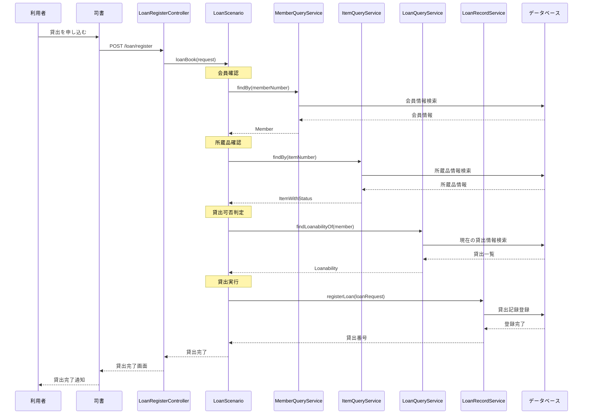
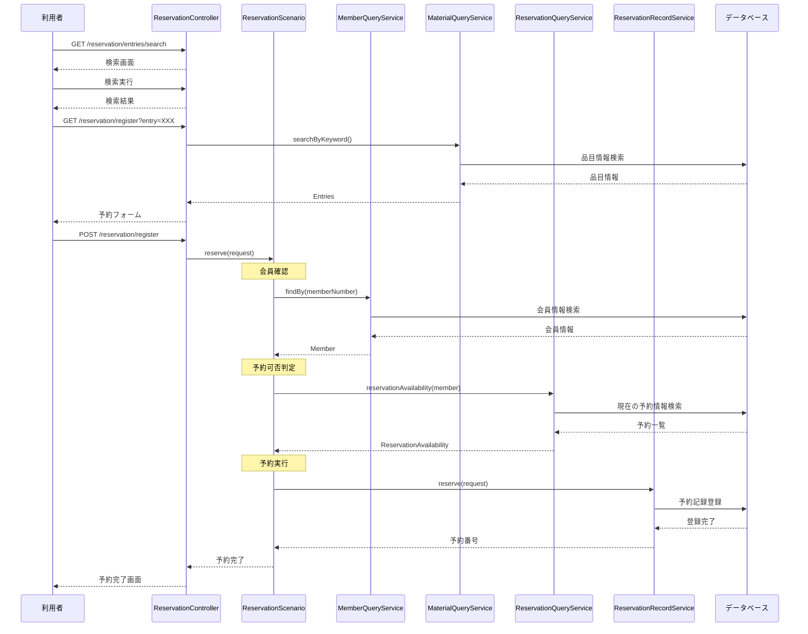
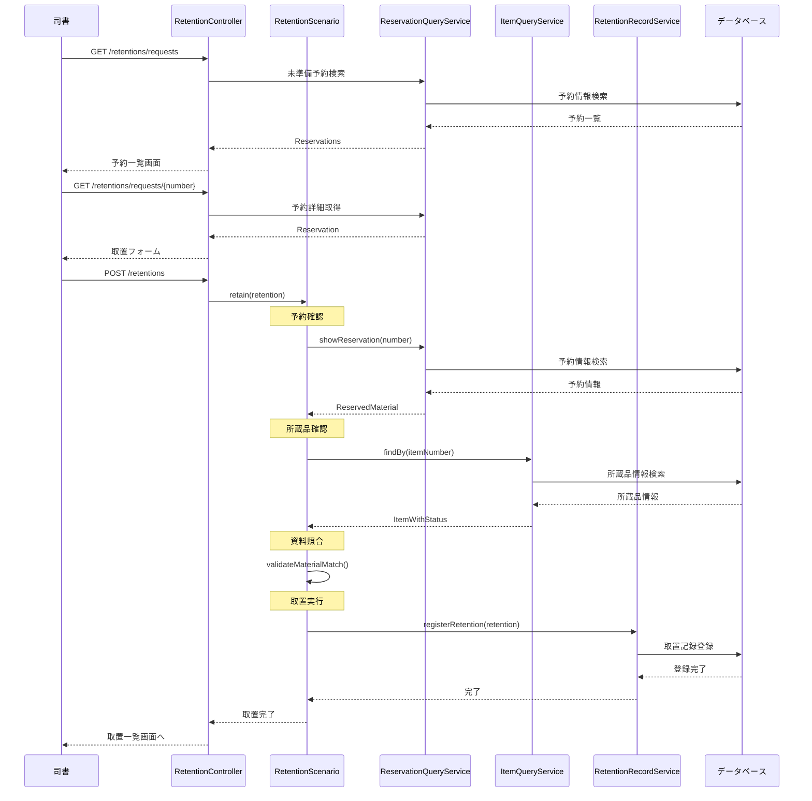
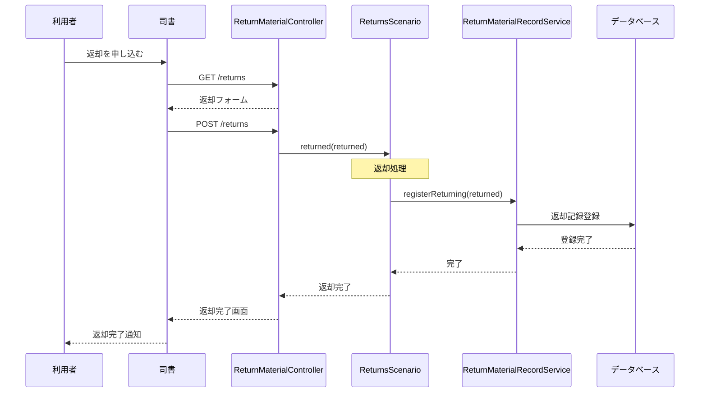
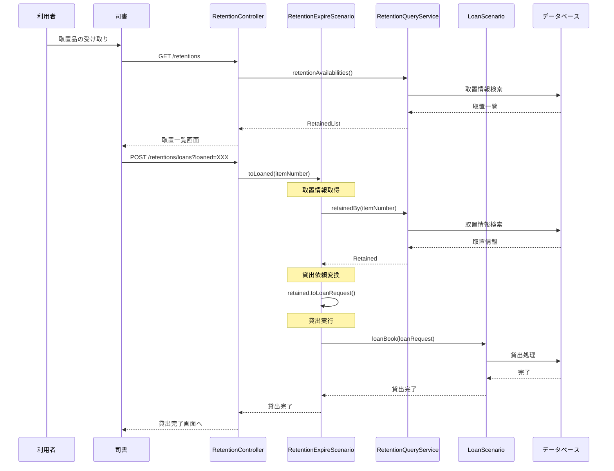
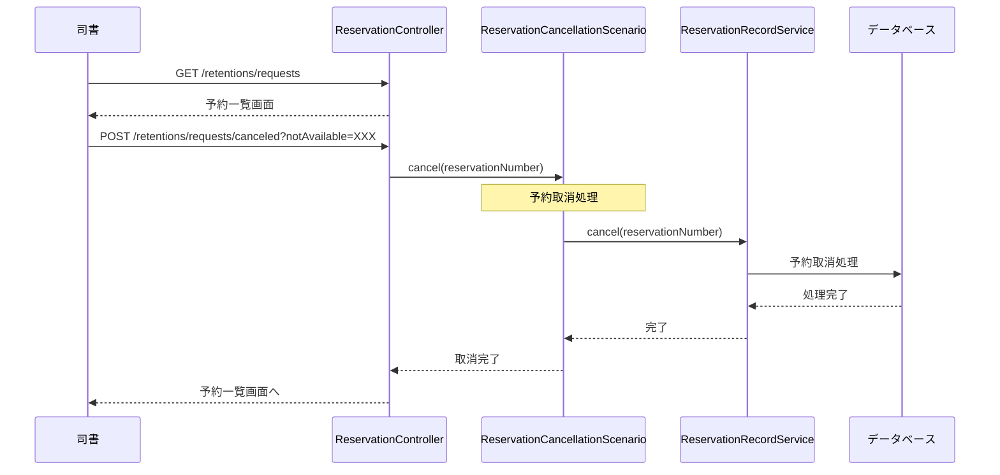
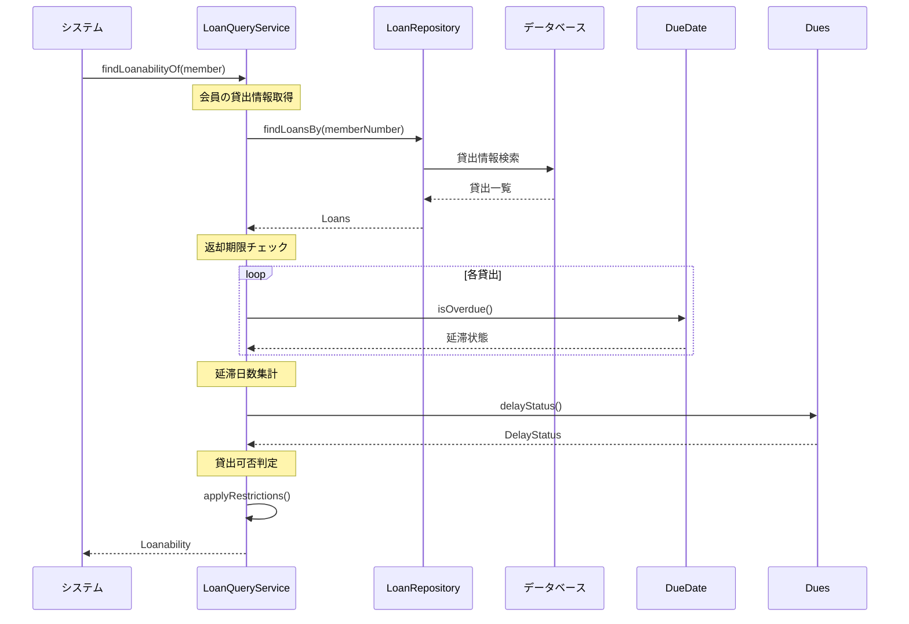
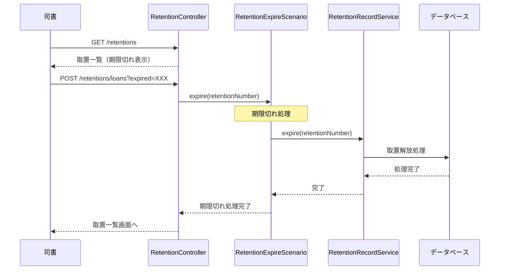

# 機能分析書

## 1. ユースケース一覧

### 1.1 システム全体のユースケース

| ユースケース | エントリーポイント | 処理概要 |
|------------|------------------|----------|
| トップページ表示 | GET `/` | システムのトップページを表示する |
| 会員番号有効性を確認する | エントリーポイントなし | 会員番号の妥当性と有効性を検証する共通処理 |
| 所蔵品貸出可否を判定する | エントリーポイントなし | 所蔵品の状態から貸出可能性を判定する共通処理 |
| 貸出制限を判定する | エントリーポイントなし | 会員の現在の貸出状況から新規貸出の可否を判定する共通処理 |
| 貸出登録画面表示 | GET `/loan/register` | 貸出登録フォームを表示する |
| 貸出を登録する | POST `/loan/register` | 会員と所蔵品を指定して貸出処理を実行する |
| 貸出完了確認 | GET `/loan/register/completed` | 貸出処理の完了を確認する画面を表示する |
| 所蔵品を検索する | GET `/reservation/entries/search` | キーワードで所蔵品目を検索する |
| 予約登録開始 | GET `/reservation/register` | 予約登録プロセスを開始（検索画面へ誘導） |
| 予約フォーム表示 | GET `/reservation/register?entry={entryNumber}` | 指定品目の予約登録フォームを表示する |
| 予約を登録する | POST `/reservation/register` | 会員と品目を指定して予約処理を実行する |
| 予約完了確認 | GET `/reservation/register/completed` | 予約処理の完了を確認する画面を表示する |
| 予約制限を判定する | エントリーポイントなし | 会員の現在の予約状況から新規予約の可否を判定する共通処理 |
| 予約一覧を表示する | GET `/retentions/requests` | 未準備の予約一覧を表示する |
| 取置フォーム表示 | GET `/retentions/requests/{reservationNumber}` | 指定予約の取置登録フォームを表示する |
| 予約を取り消す | POST `/retentions/requests/canceled?notAvailable={reservationNumber}` | 指定された予約を取り消す |
| 取置一覧を表示する | GET `/retentions` | 現在の取置一覧を表示する |
| 取置を登録する | POST `/retentions` | 予約から取置への変換処理を実行する |
| 取置品を貸し出す | POST `/retentions/loans?loaned={itemNumber}` | 取置品を実際に貸し出す |
| 取置を期限切れにする | POST `/retentions/loans?expired={retentionNumber}` | 期限切れの取置を解放する |
| 返却登録画面表示 | GET `/returns` | 返却登録フォームを表示する |
| 返却を登録する | POST `/returns` | 所蔵品の返却処理を実行する |
| 返却完了確認 | GET `/returns/completed` | 返却処理の完了を確認する画面を表示する |
| 延滞状況を確認する | エントリーポイントなし | 貸出の返却期限超過を確認する共通処理 |
| 取置期限切れを処理する | エントリーポイントなし | 取置期限を超過した資料を解放する定期処理 |

### 1.2 アクター別ユースケース

#### 図書館利用者
| ユースケース | 使用頻度 | 重要度 |
|------------|---------|--------|
| 所蔵品を検索する | 高 | 高 |
| （予約フォーム経由で）予約を登録する | 中 | 高 |
| （司書経由で）貸出を登録する | 高 | 最高 |
| （司書経由で）返却を登録する | 高 | 最高 |

#### 司書
| ユースケース | 使用頻度 | 重要度 |
|------------|---------|--------|
| 貸出を登録する | 高 | 最高 |
| 返却を登録する | 高 | 最高 |
| 予約一覧を表示する | 中 | 高 |
| 取置を登録する | 中 | 高 |
| 取置一覧を表示する | 中 | 高 |
| 取置品を貸し出す | 中 | 高 |
| 取置を期限切れにする | 低 | 中 |
| 予約を取り消す | 低 | 中 |

#### 図書館管理者
| ユースケース | 使用頻度 | 重要度 |
|------------|---------|--------|
| （実装予定）貸出状況一覧を表示する | 低 | 中 |
| （実装予定）延滞状況一覧を表示する | 低 | 高 |
| （実装予定）業務統計を表示する | 低 | 中 |

## 2. ユースケースごとのシーケンス図

### 2.1 貸出を登録する

### 2.2 予約を登録する

### 2.3 取置を登録する

### 2.4 返却を登録する

### 2.5 取置品を貸し出す

### 2.6 予約を取り消す

### 2.7 延滞状況を確認する（内部処理）

### 2.8 取置期限切れを処理する

## チェックリスト更新

- [x] ユースケース一覧作成
- [x] ユースケースごとにシーケンス図を作成