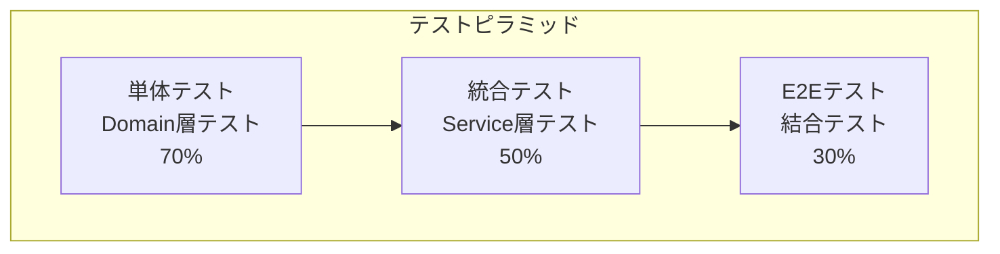

# テスト分析書

## 1. テスト戦略

### 1.1 テストピラミッド



### 1.2 テスト種別と範囲

| テスト種別 | 対象範囲 | 目的 | 実行頻度 | 実装状況 |
|-----------|---------|------|---------|----------|
| 単体テスト | ドメインモデル | ビジネスルール検証 | 毎回 | ✅実装済み |
| 統合テスト | サービス層 | データアクセス検証 | 毎回 | ✅実装済み |
| シナリオテスト | アプリケーション全体 | 業務フロー検証 | 毎回 | ✅実装済み |
| E2Eテスト | UI含む全体 | エンドユーザー視点 | リリース前 | 🔄未実装 |

### 1.3 テスト戦略の特徴

#### ドメイン駆動テスト
- ビジネスルールを中心としたテスト設計
- ドメインモデルの単体テストを重視
- 実際のビジネス要件に基づくテストケース

#### データベーステスト
- H2インメモリデータベースを使用
- テスト用データの自動投入・削除
- トランザクション自動ロールバック

#### シナリオベーステスト
- 実際の業務フローに基づくテスト
- 複数のコンポーネントを組み合わせたテスト
- エラーケースも含む包括的なテスト

## 2. テスト手順

### 2.1 単体テスト（Domain層）

#### 実行方法
```bash
# ドメインモデルテスト実行
./gradlew test --tests "library.domain.**"
```

#### 主要テストクラス
| テストクラス | 対象 | テスト内容 |
|-------------|------|----------|
| `DueDateTest` | 返却期限 | 期限超過判定、延滞日数計算 |
| `DuesTest` | 延滞状況 | 延滞レベル判定、制限適用 |
| `RestrictionTest` | 貸出制限 | 制限ルール適用、可否判定 |

#### テストケース例
```java
@Test
void 返却期限を超過している場合は延滞() {
    DueDate dueDate = new DueDate(LocalDate.now().minusDays(1));
    
    assertThat(dueDate.isOverdue()).isTrue();
}
```

### 2.2 統合テスト（Service層）

#### 実行方法
```bash
# サービス層テスト実行
./gradlew test --tests "library.application.service.**"
```

#### 主要テストクラス
| テストクラス | 対象サービス | テスト内容 |
|-------------|-------------|----------|
| `LoanQueryServiceTest` | 貸出照会 | 貸出可否判定、制限確認 |
| `LoanRecordServiceTest` | 貸出記録 | 貸出登録、状態更新 |
| `ReservationQueryServiceTest` | 予約照会 | 予約可否判定、待ち順序 |
| `ReservationRecordServiceTest` | 予約記録 | 予約登録、状態管理 |

#### データベーステスト特徴
```java
@Test
@Transactional
void 会員の貸出可能冊数を確認できる() {
    // Given: テストデータ準備
    MemberNumber memberNumber = new MemberNumber("001");
    
    // When: サービス実行
    Loanability result = loanQueryService.findLoanabilityOf(memberNumber);
    
    // Then: 結果検証
    assertThat(result).isEqualTo(Loanability.可能);
}
```

### 2.3 シナリオテスト（業務フロー）

#### 実行方法
```bash
# シナリオテスト実行
./gradlew test --tests "library.application.scenario.**"
```

#### 主要テストクラス
| テストクラス | 対象シナリオ | テスト内容 |
|-------------|-------------|----------|
| `LoanScenarioTest` | 貸出シナリオ | 貸出業務全体フロー |
| `ReservationScenarioTest` | 予約シナリオ | 予約業務全体フロー |
| `RetentionScenarioTest` | 取置シナリオ | 取置業務全体フロー |
| `ReturnsScenarioTest` | 返却シナリオ | 返却業務全体フロー |

#### 業務フローテスト例
```java
@Test
void 貸出から返却までの完全なフロー() {
    // 1. 貸出実行
    LoanRequest loanRequest = new LoanRequest(memberNumber, itemNumber, loanDate);
    loanScenario.loanBook(loanRequest);
    
    // 2. 返却実行
    Returned returned = new Returned(itemNumber, returnDate);
    returnsScenario.returned(returned);
    
    // 3. 状態確認
    assertThat(itemQueryService.findBy(itemNumber).状態()).isEqualTo(ItemStatus.在庫中);
}
```

### 2.4 統合テスト（Controller層）

#### 実行方法
```bash
# コントローラテスト実行
./gradlew test --tests "library.presentation.**"
```

#### 主要テストクラス
| テストクラス | 対象コントローラ | テスト内容 |
|-------------|-----------------|----------|
| `LoanRegisterControllerTest` | 貸出コントローラ | HTTP リクエスト/レスポンス |
| `ReservationControllerTest` | 予約コントローラ | フォーム処理、画面遷移 |
| `RetentionControllerTest` | 取置コントローラ | CRUD操作、状態管理 |

#### Webレイヤーテスト例
```java
@Test
void 貸出フォームが正常に表示される() throws Exception {
    mockMvc.perform(get("/loan/register"))
        .andExpect(status().isOk())
        .andExpect(view().name("loan/form"))
        .andExpect(model().attributeExists("loanForm"));
}
```

## 3. CIパイプライン

### 3.1 GitHub Actions構成

```yaml
name: CI Pipeline

on:
  push:
    branches: [ main, develop ]
  pull_request:
    branches: [ main ]

jobs:
  test:
    runs-on: ubuntu-latest
    
    steps:
    - uses: actions/checkout@v3
    
    - name: Set up JDK 17
      uses: actions/setup-java@v3
      with:
        java-version: '17'
        distribution: 'temurin'
    
    - name: Cache Gradle packages
      uses: actions/cache@v3
      with:
        path: ~/.gradle/caches
        key: ${{ runner.os }}-gradle-${{ hashFiles('**/*.gradle') }}
    
    - name: Run tests
      run: ./gradlew test
    
    - name: Generate test report
      run: ./gradlew jacocoTestReport
    
    - name: SonarCloud analysis
      env:
        GITHUB_TOKEN: ${{ secrets.GITHUB_TOKEN }}
        SONAR_TOKEN: ${{ secrets.SONAR_TOKEN }}
      run: ./gradlew sonar
    
    - name: Upload coverage to Codecov
      uses: codecov/codecov-action@v3
```

### 3.2 品質ゲート

| 指標 | 閾値 | 用途 |
|------|------|------|
| テストカバレッジ | 80%以上 | コード品質保証 |
| テスト成功率 | 100% | 機能安定性保証 |
| SonarQube品質評価 | A評価 | 保守性保証 |
| ビルド時間 | 5分以内 | 開発効率性 |

### 3.3 テスト環境

#### テスト用データベース
```yaml
# application-test.yaml
spring:
  datasource:
    url: jdbc:h2:mem:testdb;MODE=PostgreSQL;DB_CLOSE_DELAY=-1
  sql:
    init:
      mode: always
```

#### テストデータ管理
- `src/test/resources/data.sql`: テスト用初期データ
- 各テストクラスで独立したデータセット
- テスト間でのデータ干渉を防止

## 4. テスト実行とレポート

### 4.1 コマンド一覧

| コマンド | 用途 | 出力 |
|---------|------|------|
| `./gradlew test` | 全テスト実行 | `build/reports/tests/` |
| `./gradlew jacocoTestReport` | カバレッジレポート | `build/reports/jacoco/` |
| `./gradlew sonar` | SonarQube解析 | SonarCloud |
| `./gradlew jigReports` | 設計ドキュメント | `build/jig/` |

### 4.2 継続的品質改善

#### テストメトリクス監視
- テストカバレッジ推移
- テスト実行時間推移
- テスト失敗率推移
- 品質問題検出数推移

#### 定期的な見直し
- 月次: テスト戦略レビュー
- 四半期: テストケース追加・削除
- 半年: テスト自動化拡張
- 年次: テストツール評価・更新

## チェックリスト更新

- [x] テスト戦略作成
- [x] テスト手順作成
- [x] CIパイプライン説明