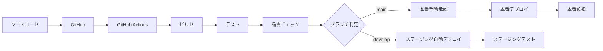

# デプロイ分析書

## 1. 環境一覧

### 1.1 環境構成

| 環境 | サービス | URL | 用途 |
|------|---------|-----|------|
| ローカル開発 | Spring Boot組み込みTomcat<br/>H2インメモリDB | http://localhost:8080 | 開発・単体テスト |
| CI/CD | GitHub Actions<br/>SonarCloud<br/>Docker（オプション） | - | 自動テスト・品質チェック |
| ステージング | PostgreSQL<br/>Spring Boot<br/>Nginx（オプション） | https://staging.library.example.com | 統合テスト・受入テスト |
| 本番環境 | PostgreSQL<br/>Spring Boot<br/>Nginx<br/>監視ツール | https://library.example.com | 本番運用 |

### 1.2 外部サービス依存

| サービス種別 | サービス名 | 用途 | 必須性 |
|-------------|-----------|------|--------|
| CI/CD | GitHub Actions | 自動ビルド・テスト | 必須 |
| コード品質 | SonarCloud | 静的解析・品質管理 | 推奨 |
| 監視 | Spring Boot Actuator | アプリケーション監視 | 必須 |
| トレーシング | Zipkin | 分散トレーシング | オプション |
| ロードバランサー | AWS ALB / Nginx | 負荷分散 | 本番時推奨 |
| データベース | PostgreSQL | データ永続化 | 本番時必須 |

## 2. デプロイ手順

### 2.1 ローカル開発環境

#### 開発者による手動デプロイ
```bash
# 1. ソースコード取得
git clone [repository-url]
cd library

# 2. アプリケーションビルド
./gradlew build

# 3. アプリケーション起動
./gradlew bootRun

# 4. 動作確認
curl http://localhost:8080
```

#### ホットリロード開発
```bash
# Spring Boot DevToolsによる自動再起動
./gradlew bootRun --continuous
```

### 2.2 CI/CD環境（GitHub Actions）

#### 自動ビルド・デプロイパイプライン
```yaml
name: Deploy Pipeline

on:
  push:
    branches: [ main ]

jobs:
  build-and-deploy:
    runs-on: ubuntu-latest
    
    steps:
    - name: Checkout code
      uses: actions/checkout@v3
    
    - name: Set up JDK 17
      uses: actions/setup-java@v3
      with:
        java-version: '17'
        distribution: 'temurin'
    
    - name: Build application
      run: ./gradlew bootJar
    
    - name: Run tests
      run: ./gradlew test
    
    - name: SonarCloud analysis
      run: ./gradlew sonar
    
    - name: Build Docker image
      run: |
        docker build -t library-app:${{ github.sha }} .
        docker tag library-app:${{ github.sha }} library-app:latest
    
    - name: Deploy to staging
      if: github.ref == 'refs/heads/develop'
      run: |
        # ステージング環境への自動デプロイ
        echo "Deploy to staging"
    
    - name: Deploy to production
      if: github.ref == 'refs/heads/main'
      run: |
        # 本番環境への自動デプロイ（手動承認後）
        echo "Deploy to production"
```

### 2.3 ステージング環境

#### インフラ構成
```bash
# PostgreSQLセットアップ
sudo apt-get update
sudo apt-get install postgresql postgresql-contrib

# データベース作成
sudo -u postgres createdb library_staging
sudo -u postgres createuser library_user

# アプリケーションデプロイ
scp build/libs/library-*.jar staging-server:/opt/library/
ssh staging-server "sudo systemctl restart library"
```

#### アプリケーション設定
```yaml
# application-staging.yaml
spring:
  datasource:
    url: jdbc:postgresql://db-server:5432/library_staging
    username: ${DB_USERNAME}
    password: ${DB_PASSWORD}
  sql:
    init:
      mode: never
  
logging:
  level:
    library: DEBUG
    
management:
  endpoints:
    web:
      exposure:
        include: health,info,metrics,loggers
```

### 2.4 本番環境

#### Blue-Greenデプロイ戦略
```bash
# 1. 新バージョンのデプロイ（Green環境）
docker run -d --name library-green \
  -p 8081:8080 \
  -e SPRING_PROFILES_ACTIVE=production \
  -e DB_USERNAME=${PROD_DB_USER} \
  -e DB_PASSWORD=${PROD_DB_PASS} \
  library-app:latest

# 2. ヘルスチェック
curl http://localhost:8081/actuator/health

# 3. ロードバランサー切り替え
# nginx.conf更新してBlue->Green切り替え

# 4. 旧バージョン停止（Blue環境）
docker stop library-blue
docker rm library-blue
```

#### ローリングデプロイ（複数インスタンス）
```bash
# 1つずつインスタンスを更新
for instance in instance1 instance2 instance3; do
  # ロードバランサーから除外
  aws elbv2 deregister-targets --target-group-arn $TG_ARN \
    --targets Id=$instance
  
  # インスタンス更新
  ssh $instance "sudo systemctl stop library"
  scp build/libs/library-latest.jar $instance:/opt/library/
  ssh $instance "sudo systemctl start library"
  
  # ヘルスチェック待機
  until curl -f http://$instance:8080/actuator/health; do
    sleep 10
  done
  
  # ロードバランサーに復帰
  aws elbv2 register-targets --target-group-arn $TG_ARN \
    --targets Id=$instance
done
```

## 3. CDパイプライン

### 3.1 パイプライン全体構成



### 3.2 デプロイメント戦略

#### 段階的リリース
| 段階 | 対象 | 確認項目 | 承認者 |
|------|------|----------|--------|
| 1. 開発環境 | 開発者 | 機能動作確認 | 開発者 |
| 2. ステージング | QAチーム | 統合テスト・性能テスト | QAリード |
| 3. 本番（限定） | 内部ユーザー | ユーザビリティ確認 | プロダクトマネージャー |
| 4. 本番（全体） | 全ユーザー | サービス安定性確認 | システム管理者 |

#### 自動化範囲
```yaml
automation_levels:
  development:
    build: 自動
    test: 自動
    deploy: 自動
  staging:
    build: 自動
    test: 自動
    deploy: 自動
  production:
    build: 自動
    test: 自動
    deploy: 手動承認
```

### 3.3 ロールバック手順

#### 緊急ロールバック
```bash
# 1. 即座に前バージョンに戻す
kubectl rollout undo deployment/library-app

# または Docker環境の場合
docker stop library-current
docker start library-previous
```

#### データベースロールバック
```sql
-- マイグレーションの取り消し
BEGIN;
-- スキーマ変更の取り消し処理
-- データの整合性確認
COMMIT; -- または ROLLBACK;
```

## 4. 環境別設定管理

### 4.1 設定ファイル管理

| 環境 | 設定ファイル | 管理方法 |
|------|------------|----------|
| ローカル | application.yaml | Git管理 |
| ステージング | application-staging.yaml | Git管理 |
| 本番 | application-production.yaml | Git管理（機密情報除く） |
| 機密情報 | 環境変数 | 外部ツール管理 |

### 4.2 シークレット管理

#### 環境変数による管理
```bash
# 本番環境の環境変数
export DB_USERNAME=prod_user
export DB_PASSWORD=secure_password
export JWT_SECRET=jwt_secret_key
```

#### 外部ツール活用
```yaml
# AWS Systems Manager Parameter Store
parameters:
  /library/prod/database/username: "prod_user"
  /library/prod/database/password: "secure_password"

# または Kubernetes Secrets
apiVersion: v1
kind: Secret
metadata:
  name: library-secrets
data:
  db-username: cHJvZF91c2Vy
  db-password: c2VjdXJlX3Bhc3N3b3Jk
```

## 5. モニタリングとアラート

### 5.1 デプロイメント監視

#### デプロイ成功指標
```yaml
metrics:
  deployment_success_rate: "> 95%"
  deployment_time: "< 10分"
  rollback_frequency: "< 5%"
  zero_downtime_achievement: "> 99%"
```

#### アラート設定
```yaml
alerts:
  - name: "デプロイメント失敗"
    condition: "deployment_failed"
    notification: "Slack #ops-team"
  
  - name: "ロールバック実行"
    condition: "rollback_triggered"
    notification: "Email to team-leads"
```

### 5.2 継続的改善

#### デプロイメント品質向上
- デプロイ時間の短縮
- 自動テストカバレッジ拡大
- 監視・アラートの精度向上
- ロールバック手順の自動化

#### 定期レビュー
- 月次: デプロイ頻度・成功率分析
- 四半期: デプロイプロセス改善
- 半年: ツール・技術スタック見直し

## チェックリスト更新

- [x] 環境一覧作成
- [x] デプロイ手順作成
- [x] CDパイプライン説明