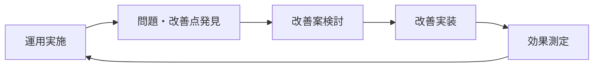

# 運用分析書

## 1. モニタリング手順

### 1.1 メトリクス監視

#### アプリケーションメトリクス
| メトリクス | 確認方法 | 正常範囲 | アラート閾値 |
|-----------|---------|---------|------------|
| CPU使用率 | `/actuator/metrics/system.cpu.usage` | < 70% | > 80% |
| メモリ使用率 | `/actuator/metrics/jvm.memory.used` | < 80% | > 90% |
| レスポンス時間 | `/actuator/metrics/http.server.requests` | < 500ms | > 1000ms |
| エラー率 | `/actuator/metrics/http.server.requests` | < 1% | > 5% |
| データベース接続数 | `/actuator/metrics/hikaricp.connections.active` | < 80% | > 90% |

#### ビジネスメトリクス
```bash
# 主要業務指標の確認
curl http://localhost:8080/actuator/metrics/loan.count.daily
curl http://localhost:8080/actuator/metrics/reservation.count.daily
curl http://localhost:8080/actuator/metrics/return.count.daily
```

#### データベース監視
```sql
-- 接続数確認
SELECT count(*) FROM pg_stat_activity;

-- 長時間実行クエリ確認
SELECT pid, query, state, query_start 
FROM pg_stat_activity 
WHERE state = 'active' AND query_start < now() - interval '1 minute';

-- テーブルサイズ確認
SELECT schemaname, tablename, pg_size_pretty(pg_total_relation_size(schemaname||'.'||tablename)) 
FROM pg_tables 
WHERE schemaname = 'public';
```

### 1.2 ロギング

#### ログレベル設定
```yaml
# application-production.yaml
logging:
  level:
    library: INFO
    library.application.scenario: DEBUG
    library.domain.model: WARN
    org.springframework.web: WARN
    org.mybatis: WARN
  file:
    name: /var/log/library/application.log
  pattern:
    file: "%d{yyyy-MM-dd HH:mm:ss} [%thread] %-5level %logger{36} - %msg%n"
```

#### ログ監視ポイント
```bash
# エラーログ監視
tail -f /var/log/library/application.log | grep -i error

# 業務ログ監視（貸出・返却・予約）
tail -f /var/log/library/application.log | grep -E "(LoanScenario|ReturnsScenario|ReservationScenario)"

# パフォーマンス監視
tail -f /var/log/library/application.log | grep -E "(SLOW|WARNING|timeout)"
```

#### ログローテーション
```bash
# /etc/logrotate.d/library
/var/log/library/*.log {
    daily
    missingok
    rotate 30
    compress
    delaycompress
    notifempty
    sharedscripts
    postrotate
        systemctl reload library
    endscript
}
```

### 1.3 トレーシング

#### OpenTelemetry設定
```yaml
management:
  tracing:
    enabled: true
    sampling:
      probability: 0.1
  zipkin:
    tracing:
      endpoint: http://zipkin-server:9411/api/v2/spans
```

#### 主要トレース確認
- 貸出処理のエンドツーエンド時間
- データベースクエリ実行時間
- 外部サービス呼び出し時間
- 並行処理の競合状況

## 2. 定期的な作業

### 2.1 日次作業

#### 毎日の運用チェック
```bash
#!/bin/bash
# daily_check.sh

echo "=== Library System Daily Check ==="
echo "Date: $(date)"

# 1. サービス稼働確認
echo "1. Service Status Check"
systemctl status library
curl -f http://localhost:8080/actuator/health || echo "ALERT: Health check failed"

# 2. ディスク使用量確認
echo "2. Disk Usage Check"
df -h | grep -E "(\/var\/log|\/opt\/library)"

# 3. メモリ使用量確認
echo "3. Memory Usage Check"
free -h

# 4. エラーログ確認
echo "4. Error Log Check"
grep -c "ERROR" /var/log/library/application.log || echo "No errors found"

# 5. 業務統計確認
echo "5. Business Metrics"
curl -s http://localhost:8080/actuator/metrics/loan.count.daily | jq '.measurements[0].value'
curl -s http://localhost:8080/actuator/metrics/reservation.count.daily | jq '.measurements[0].value'
curl -s http://localhost:8080/actuator/metrics/return.count.daily | jq '.measurements[0].value'

echo "=== Daily Check Completed ==="
```

### 2.2 週次作業

#### 毎週の保守作業
```bash
#!/bin/bash
# weekly_maintenance.sh

echo "=== Weekly Maintenance ==="

# 1. ログファイルアーカイブ
echo "1. Log Archive"
find /var/log/library -name "*.log.*" -mtime +7 -exec gzip {} \;

# 2. データベース統計更新
echo "2. Database Statistics Update"
sudo -u postgres psql -d library_production -c "ANALYZE;"

# 3. 不要な一時ファイル削除
echo "3. Cleanup Temporary Files"
find /tmp -name "library-*" -mtime +7 -delete

# 4. 監視メトリクス確認
echo "4. Monitoring Metrics Review"
curl -s http://localhost:8080/actuator/metrics | jq '.names[] | select(contains("library"))'

echo "=== Weekly Maintenance Completed ==="
```

### 2.3 月次作業

#### 毎月の分析作業
```bash
#!/bin/bash
# monthly_analysis.sh

echo "=== Monthly Analysis ==="

# 1. 業務統計レポート生成
echo "1. Business Statistics Report"
psql -d library_production -c "
SELECT 
  DATE_TRUNC('day', loan_date) as date,
  COUNT(*) as loan_count
FROM loans 
WHERE loan_date >= DATE_TRUNC('month', CURRENT_DATE - INTERVAL '1 month')
  AND loan_date < DATE_TRUNC('month', CURRENT_DATE)
GROUP BY DATE_TRUNC('day', loan_date)
ORDER BY date;
" -o /var/reports/monthly_loan_stats.csv

# 2. パフォーマンス分析
echo "2. Performance Analysis"
grep "SLOW" /var/log/library/application.log.* | wc -l > /var/reports/slow_queries_count.txt

# 3. エラー分析
echo "3. Error Analysis"
grep "ERROR" /var/log/library/application.log.* | cut -d' ' -f5- | sort | uniq -c | sort -nr > /var/reports/error_summary.txt

echo "=== Monthly Analysis Completed ==="
```

### 2.4 四半期作業

#### 四半期ごとの見直し
- システムパフォーマンス分析
- セキュリティ監査
- バックアップ・リストア手順確認
- 監視アラート設定見直し
- 容量計画の更新

## 3. 不定期な作業

### 3.1 バージョンアップ作業

#### Spring Bootバージョンアップ
```bash
# 1. 依存関係確認
./gradlew dependencyUpdates

# 2. テスト環境でアップグレード
git checkout -b upgrade/spring-boot-3.2
# build.gradle更新
./gradlew build
./gradlew test

# 3. 回帰テスト実行
./gradlew integrationTest

# 4. ステージング環境デプロイ・検証
# 5. 本番環境アップグレード計画作成
```

#### PostgreSQLバージョンアップ
```bash
# 1. バックアップ作成
pg_dump library_production > backup_pre_upgrade.sql

# 2. 新バージョンインストール・設定
# 3. データ移行・検証
# 4. アプリケーション接続テスト
# 5. パフォーマンステスト
```

### 3.2 セキュリティ対応

#### 脆弱性対応手順
```bash
# 1. 脆弱性スキャン
./gradlew dependencyCheckAnalyze

# 2. 影響範囲分析
# 3. 修正版への更新
# 4. セキュリティテスト
# 5. 緊急デプロイ（必要に応じて）
```

#### 定期セキュリティ監査
- 依存関係の脆弱性チェック
- ログイン・認証機能の監査
- 個人情報アクセスログの確認
- SSL/TLS設定の確認

## 4. 障害対応手順

### 4.1 障害検知から初動対応

#### 自動検知システム
```yaml
alerts:
  - name: "Application Down"
    condition: "health_check_failed"
    action: "immediate_notification"
    
  - name: "High Error Rate"
    condition: "error_rate > 5%"
    action: "escalation_after_5min"
    
  - name: "Database Connection Failed"
    condition: "db_connection_failed"
    action: "immediate_escalation"
```

#### 初動対応チェックリスト
1. **障害確認** - 影響範囲と症状の把握
2. **緊急度判定** - サービス停止レベルの判定
3. **関係者への連絡** - ステークホルダーへの第一報
4. **応急処置** - 可能な場合は迅速な復旧処理
5. **原因調査開始** - ログ・メトリクス分析

### 4.2 問題切り分け手順

#### システム層別の確認
```bash
# 1. アプリケーション層
curl -f http://localhost:8080/actuator/health
systemctl status library

# 2. データベース層
psql -d library_production -c "SELECT 1;"
netstat -an | grep 5432

# 3. インフラ層
ping database-server
df -h
free -m

# 4. ネットワーク層
netstat -i
ss -tuln
```

#### ログ分析手順
```bash
# 直近のエラーログ
tail -n 100 /var/log/library/application.log | grep ERROR

# 特定時間帯のログ
grep "2024-01-15 14:0" /var/log/library/application.log

# スタックトレース分析
grep -A 20 "Exception" /var/log/library/application.log
```

### 4.3 復旧作業からポストモーテム

#### 復旧手順テンプレート
1. **根本原因の特定**
2. **修正版の準備・テスト**
3. **本番環境への適用**
4. **動作確認・監視強化**
5. **関係者への復旧報告**

#### ポストモーテム実施
```markdown
# 障害報告書テンプレート

## 障害概要
- 発生日時: 
- 復旧日時: 
- 影響範囲: 
- 影響時間: 

## 原因分析
- 直接原因: 
- 根本原因: 
- 関連要因: 

## 対応内容
- 応急処置: 
- 根本対策: 
- 再発防止策: 

## 改善提案
- 監視強化: 
- プロセス改善: 
- 技術的改善: 
```

## 5. 運用改善とナレッジ蓄積

### 5.1 運用効率化

#### 自動化の推進
- 日次チェックの完全自動化
- 障害検知からアラートまでの自動化
- 定期メンテナンス作業の自動化
- レポート生成の自動化

#### 運用ツールの活用
- 監視ダッシュボードの整備
- ログ分析ツールの導入
- チャットボットによる運用情報提供
- 自動復旧スクリプトの整備

### 5.2 ナレッジ管理

#### 運用手順書の維持管理
- 手順書の定期見直し（四半期）
- 新メンバーへの教育資料
- トラブルシューティングガイド
- よくある質問（FAQ）集

#### 運用改善サイクル


## チェックリスト更新

- [x] モニタリング手順作成
- [x] 定期的な作業作成
- [x] 不定期な作業作成
- [x] 障害対応手順作成